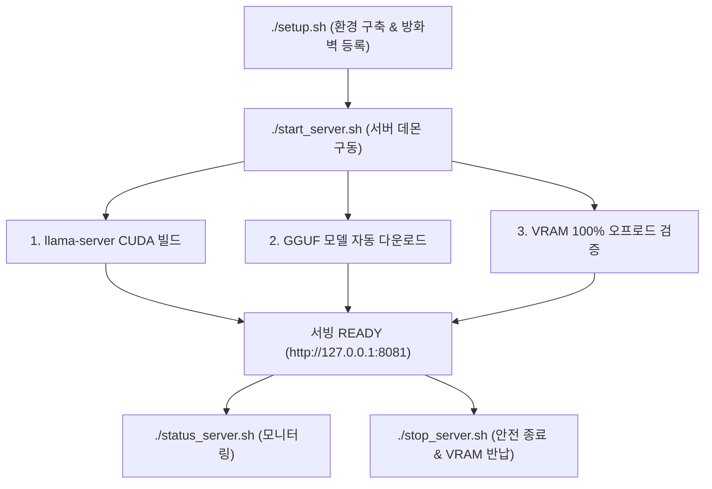

# ⚡ vllm_serv: Qwen 3.5 & Gemma 4 High-Performance GPU Serving Engine

> **NVIDIA GPU/CUDA 하드웨어 가속 사전 검증, VRAM 100% 레이어 오프로드 실시간 모니터링, 동적 핫스왑(Hot-Swap) 모델 서빙 및 3D 품질-속도-VRAM 종합 평가 파이프라인**

---

## 📌 개요 (Overview)

`vllm_serv`는 단일 NVIDIA GPU(예: GTX 1080 Ti 11GB VRAM) 환경에서 **Qwen 3.5** (2B, 4B, 9B) 및 **Gemma 4** (E2B, E4B, 12B) GGUF 양자화 모델을 최대로 가속하여 서빙하기 위한 고성능 파이프라인 엔진입니다.

CPU-only 전용 바이너리로 인한 성능 저하를 사전에 100% 차단하며, 모델 가중치 및 CLIP 프로젝터의 **GPU VRAM 100% 레이어 오프로딩을 실시간 검증**하여 초당 30~50 tok/s 이상의 고성능 추론과 VRAM OOM(Out of Memory) 사전 방지를 보장합니다.

또한 **표준 OpenAI REST API (`GET /v1/models`, `POST /v1/chat/completions`) 규격을 100% 지원**하여 파이썬 OpenAI SDK, Node.js SDK, LangChain, LlamaIndex, Open-WebUI 등 기존 LLM 생태계 앱과 완벽히 연동됩니다.

---

## 🛠️ 서버 셋팅 및 구축 절차 (Server Setup & Operation Workflow)

`vllm_serv`는 원스톱 셋팅 쉘 스크립트(`./setup.sh`)를 통해 프로젝트 환경 검증, `uv` 동기화, 방화벽 포트 개설 및 서버 제어 스크립트를 자동 생성합니다.



### 1단계: 원스톱 환경 셋팅 (`./setup.sh`)
아래 명령어를 실행하면 필요한 모든 기본 설정과 방화벽 등록, 서버 제어 스크립트 생성이 자동으로 진행됩니다:

```bash
# 원스톱 셋팅 스크립트 실행
./setup.sh
```

**`./setup.sh` 자동 처리 항목**:
1. **필수 프로젝트 파일 검증**: `pyproject.toml`, `config/*.json`, `src/api/server.py` 등 필수 파일 유무 검사
2. **`uv` 패키지 매니저 및 가상환경 구성**: `uv` 설치 여부 확인 및 패키지 자동 동기화 (`uv sync`)
3. **NVIDIA CUDA Toolkit (`nvcc`) & GPU 드라이버 검증**: `nvcc` 및 `nvidia-smi` 검증 (미설치 시 CPU 전용 폴백 없이 즉각 Fail-Fast 종료)
4. **CUDA 가속 `llama-cpp-python` 자동 소스 컴파일**: `CMAKE_ARGS="-DGGML_CUDA=on"`으로 CUDA 가속 바이너리 설치 및 `llama_supports_gpu_offload()` 보장
5. **네트워크 방화벽 자동 등록**: `config/server_config.json` 포트(`8081/tcp`)를 읽어 `ufw` / `firewalld` 허용 규칙 추가
6. **서버 제어 쉘 스크립트 생성 및 심볼릭 링크 연결**: `./start_server.sh`, `./stop_server.sh`, `./status_server.sh` 자동 생성 및 실행 권한 부여

---

### 2단계: 서버 백그라운드 구동 (`./start_server.sh`)
서버 인퍼런스 엔진을 백그라운드 데몬 프로세스로 시작합니다:

```bash
./start_server.sh
```

**`./start_server.sh` 자동 파이프라인 단계**:
1. **바이너리 자동 빌드**: `llama-server` CUDA 바이너리 미존재 시 `GGML_CUDA=ON` 옵션으로 C++ 소스코드를 자동 컴파일
2. **가중치 자동 다운로드**: 기본 상주 모델(`qwen3.5-4b`) GGUF 파일 미존재 시 HuggingFace Hub에서 원스톱 자동 다운로드
3. **VRAM 100% 오프로드 검증**: 서빙 개설 직후 VRAM 레이어 오프로딩 및 헬스체크(`http://127.0.0.1:8081/health`) 확인 후 `READY` 상태 전환

---

### 3단계: 서버 상태 및 GPU VRAM 모니터링 (`./status_server.sh`)
현재 서빙 프로세스 구동 상태, REST API 헬스체크 및 GPU VRAM 실시간 현황을 조회합니다:

```bash
./status_server.sh
```

---

### 4단계: 서버 안전 종료 및 VRAM 해제 (`./stop_server.sh`)
서버와 관련 `llama-server` 하위 프로세스를 완전히 종료하고 GPU VRAM을 무결하게 반납합니다:

```bash
./stop_server.sh
```

---

## 📋 서버 제어 쉘 스크립트 레퍼런스 (Control Scripts Reference)

| 쉘 스크립트명 | 실행 경로 | 주요 역할 및 내부 수행 동작 |
|---------------|-----------|-----------------------------|
| **`setup.sh`** | `./setup.sh` | 필수 파일 점검, `uv sync` 가상환경 동기화, `8081/tcp` 방화벽 등록, 제어 스크립트 생성 |
| **`start_server.sh`** | `./start_server.sh` | 백그라운드 데몬 구동, llama-server C++ 자동 빌드, GGUF 자동 다운로드, VRAM 100% 오프로드 검증 |
| **`stop_server.sh`** | `./stop_server.sh` | PID 및 하위 llama-server 프로세스 단계별 종료 (`SIGTERM` ➔ `SIGKILL`), VRAM 메모리 완전 반납 |
| **`status_server.sh`** | `./status_server.sh` | 서빙 PID, HTTP `/health` JSON API 헬스체크, nvidia-smi GPU 사용량 및 온도 실시간 리포트 |
| **`make_seed_pack.sh`** | `./make_seed_pack.sh` | 타 서버 이관용 경량 Seed Pack 압축 생성 (`dist/vllm_serv_seed.tar.gz`, 대용량 모델 및 `.venv` 배제) |

---

## 🔥 핵심 기능 (Key Features)

### 1. 🌐 OpenAI API 표준 100% 호환 (`/v1/models`, `/v1/chat/completions`)
- **동적 모델 목록 조회 (`GET /v1/models`)**: 서버 구동 상태와 무관하게 카탈로그 6개 전체 지원 모델의 ID, VRAM 상주 서빙 여부(`active`), 로컬 가중치 미존재/존재 여부(`available`)를 OpenAI 표준 JSON 규격으로 리턴합니다.
- **표준 챗 컴플리션 (`POST /v1/chat/completions`)**: `temperature`, `top_p`, `max_tokens`, `stream` 등의 파라미터를 지원하는 표준 텍스트 생성 API를 제공합니다.

### 2. 🛡️ GPU/CUDA 하드웨어 사전 검증 엔진 (`src/core/gpu_detector.py`)
- **3단계 하드웨어 Pre-flight Check**: NVIDIA GPU 존재 여부, CUDA 백엔드 드라이버, `nvcc` 툴킷 버전을 동적으로 감지합니다.
- **CPU Fallback 엄격 차단**: CPU 전용 실행 시도가 감지되거나 CUDA 백엔드 로드 실패 시 `GpuAccelerationError`를 즉각 발생시켜 서빙 개설을 차단합니다.

### 3. ⚡ VRAM 100% 레이어 오프로딩 실시간 검증 (`src/core/process_manager.py`)
- **실시간 로그 파싱**: `llama-server` 구동 로그를 파싱하여 모델 전체 레이어 및 CLIP 멀티모달 가중치가 VRAM에 100% 오프로드되었는지 검증합니다.
- **부분 오프로드 에러 차단**: VRAM 부족으로 일부 레이어가 RAM으로 튕겨 나가는 현상 감지 시 `VramOverflowError` 예외를 던지고 프로세스를 안전 종료합니다.
- **VRAM 해제 무결성 보장**: 모델 언로드/스위칭 시 `nvidia-smi`를 통해 GPU VRAM이 완전 반납되었는지 확인 후 신규 모델을 개설합니다.

### 4. 🔄 동적 모델 스위칭 (Hot-Swap) & Asynchronous SSE 브로드캐스팅
- **서버 재시작 없는 핫스왑**: `/api/v1/models/load` 호출만으로 메모리 누수 없이 모델을 즉시 스위칭합니다.
- **실시간 상태 브로드캐스팅**: SSE 엔드포인트(`GET /api/v1/events/stream`)를 통해 GPU 정보 및 VRAM 점유량을 실시간 스트리밍합니다.

### 5. ⚙️ 외부 설정 JSON & 환경변수 모듈화
- 파이썬 소스 코드 하드코딩을 제거하고 모델 카탈로그(`config/model_catalog.json`), 서버 호스트/포트 및 타임아웃(`config/server_config.json`), 환경변수(`LLAMA_PORT`, `LLAMA_HOST`)로 시스템 동작을 가변 설정할 수 있습니다.

---

## 🌐 API 접속 주소 및 엔드포인트 (API Reference)

### Base URL
- **기본 접속 URL**: `http://127.0.0.1:8081` (또는 `config/server_config.json` 설정 기준)

### 주요 API 엔드포인트 목록

| 엔드포인트 | Method | 설명 | 요청 규격 |
|------------|--------|------|-----------|
| `/v1/models` | `GET` | 서빙 지원 카탈로그 전체 모델 목록 동적 조회 | OpenAI API Standard |
| `/v1/chat/completions` | `POST` | OpenAI 호환 텍스트/대화 생성 | OpenAI API Standard |
| `/api/v1/status` | `GET` | GPU VRAM 사용량, 100% 오프로드 여부 및 서빙 상태 조회 | `vllm_serv` Custom JSON |
| `/api/v1/models/load` | `POST` | VRAM 상주 서빙 모델 동적 핫스왑 (Hot-Swap) | `{"model_id": "...", "n_ctx": 4096}` |
| `/api/v1/events/stream` | `GET` | GPU 및 서빙 프로세스 상태 SSE 실시간 스트리밍 | Event-Stream (`text/event-stream`) |

---

## 🤖 서빙 LLM 모델 목록 (Servable Model Catalog)

`vllm_serv`는 **Gemma 4** 라인업 3종 및 **Qwen 3.5** 라인업 3종, 총 6개 모델 카탈로그를 기본 지원합니다.

| 모델 ID (`model_id`) | 모델명 | 양자화 | 파일 크기 | 기본 VRAM 점유 | CLIP 비전 지원 | 권장 안전 `n_ctx` 범위 |
|----------------------|--------|--------|-----------|----------------|----------------|------------------------|
| **`gemma4-e2b`** | Gemma 4 E2B | `q4_0` | 1.8 GB | ~2,680 MB | ✅ 지원 (`mmproj`) | `2K` ~ `32K` (Safe) |
| **`gemma4-e4b`** | Gemma 4 E4B | `q4_0` | 3.1 GB | ~4,210 MB | ✅ 지원 (`mmproj`) | `2K` ~ `16K` (Safe) |
| **`gemma4-12b`** | Gemma 4 12B | `qat_q4_0` | 7.4 GB | ~8,900 MB | ✅ 지원 (`mmproj`) | `2K` ~ `8K` (Max Limit) |
| **`qwen3.5-2b`** | Qwen 3.5 2B | `q4_k_m` | 1.6 GB | ~2,450 MB | ❌ 미지원 | `2K` ~ `32K` (Safe) |
| **`qwen3.5-4b`** *(Default)* | Qwen 3.5 4B | `q4_k_m` | 2.8 GB | ~3,950 MB | ❌ 미지원 | `2K` ~ `16K` (Safe) |
| **`qwen3.5-9b`** | Qwen 3.5 9B | `q4_k_m` | 5.8 GB | ~7,120 MB | ❌ 미지원 | `2K` ~ `8K` (Max Limit) |

---

## 🎯 서비스 목적별 적정 모델 & 적정 컨텍스트 윈도우 추천 매트릭스

단일 GTX 1080 Ti (11GB VRAM) 환경에서의 실측 벤치마크 기반 서비스 유형별 최적 조합입니다:

| 서비스 추천 카테고리 | 추천 모델 ID | 적정 컨텍스트 크기 (`n_ctx`) | TTFT (ms) | TPOT (tok/s) | VRAM 안전 마진 & 추천 사유 |
|----------------------|--------------|------------------------------|-----------|--------------|----------------------------|
| ⚡ **초저지연 에이전트 서빙** | `qwen3.5-2b` | **`4,096`** (또는 `2,048`) | **~95 ms** | **55.3 tok/s** | 최소 지연시간 및 최대 토큰 생성 속도, 8GB VRAM 여유 마진 확보 |
| ⚖️ **기본 상주 서빙 (Default)** | `qwen3.5-4b` | **`8,192`** (또는 `4,096`) | **~142 ms** | **36.2 tok/s** | 품질-속도-VRAM 종합 1위 가성비 밸런스, Peak VRAM ~3.95GB |
| 🎯 **고정밀 분석 서빙** | `gemma4-12b` | **`8,192`** (최대 상한) | **~285 ms** | **17.6 tok/s** | 지시 이행력 및 슬롯 정밀도 최고 수준 (8K 초과 시 VRAM OOM 가드 작동) |

---

## 🎛️ 요청 파라미터 종류 및 값의 범위 (Request Parameters)

`POST /v1/chat/completions` 호출 시 사용할 수 있는 파라미터 규격입니다:

| 파라미터명 | 타입 | 기본값 | 허용/권장 범위 | 설명 |
|------------|------|--------|----------------|------|
| **`model`** *(필요)* | `string` | `"qwen3.5-4b"` | 카탈로그 6개 ID 중 선택 | 추론 요청을 전달할 LLM 모델 ID |
| **`messages`** *(필요)* | `array` | - | `[{"role": "...", "content": "..."}]` | 대화 메시지 객체 리스트 (`system`, `user`, `assistant`) |
| **`temperature`** | `float` | `0.7` | `0.0` ~ `2.0` | 생성 무작위성 제어 (`0.0`: 결점 정밀 추론, `1.0+`: 창의적 생성) |
| **`top_p`** | `float` | `0.9` | `0.0` ~ `1.0` | Nucleus 샘플링 상위 확률 누적 임계치 |
| **`max_tokens`** | `integer` | `512` | `1` ~ `n_ctx` | 모델이 생성할 최대 토큰 수 |
| **`stream`** | `boolean` | `false` | `true` / `false` | `true` 설정 시 SSE 표준 토큰 스트리밍 반환 |
| **`presence_penalty`** | `float` | `0.0` | `-2.0` ~ `2.0` | 새 토큰의 대화 내 존재 여부에 따른 패널티 |
| **`frequency_penalty`**| `float` | `0.0` | `-2.0` ~ `2.0` | 토큰 빈도수에 따른 반복 억제 패널티 |
| **`n_ctx`** *(옵션)* | `integer` | `4096` | `2048`, `4096`, `8192`, `16384`, `32768` | 핫스왑/로드 시 컨텍스트 윈도우 크기 지정 |

---

## 💻 OpenAI API 라이브러리 연동 호출 양식 (Code Examples)

### 1. Python OpenAI SDK (`openai>=1.0.0`)

```python
from openai import OpenAI

# 1. vllm_serv API 클라이언트 생성 (로컬 서빙으로 API 키 불필요)
client = OpenAI(
    base_url="http://127.0.0.1:8081/v1",
    api_key="not-needed"
)

# 2. 지원 모델 목록 동적 조회 (GET /v1/models)
models_list = client.models.list()
print("=== [vllm_serv 서빙 가능 모델 카탈로그] ===")
for model in models_list.data:
    active_status = "🟢 ACTIVE (VRAM 상주)" if getattr(model, "active", False) else "⚪ Standby"
    print(f"- {model.id} [{active_status}]")

# 3. 챗 컴플리션 텍스트 생성 (POST /v1/chat/completions)
response = client.chat.completions.create(
    model="qwen3.5-4b",
    messages=[
        {"role": "system", "content": "당신은 한국어 정보 추출 및 요약 전문 AI 비서입니다."},
        {"role": "user", "content": "GPU VRAM 100% 오프로딩이 LLM 인퍼런스 속도에 미치는 영향을 3줄로 요약해줘."}
    ],
    temperature=0.2,
    max_tokens=256
)

print("\n=== [모델 생성 답변] ===")
print(response.choices[0].message.content)
```

#### Python Streaming 응답 예시
```python
stream_response = client.chat.completions.create(
    model="qwen3.5-4b",
    messages=[{"role": "user", "content": "인공지능의 미래에 대해 짤막하게 말해줘."}],
    stream=True
)

for chunk in stream_response:
    content = chunk.choices[0].delta.content or ""
    print(content, end="", flush=True)
```

---

### 2. Node.js / TypeScript OpenAI SDK (`openai`)

```typescript
import OpenAI from 'openai';

const openai = new OpenAI({
  baseURL: 'http://127.0.0.1:8081/v1',
  apiKey: 'not-needed',
});

async function main() {
  // GET /v1/models
  const models = await openai.models.list();
  console.log('Available Models:', models.data.map(m => m.id));

  // POST /v1/chat/completions
  const completion = await openai.chat.completions.create({
    model: 'gemma4-e4b',
    messages: [
      { role: 'system', content: 'You are a concise AI assistant.' },
      { role: 'user', content: 'What is GQA (Grouped-Query Attention)?' }
    ],
    temperature: 0.1,
    max_tokens: 200,
  });

  console.log('Response:', completion.choices[0].message.content);
}

main();
```

---

### 3. cURL CLI 호출 양식

#### A. 모델 목록 조회 (`GET /v1/models`)
```bash
curl -s http://127.0.0.1:8081/v1/models | jq .
```

#### B. 챗 컴플리션 생성 (`POST /v1/chat/completions`)
```bash
curl -X POST http://127.0.0.1:8081/v1/chat/completions \
  -H "Content-Type: application/json" \
  -d '{
    "model": "qwen3.5-4b",
    "messages": [
      {"role": "system", "content": "You are a helpful assistant."},
      {"role": "user", "content": "안녕하세요! 간단히 자기소개 해주세요."}
    ],
    "temperature": 0.3,
    "max_tokens": 128
  }'
```

---

## 📊 3D 종합 벤치마크 실행

원스톱 자동 다운로드 및 실측 GPU 벤치마크를 수행하여 품질, 속도(TTFT/TPOT), VRAM 점유량을 측정하고 마크다운 리포트를 자동 생성합니다:

```bash
uv run python scripts/benchmark_quality.py --auto-download --real
```
> 생성된 리포트 경로: `specs/016-context-scaling-and-cleanup-fix/analysis_report_quality.md` 및 `data/reports/analysis_report_quality.md`

---

## ⚙️ 프로젝트 디렉토리 및 외부 설정 구조 (Configurations)

- **`.legacy/`**: 더 이상 직접 실행되지 않는 1회성 스크립트, 구형 설치 파일 및 벤치마크 임시 결과를 영구 아카이빙하는 비파괴적 보존 디렉토리.
- **`config/model_catalog.json`**: 지원 모델의 GGUF 경로, CLIP 경로, HF repo_id, VRAM 추정치 모듈화.
- **`config/server_config.json`**: 서빙 포트(`8081`), 호스트(`0.0.0.0`), VRAM 상한(`11264MB`), 헬스체크 타임아웃(`120s`) 설정.

---

## 📜 라이선스 (License)

Apache 2.0 License
