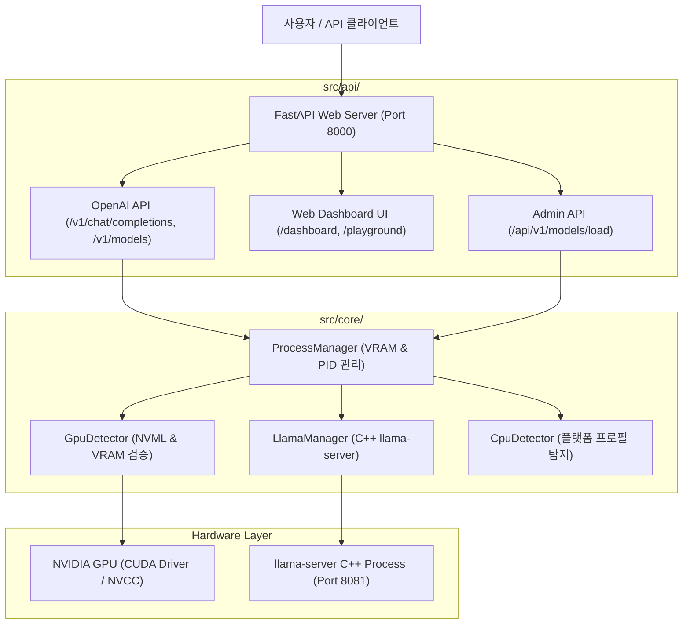

# ⚡ vllm_serv: Qwen 3.5 & Gemma 4 High-Performance GPU Serving Engine

> **NVIDIA GPU/CUDA 하드웨어 가속 사전 검증, VRAM 100% 레이어 오프로드 실시간 모니터링, 동적 핫스왑(Hot-Swap) 모델 서빙 및 웹 대시보드 관리 파이프라인**

---

## 📌 개요 (Overview)

`vllm_serv`는 단일/다중 NVIDIA GPU 환경에서 **Qwen 3.5** (2B, 4B, 9B) 및 **Gemma 4** (E2B, E4B, 12B) GGUF 양자화 모델을 고성능으로 최적화하여 서빙하는 통합 인퍼런스 엔진 및 웹 서비스 플랫폼입니다.

- **CUDA 가속 보장**: CPU 전용 빌드로 인한 성능 저하를 감지 시 즉각 Fail-Fast 종료하며, GPU VRAM 100% 레이어 오프로딩을 실시간 검증합니다.
- **OpenAI API 규격 100% 호환**: 표준 REST API (`GET /v1/models`, `POST /v1/chat/completions`)를 지원하여 파이썬 OpenAI SDK, Node.js SDK, LangChain, Open-WebUI 등과 바로 연동됩니다.
- **웹 대시보드 UI**: 브라우저 기반의 실시간 GPU VRAM 모니터링, 모델 핫스왑 제어 및 인터랙티브 플레이그라운드를 제공합니다.

---

## 🏗️ 시스템 아키텍처 (System Architecture)



---

## 🚀 3단계 빠른 시작 (3-Step Quick Start)

### 1단계: 원스톱 환경 구축 (`./setup.sh`)
시스템 환경을 자동 검증하고 필수 패키지 설치, C++ CUDA 컴파일 및 기본 벤치마크를 수행합니다:

```bash
./setup.sh
```
> **강제 재컴파일/휠 지정**: `./setup.sh --force-build` 또는 `./setup.sh --wheel-path <WHEEL.whl>`

---

### 2단계: 서버 데몬 백그라운드 구동 (`./start_server.sh`)
LLM 인퍼런스 엔진 및 웹 대시보드를 백그라운드 데몬으로 구동합니다:

```bash
./start_server.sh
```
> **서버 개설 완료**: LLM Engine (`http://127.0.0.1:8081`), Web Dashboard (`http://127.0.0.1:8000`)

---

### 3단계: OpenAI 호환 API 호출 테스트

```bash
curl -X POST http://127.0.0.1:8000/v1/chat/completions \
  -H "Content-Type: application/json" \
  -d '{
    "model": "qwen3.5-4b",
    "messages": [
      {"role": "user", "content": "안녕하세요! vllm_serv 서버의 대표적 특징 2가지를 말해주세요."}
    ],
    "temperature": 0.3,
    "max_tokens": 128
  }'
```

---

## 🛠️ 루트 제어 쉘 스크립트 레퍼런스 (Root Control Scripts)

프로젝트 루트 디렉터리에는 서버 생애주기 관리를 위한 6대 핵심 제어 스크립트가 수록되어 있습니다:

| 스크립트명 | 실행 예시 | 주요 기능 및 수행 로직 |
|------------|-----------|------------------------|
| **`setup.sh`** | `./setup.sh` | Sudo 관리자 인증 유지, `uv sync` 가상환경 동기화, CUDA `nvcc` & `nvidia-smi` 검증, C++ CUDA 바이너리 빌드, 방화벽 포트 등록, 기본 벤치마크 수행 |
| **`start_server.sh`** | `./start_server.sh` | 백그라운드 데몬 구동, llama-server C++ 자동 컴파일, 기본 GGUF 모델 자동 다운로드, VRAM 100% 오프로드 사전 점검 후 `READY` 전환 |
| **`status_server.sh`** | `./status_server.sh` | 실시간 서버 구동 PID, REST API 헬스체크 (`/health`), GPU 사용량, VRAM 점유율 및 온도 리포트 |
| **`stop_server.sh`** | `./stop_server.sh` | 실행 중인 서버 프로세스 및 하위 `llama-server` 백그라운드 프로세스 안전 종료 (`SIGTERM` ➔ `SIGKILL`) 및 VRAM 메모리 반납 |
| **`make_seed_pack.sh`** | `./make_seed_pack.sh` | 타겟 서버 마이그레이션용 사전 빌드 휠 및 방화벽/제어 스크립트 포함 아카이브 패키지 생성 (`dist/vllm_serv_seed.tar.gz`) |
| **`unpack_seed.sh`** | `./unpack_seed.sh` | 마이그레이션 타겟 서버에서 Seed Pack 압축 해제 및 엔트리 무결성 검증 수행 |

### 💡 `setup.sh` 주요 CLI 옵션

- **`./setup.sh`**: (기본값) 필수 3종 모델 자동 다운로드, GPU 가속 환경 검증, 미측정 모델 대상 자동 이진 탐색 벤치마크 및 서빙 설정 원자적 반영
- **`./setup.sh --force-benchmark`**: 기존 카탈로그 전체 모델에 대해 벤치마크 재측정을 강제 수행합니다.
- **`./setup.sh --skip-benchmark`**: VRAM 및 컨텍스트 윈도우 벤치마크 측정을 건너뛰고 빠른 셋업을 완료합니다.
- **`./setup.sh --force-build`**: 기존 uv 캐시를 무효화(`--no-cache-dir`)하고 CUDA C++ 소스를 원스톱 강제 재컴파일합니다.
- **`./setup.sh --wheel-path <PATH>`**: 지정한 커스텀 휠 패키지(`.whl`)를 `--force-reinstall`하여 재설치합니다.
- **`./setup.sh --skip-build`**: 기존 C++ 빌드가 준비된 경우 빌드 단계를 건너뛰고 빠른 설정을 완료합니다.

> ℹ️ **`setup.sh` 벤치마크 실행 및 모델 다운로드 관련 참고 사항**
> 1. **필수 모델 자동 다운로드 정책**: `./setup.sh` 실행 시 초기 설정 시간을 최적화하기 위해 즉시 서비스에 필요한 **기본 3개 필수 모델**(`qwen3.5-4b`, `bge-m3`, `bge-reranker-v2-m3`)만 우선 자동 다운로드합니다.
> 2. **카탈로그 미다운로드 모델 처리**: 로컬에 다운로드되지 않은 모델은 벤치마크 시 안전하게 스킵(`is_supported: false`)되며, 실제 준비된 로컬 모델 중에서만 최적의 서빙 모델을 선별합니다.
> 3. **벤치마크 중 한계 부하 로그 (`ArrayMemoryError` 등)**: 이진 탐색 중 극단적인 컨텍스트 크기(`n_ctx=56,320` 등)를 검증할 때 호스트 RAM 용량 한계로 `ArrayMemoryError`나 타임아웃 로그가 발생할 수 있습니다.이는 **GPU/RAM 한계값을 찾아내기 위한 정상적인 한계 테스트**이며, 시스템이 자동으로 예외를 포착하여 VRAM을 해제하고 안정적인 최적 컨텍스트 크기를 구하므로 안심하셔도 됩니다.

---

## 📂 `scripts/` 디렉터리 유틸리티 스크립트 레퍼런스

`scripts/` 폴더 내에는 벤치마크, 무결성 검증, 모델 다운로드 등을 담당하는 파이썬/쉘 도구들이 수록되어 있습니다:

| 스크립트 파일 | 구동 명령어 예시 | 역할 및 주요 기능 |
|---------------|------------------|-------------------|
| **`ensure_models.py`** | `uv run python scripts/ensure_models.py` | 기본 필수 3종 모델(`qwen3.5-4b`, `bge-m3`, `bge-reranker-v2-m3`) 점검 및 자동 다운로드 |
| | `uv run python scripts/ensure_models.py --all` | 카탈로그 전체 14개 모델 가중치 및 CLIP 비전 프로젝터 일괄 다운로드 |
| | `uv run python scripts/ensure_models.py --model gemma4-12b` | 특정 모델 ID(또는 쉼표로 구분된 복수 모델) 지정 다운로드 |
| **`benchmark_context_window.py`** | `uv run python scripts/benchmark_context_window.py` | GPU VRAM 용량 기반 이진 탐색을 구동하여 모델별 최적 안전 컨텍스트 크기(`n_ctx`) 측정 후 `config/model_context_profiles.json` 저장 |
| | `uv run python scripts/benchmark_context_window.py --force-benchmark` | 카탈로그 전체 LLM 후보 모델 대상 실측 벤치마크 평가 및 최적 서빙 모델 자동 선택 |
| | `uv run python scripts/benchmark_context_window.py --all` | 카탈로그 전체 LLM 후보 모델 대상 순차 이진 탐색 전수 평가 구동 |
| | `uv run python scripts/benchmark_context_window.py --fine-grained --model qwen3.5-4b` | 특정 모델에 대해 512/1024 블록 얼라인먼트 정밀 이진 탐색 프로파일링 구동 |
| **`benchmark_quality.py`** | `uv run python scripts/benchmark_quality.py --real` | 응답 품질(정밀도) 및 생성 속도(TTFT, TPOT tok/s), VRAM 점유율을 종합 평가하여 분석 마크다운 리포트 생성 |
| **`verify_wheel_binary.py`** | `uv run python scripts/verify_wheel_binary.py --check-live` | 설치된 `llama-cpp-python` 패키지의 CUDA GPU 가속 지원 여부(`llama_supports_gpu_offload()`) 실측 검증 |
| **`configure_firewall.sh`** | `sudo ./scripts/configure_firewall.sh` | OS 방화벽(`ufw`, `firewalld`, `nftables`, `iptables`) 포트(`8081/tcp`, `8082/tcp`) 자동 개방 헬퍼 |
| **`common.sh`** | `source scripts/common.sh` | 쉘 스크립트 전용 공통 로깅 포맷터, 색상 출력 및 환경변수 헬퍼 모듈 |

---

## 🏛️ `src/` 시스템 아키텍처 및 코어 모듈

`vllm_serv` 백엔드는 모듈화된 파이썬 구조로 설계되어 있습니다:

### 1. `src/core/` (LLM 인퍼런스 코어 엔진)
- **`process_manager.py`**: `llama-server` 프로세스 생애주기 관리, 동적 VRAM 점유량 계산, 포트 충돌 차단 및 핫스왑 제어.
- **`llama_manager.py`**: `llama-server` C++ 바이너리 자동 빌드, CLI 실행 인자 파싱 및 실행 상태 관리.
- **`gpu_detector.py`**: NVML 및 CUDA 드라이버 탐지, 실시간 사용 가능 VRAM 연산, VRAM 기반 최대 안전 컨텍스트(`n_ctx`) 계산.
- **`cpu_detector.py`**: 호스트 CPU 명령어 세트(AVX, AVX2, FMA 등) 탐지 및 동적 `CMAKE_ARGS` 생성.
- **`config_manager.py`**: `config/model_catalog.json` 및 `config/server_config.json` 원자적 읽기/쓰기 관리.
- **`model_downloader.py`**: HuggingFace Hub 기반 모델 및 비전 프로젝터 다운로드 엔진.

### 2. `src/api/` (웹 REST API 및 대시보드)
- **`server.py`**: FastAPI 기반 웹 서버 진입점 (OpenAI REST API 및 대시보드 라우팅 통합).
- **`routes/inference_api.py`**: OpenAI 호환 `/v1/chat/completions`, `/v1/models` API 처리기.
- **`routes/dashboard_api.py`**: 실시간 GPU 상태, VRAM 차트 및 시스템 메트릭 API.
- **`routes/admin_api.py`**: 동적 모델 핫스왑(`/api/v1/models/load`) 및 대시보드 관리 제어.
- **`middleware/`**: API 키 인증 및 서브넷 IP 필터링 미들웨어.

### 3. `src/eval/` (품질 평가 파이프라인)
- **`quality_evaluator.py`**: 지시 이행성, 정보 추출 정밀도 및 생성 속도 종합 벤치마크 평가기.

---

## 🤖 지원 모델 카탈로그 (Supported Model Catalog)

`vllm_serv`는 다음 6종의 기본 LLM 카탈로그를 지원합니다:

| 모델 ID (`model_id`) | 모델명 | 양자화 | 파일 크기 | 기본 VRAM 점유 | 비전(CLIP) 지원 |
|----------------------|--------|--------|-----------|----------------|-----------------|
| **`gemma4-e2b`** | Gemma 4 E2B | `q4_0` | 1.8 GB | ~2,680 MB | ✅ 지원 (`mmproj`) |
| **`gemma4-e4b`** | Gemma 4 E4B | `q4_0` | 3.1 GB | ~4,210 MB | ✅ 지원 (`mmproj`) |
| **`gemma4-12b`** | Gemma 4 12B | `qat_q4_0` | 7.4 GB | ~8,900 MB | ✅ 지원 (`mmproj`) |
| **`qwen3.5-2b`** | Qwen 3.5 2B | `q4_k_m` | 1.6 GB | ~2,450 MB | ❌ 미지원 |
| **`qwen3.5-4b`** *(Default)* | Qwen 3.5 4B | `q4_k_m` | 2.8 GB | ~3,950 MB | ❌ 미지원 |
| **`qwen3.5-9b`** | Qwen 3.5 9B (Text-Only) | `q4_k_m` | 5.8 GB | ~7,120 MB | ❌ 미지원 |
| **`qwen3.5-9b-vision`** | Qwen 3.5 9B Vision | `q4_k_m` | 5.8 GB | ~9,800 MB | ✅ 지원 (`mmproj`) |

> **멀티모달 이미지 서빙 (VLM Support)**: `gemma4-e2b`, `gemma4-e4b`, `gemma4-12b`, `qwen3.5-9b-vision` 모델은 OpenAI 표준 규격의 `image_url` 객체 (Data URL Base64 및 HTTP URL)를 통한 이미지 프롬프트 입력을 원자적으로 지원하며, 32GB RAM / 11GB VRAM 서버 방어를 위해 HTTP 요청 페이로드 최대 크기는 **25MB**로 제한됩니다.

---

## 💻 API 연동 코드 예시 (Code Examples)

### Python OpenAI SDK (`openai>=1.0.0`)

```python
from openai import OpenAI

# vllm_serv API 클라이언트 생성
client = OpenAI(
    base_url="http://127.0.0.1:8000/v1",
    api_key="not-needed"
)

# 챗 컴플리션 요청 (스트리밍)
stream = client.chat.completions.create(
    model="qwen3.5-4b",
    messages=[
        {"role": "system", "content": "당신은 AI 기술 전문 비서입니다."},
        {"role": "user", "content": "LLM GPU VRAM 오프로딩에 대해 설명해줘."}
    ],
    temperature=0.3,
    stream=True
)

for chunk in stream:
    content = chunk.choices[0].delta.content or ""
    print(content, end="", flush=True)
```

---

## ⚙️ 설정 파일 구조 (Configuration Files)

- **`config/server_config.json`**: 서빙 포트(`8000`, `8081`), 바인딩 호스트, 기본 모델 및 헬스체크 타임아웃 설정.
- **`config/model_catalog.json`**: 지원 모델의 GGUF 경로, HuggingFace repository ID, CLIP 경로 및 VRAM 기본 요구량 정의.
- **`config/model_context_profiles.json`**: GPU 벤치마크 탐지를 통해 동적 저장된 모델별 최대 안전 컨텍스트 윈도우 프로필.

---

```
   # 1단계: Seed Pack 압축 해제 및 파일 무결성 검증
    ./unpack_seed.sh
  
    # 2단계: 셋업 기초 가동 (.venv 가상환경 수립, CUDA GPU 가속 검증, 
  DB 및 방화벽 설정)
    ./setup.sh
  
    # 3단계: 카탈로그 전체 14개 모델 가중치 일괄 다운로드             
    uv run python scripts/ensure_models.py --all
  
    # 4단계: 전체 14개 모델 대상 GPU 실측 벤치마킹 및 최적 서빙 프로필
  최종 산출
    ./setup.sh --force-benchmark
```

## 📜 라이선스 (License)

Apache 2.0 License
