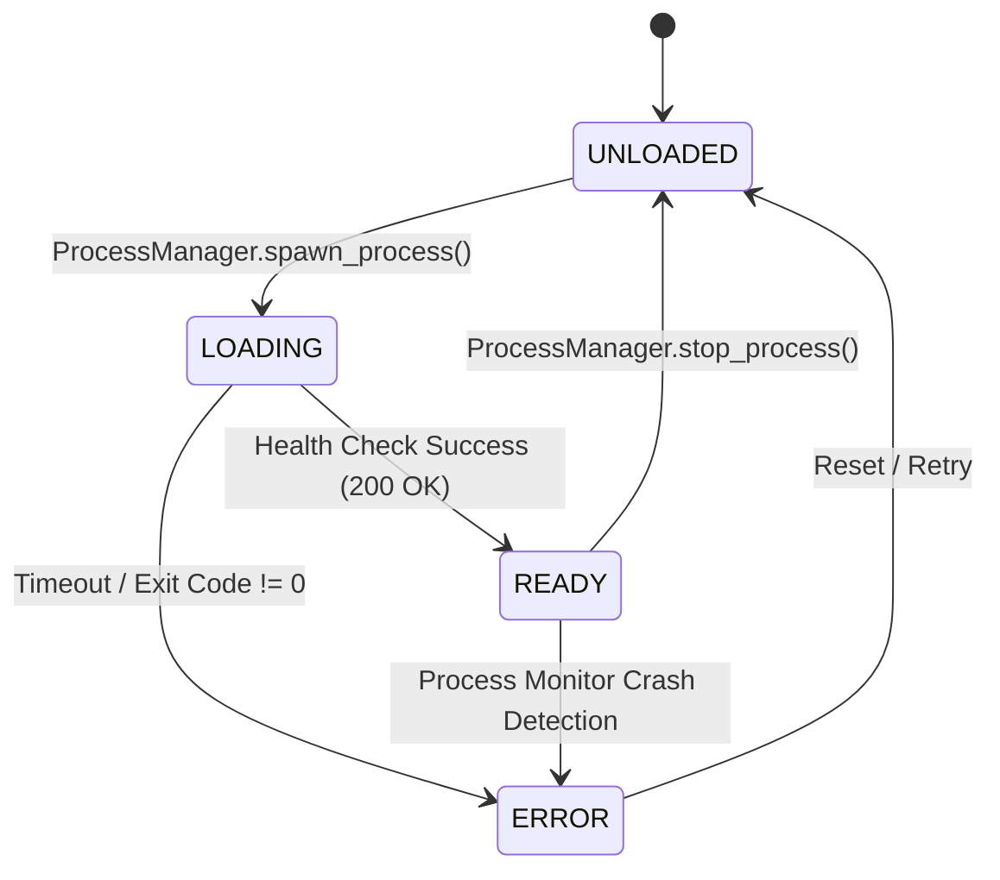

# Data Model & Schema Specification: Codebase Efficiency Refactoring

**Feature**: `006-codebase-efficiency-refactoring`  
**Date**: 2026-07-29

## Entities & Pydantic Data Models

### 1. ProcessState (Pydantic v2 Frozen Model)

불변(Immutable) 상태 관리 객체로서 `llama-server` 서브프로세스의 구동 현황 및 상태 이력을 안전하게 캡슐화합니다.

```python
from enum import Enum
from typing import Optional
from pydantic import BaseModel, ConfigDict, Field

class ProcessStatusEnum(str, Enum):
    UNLOADED = "unloaded"
    LOADING = "loading"
    READY = "ready"
    ERROR = "error"

class ProcessState(BaseModel):
    model_config = ConfigDict(frozen=True)  # Thread/Async-safe immutable model

    status: ProcessStatusEnum = Field(default=ProcessStatusEnum.UNLOADED, description="현재 프로세스 구동 상태")
    model_id: Optional[str] = Field(default=None, description="로딩된 모델 식별자 (예: gemma4-e4b)")
    port: Optional[int] = Field(default=None, description="llama-server 바인딩 포트")
    pid: Optional[int] = Field(default=None, description="OS 프로세스 PID")
    error_message: Optional[str] = Field(default=None, description="에러 발생 시 상세 메세지")
    exit_code: Optional[int] = Field(default=None, description="프로세스 종료 코드")
```

---

### 2. EventPayload (SSE Broadcast Schema)

프론트엔드 대시보드 구독자에게 실시간 전송되는 서버 상태 브로드캐스트 데이터 포맷입니다.

```python
from pydantic import BaseModel, Field
from typing import Optional

class EventPayload(BaseModel):
    status: ProcessStatusEnum = Field(..., description="서버 상태")
    model_id: Optional[str] = Field(None, description="현재 로딩된 모델 ID")
    n_ctx: Optional[int] = Field(None, description="컨텍스트 윈도우 크기")
    vram_usage_mb: Optional[int] = Field(None, description="추정 VRAM 사용량 (MB)")
    error: Optional[str] = Field(None, description="에러 메세지")
```

---

### 3. ConfigSchema & Atomic File Protocol

`ConfigManager`가 영속화하고 메모리 캐싱하는 JSON 구조 및 원자적 파일 교체 상태 흐름입니다.

```text
[In-Memory Config Cache] ──(Write Request)──> [NamedTemporaryFile in SAME dir]
                                                           │
                                                  (Flush & fsync)
                                                           │
                                                           ▼
                                                [os.replace Atomic Swap]
                                                           │
                                                           ▼
                                                [config/model_config.json]
```

---

## State Transition Lifecycle


