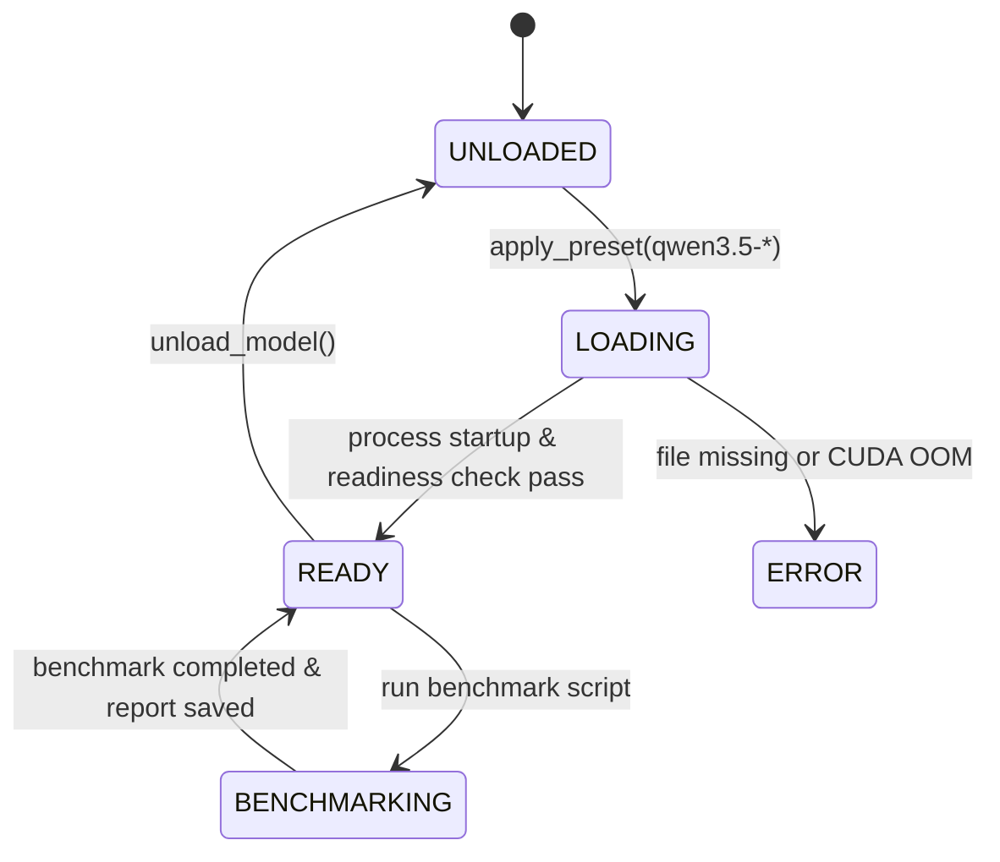

# Data Model: Qwen3.5 모델 연동 및 성능 검증 데이터 구조

## Entities

### 1. `QwenModelPreset` (Pydantic v2 Immutable Model)

Qwen3.5 및 기존 Gemma 4 모델 라인업의 메타데이터 및 바인딩 경로를 정의합니다.

```python
from pydantic import BaseModel, ConfigDict, Field
from typing import Optional

class QwenModelPreset(BaseModel):
    model_config = ConfigDict(frozen=True)

    model_id: str = Field(..., description="모델 식별자 (예: qwen3.5-2b, qwen3.5-4b, qwen3.5-9b)")
    model_name: str = Field(..., description="표시용 모델 명칭")
    gguf_path: str = Field(..., description="GGUF 모델 파일 상대/절대 경로")
    chat_template: str = Field(default="chatml", description="llama-server 채팅 템플릿 인자")
    default_n_ctx: int = Field(default=4096, description="기본 컨텍스트 크기")
    vram_limit_mb: int = Field(..., description="권장 VRAM 임계치 (MB)")
    quant_type: str = Field(default="q4_k_m", description="양자화 타입 (q4_k_m, q4_0, q8_0)")
```

### 2. `QwenPerformanceReport` (벤치마크 결과 엔티티)

모델별 벤치마크 실측 수치를 저장하고 분석 보고서 생성 시 소스로 사용합니다.

```python
class BenchmarkMetric(BaseModel):
    model_id: str
    quant_type: str
    prompt_type: str  # Short (100t), Medium (1000t), Long (4000t/8000t)
    load_time_sec: float
    ttft_ms: float
    tpot_tokens_per_sec: float
    vram_peak_mb: int
    is_oom: bool = False
    error_message: Optional[str] = None

class QwenPerformanceReport(BaseModel):
    timestamp: str
    metrics: list[BenchmarkMetric]
    recommended_model: str
    recommended_quant: str
```

## State Diagram (Qwen3.5 Benchmark & Switch Lifecycle)


