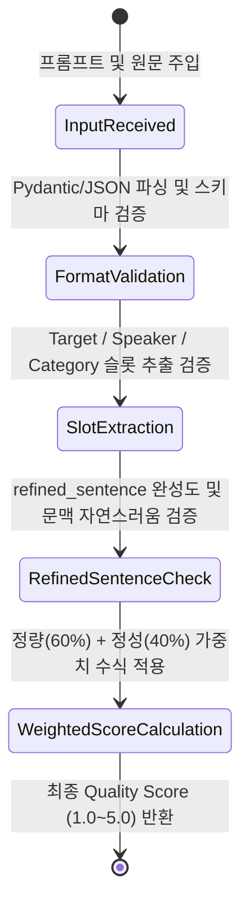

# Data Model: 모델 답변 품질 비교 분석 및 자동 검증 테스트 (Response Quality Evaluation & Benchmark)

**Feature Branch**: `008-response-quality-eval`
**Date**: 2026-07-29

## Overview

본 데이터 모델은 LLM 답변 품질 평가 엔진(`src/eval/quality_evaluator.py`) 및 종합 벤치마크 실행기(`scripts/benchmark_quality.py`)에서 사용되는 Pydantic v2 데이터 구조 및 엔티티 관계를 정의합니다.

---

## Data Entities & Schemas

### 1. `QualityBenchmarkPrompt` (평가 프롬프트 데이터셋 엔티티)

| Field Name | Type | Description | Validation Rules |
|------------|------|-------------|------------------|
| `prompt_id` | `str` | 프롬프트 고유 식별자 | 예: `"ATEAM-STOCK-01"`, `"BTEAM-REVIEW-01"` |
| `domain_type` | `str` | 도메인 유형 | `"stock_comment"`, `"restaurant_review"`, `"general_instruction"` |
| `input_text` | `str` | 원문 입력 텍스트 | 다중 문장 리뷰 또는 대화 타임라인 |
| `context_metadata` | `Optional[str]` | 상위 게시글/종목 메타정보 | ATEAM `board_context` 등 |
| `expected_slots` | `List[Dict[str, Any]]` | 정답 기준 Ground-Truth 슬롯 | `target`, `speaker`, `category` 정답 세트 |
| `expected_format` | `str` | 요구되는 출력 포맷 | `"json_object"`, `"markdown"`, `"free_text"` |
| `golden_verified` | `bool` | 인간 전문가 최종 검증 여부 | `True` / `False` |
| `golden_source` | `str` | 정답지 생성 출처 | `"teacher_generated_human_verified"` (대형모델 초안 + 인간검증) |

---

### 2. `QualityEvaluationMetric` (개별 검증 평가 수치 엔티티)

| Field Name | Type | Description | Validation Rules / Range |
|------------|------|-------------|--------------------------|
| `prompt_id` | `str` | 대상 프롬프트 ID | 필수 |
| `model_id` | `str` | 서빙 모델 ID | 예: `"qwen3.5-4b"`, `"gemma4-e4b"` |
| `json_schema_score` | `float` | JSON/포맷 파싱 정합성 점수 | `0.0` ~ `1.0` (가중치 30%) |
| `slot_precision_score` | `float` | Target/Speaker 슬롯 추출 정확도 | `0.0` ~ `1.0` (가중치 30%) |
| `narrative_naturalness_score` | `float` | 문맥 자연스러움 및 언어 점수 | `1.0` ~ `5.0` (가중치 20%) |
| `refined_completeness_score` | `float` | `refined_sentence` 정제문 완성도 | `1.0` ~ `5.0` (가중치 20%) |
| `quantitative_score` | `float` | 정량 점수 소계 | $(0.5 \times \text{json\_schema} + 0.5 \times \text{slot\_precision}) \times 5.0$ |
| `qualitative_score` | `float` | 정성 점수 소계 | $0.5 \times \text{narrative} + 0.5 \times \text{refined}$ |
| `final_quality_score` | `float` | **종합 답변 품질 점수** | **$0.6 \times \text{quantitative} + 0.4 \times \text{qualitative}$ (1.0~5.0)** |
| `error_flags` | `List[str]` | 감점/경고 발생 플래그 | `["INVALID_JSON"]`, `["HALLUCINATION"]`, `["SLOT_MISMATCH"]` 등 |

---

### 3. `ComprehensiveQualityReportMetric` (모델별 종합 3차원 레포트 엔티티)

| Field Name | Type | Description | Validation Rules / Formula |
|------------|------|-------------|----------------------------|
| `model_id` | `str` | 서빙 모델 ID | 필수 |
| `quant_type` | `str` | 양자화 포맷 | `"q4_k_m"`, `"q4_0"`, `"q8_0"` |
| `load_time_sec` | `float` | 모델 로딩 소요 시간 | 초 단위 |
| `ttft_ms` | `float` | 초통 시간 | ms 단위 |
| `tpot_tok_per_sec` | `float` | 토큰 생성 속도 | tokens/sec |
| `peak_vram_mb` | `int` | 피크 VRAM 사용량 | MB 단위 |
| `avg_quality_score` | `float` | 평균 종합 품질 점수 | 1.0 ~ 5.0 |
| `quality_per_speed_index` | `float` | **속도 대비 품질 지수** | $\frac{\text{avg\_quality\_score}}{\text{tpot\_tok\_per\_sec} \times 0.1}$ |
| `quality_per_vram_index` | `float` | **메모리 대비 품질 지수** | $\frac{\text{avg\_quality\_score}}{\text{peak\_vram\_mb} / 1024.0}$ |
| `is_oom` | `bool` | OOM 발생 여부 | `True` / `False` |

---

## State Transition & Validation Rules

