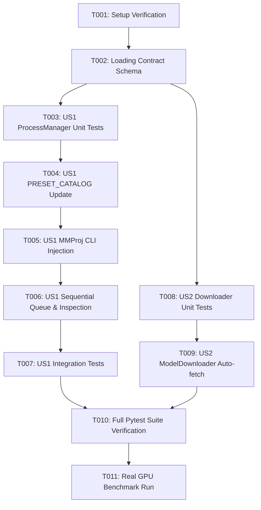

# Tasks: Gemma 4 Model Loading Fix & MMProj Vision Projector Binding

**Feature Branch**: `015-gemma4-model-loading-fix`  
**Spec**: [spec.md](file:///home/dev/storage/vllm_serv/specs/015-gemma4-model-loading-fix/spec.md) | **Plan**: [plan.md](file:///home/dev/storage/vllm_serv/specs/015-gemma4-model-loading-fix/plan.md)

---

## Phase 1: Setup & Environment Verification

- [x] T001 Verify existing model files and environment setup for Gemma 4 in `models/gemma4-2b/` and `models/gemma4-4b/`

---

## Phase 2: Foundational Prerequisites

- [x] T002 [P] Update contract JSON schema in `specs/015-gemma4-model-loading-fix/contracts/gemma4_loading_contract.json`

---

## Phase 3: User Story 1 - Gemma 4 MMProj Binding & 100% CUDA VRAM Offloading (Priority: P1)

**Goal**: Gemma 4 (E2B, E4B) 모델 개설 시 MMProj (CLIP) 프로젝터파일(`--mmproj` / `--clip_model_path`)을 자동 바인딩하여 36/36 전체 레이어가 GPU VRAM에 100% 오프로드되고 헬스체크 200 OK 상태로 즉시 준비되도록 함.

**Independent Test**: `uv run pytest tests/unit/test_process_manager.py tests/integration/test_gemma4_serving.py -v` 통과 및 `uv run python scripts/benchmark_quality.py --auto-download --real` 구동 시 Gemma 4 E2B/E4B 36/36 layers offloaded 100% 추론 성공.

- [x] T003 [P] [US1] Create unit tests for Gemma 4 MMProj preset catalog and CLI argument generation in `tests/unit/test_process_manager.py`
- [x] T004 [US1] Update `PRESET_CATALOG` in `src/core/process_manager.py` to bind MMProj projector paths (`gemma-4-E2B-it-mmproj.gguf`, `gemma-4-E4B-it-mmproj.gguf`) and `requires_mmproj=True`
- [x] T005 [US1] Update `ProcessManager.spawn_process()` in `src/core/process_manager.py` to inject `--mmproj` (standalone) or `--clip_model_path` (python module) when MMProj exists
- [x] T006 [US1] Implement single sequential inference queue parameter (`n_seq_max=1`) and VRAM offload inspection in `src/core/process_manager.py`
- [x] T007 [P] [US1] Create integration test in `tests/integration/test_gemma4_serving.py` verifying 36/36 layers offloaded to GPU and 200 OK READY state

---

## Phase 4: User Story 2 - HuggingFace Hub One-Stop MMProj Auto-Download (Priority: P1)

**Goal**: Gemma 4 모델 다운로드 시 메인 GGUF 가중치 파일과 세트 MMProj 프로젝터 파일도 한 번의 명령으로 자동 다운로드되도록 함.

**Independent Test**: `uv run pytest tests/unit/test_model_downloader.py -v` 통과 및 `ModelDownloader.download_model("gemma4-e2b")` 실행 시 메인 GGUF 및 MMProj 파일 동시 저장 검증.

- [x] T008 [P] [US2] Create unit test for one-stop MMProj auto-downloading in `tests/unit/test_model_downloader.py`
- [x] T009 [US2] Update `ModelDownloader.download_model()` in `src/core/model_downloader.py` to automatically fetch `.mmproj.gguf` files when preset `clip` field is specified

---

## Phase 5: Polish & Cross-Cutting Concerns

**Goal**: CI 듀얼 모드 테스트 수트 100% 통과 및 실측 GPU 벤치마크 마크다운 리포트 자동 생성 검증.

- [x] T010 Run full dual-mode pytest suite `uv run pytest -v` ensuring 100% test pass rate
- [x] T011 Run real GPU benchmark quality evaluation `uv run python scripts/benchmark_quality.py --auto-download --real` and verify report generation in `data/reports/analysis_report_quality.md`

---

## Dependencies & Execution Order

---

## Parallel Execution Opportunities

- **Parallel Track 1**: T003 (`test_process_manager.py`) & T008 (`test_model_downloader.py`) can be authored concurrently.
- **Parallel Track 2**: T007 (`test_gemma4_serving.py`) can be created in parallel with T009 (`model_downloader.py`) logic update.

---

## Implementation Strategy & MVP Scope

- **MVP Scope**: Phase 1 through Phase 3 (US1: Gemma 4 MMProj binding & 100% CUDA VRAM offloading).
- **Incremental Delivery**: Complete US1 → verify 100% layer offload → complete US2 auto-downloader → execute full benchmark.
