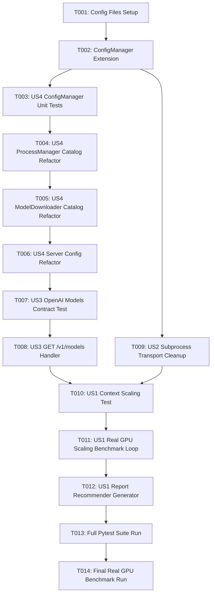

# Tasks: Real GPU Context Window Scaling Benchmark, Event Loop Cleanup, OpenAI Models API & Config Externalization

**Feature Branch**: `016-context-scaling-and-cleanup-fix`  
**Spec**: [spec.md](file:///home/dev/storage/vllm_serv/specs/016-context-scaling-and-cleanup-fix/spec.md) | **Plan**: [plan.md](file:///home/dev/storage/vllm_serv/specs/016-context-scaling-and-cleanup-fix/plan.md)

---

## Phase 1: Setup (Shared Infrastructure)

**Purpose**: Project initialization and configuration file creation

- [X] T001 Create default configuration files `config/model_catalog.json` and `config/server_config.json` per implementation plan

---

## Phase 2: Foundational (Blocking Prerequisites)

**Purpose**: ConfigManager extensions required before refactoring process manager and router

- [X] T002 Update `ConfigManager` in `src/core/config_manager.py` to load and cache `model_catalog.json` and `server_config.json` with environment variable overrides (`LLAMA_PORT`, `LLAMA_HOST`)

---

## Phase 3: User Story 4 - Hardcoded Configuration Externalization (Priority: P2)

**Goal**: Remove hardcoded dictionary constants, HF repo IDs, ports, and URLs from Python source code by connecting them to `ConfigManager`.

**Independent Test**: `uv run pytest tests/unit/test_config_manager.py -v`

- [X] T003 [P] [US4] Create unit test `tests/unit/test_config_manager.py` verifying JSON config loading, schema parsing, and environment variable overrides
- [X] T004 [US4] Refactor `ProcessManager` in `src/core/process_manager.py` to load presets and hardware limits dynamically from `ConfigManager.get_model_catalog()`
- [X] T005 [US4] Refactor `ModelDownloader` in `src/core/model_downloader.py` to load download catalog from `ConfigManager.get_model_catalog()`
- [X] T006 [US4] Refactor `src/api/routes/inference_api.py` and `src/core/llama_manager.py` to read port and host from `ConfigManager.get_server_config()`

---

## Phase 4: User Story 3 - OpenAI API Standard `GET /v1/models` Endpoint (Priority: P1)

**Goal**: Provide a dynamic OpenAI-compatible `GET /v1/models` endpoint returning all catalog models with local availability and active serving state.

**Independent Test**: `uv run pytest tests/unit/test_openai_models.py -v` & `curl http://127.0.0.1:8000/v1/models`

- [X] T007 [P] [US3] Create contract unit test `tests/unit/test_openai_models.py` verifying `GET /v1/models` JSON format against `openai_models_contract.json`
- [X] T008 [US3] Implement `@router.get("/v1/models")` dynamic handler in `src/api/routes/inference_api.py` querying model catalog and active state

---

## Phase 5: User Story 2 - Subprocess Transport Clean Exit (Priority: P1)

**Goal**: Eliminate `BaseSubprocessTransport.__del__ RuntimeError: Event loop is closed` warnings on script termination.

**Independent Test**: `uv run pytest tests/unit/test_process_manager.py -v` verifying clean transport closure without warnings.

- [X] T009 [US2] Update `ProcessManager.stop_process()` in `src/core/process_manager.py` to close `_transport` explicitly and yield microtask `await asyncio.sleep(0)`

---

## Phase 6: User Story 1 - Real GPU Multi-Context Scaling & Recommendation Engine (Priority: P1) 🎯 MVP

**Goal**: Execute real GPU multi-context benchmark (2K~32K) measuring VRAM, TTFT, TPOT, and generate optimal model & context recommendation matrix in report.

**Independent Test**: `PYTHONUNBUFFERED=1 uv run python -u scripts/benchmark_quality.py --auto-download --real` generates report with scaling table and recommendation matrix.

- [X] T010 [P] [US1] Create integration test `tests/integration/test_context_scaling.py` verifying multi-context loop execution
- [X] T011 [US1] Refactor `scripts/benchmark_quality.py` to iterate over `n_ctx` (2K, 4K, 8K, 16K, 32K) with real GPU process spawning loop
- [X] T012 [US1] Update `QualityEvaluator.generate_markdown_report()` in `src/eval/quality_evaluator.py` to format scaling comparison table and optimal model recommendation matrix

---

## Phase 7: Polish & Cross-Cutting Concerns

**Goal**: CI dual-mode test suite validation and real GPU benchmark execution.

- [X] T013 [P] Run full dual-mode pytest suite `uv run pytest -v` ensuring 100% test pass rate
- [X] T014 Run real GPU multi-context quality evaluation `uv run python scripts/benchmark_quality.py --auto-download --real` and verify report generation in `data/reports/analysis_report_quality.md`

---

## Dependencies & Execution Order

---

## Parallel Execution Opportunities

- **Parallel Track 1**: T003 (`test_config_manager.py`), T007 (`test_openai_models.py`), T010 (`test_context_scaling.py`) unit/contract tests can be authored concurrently.
- **Parallel Track 2**: T009 (`stop_process` cleanup) can be updated in parallel with T008 (`GET /v1/models` handler).

---

## Implementation Strategy & MVP Scope

- **MVP Scope**: Phase 1 through Phase 6 (US1 context scaling + US2 clean exit + US3 OpenAI API + US4 config externalization).
- **Incremental Delivery**: Setup config JSONs → extend ConfigManager → update ProcessManager/Downloader → add GET /v1/models → fix transport cleanup → run real GPU scaling benchmark.

---

## Phase 8: Convergence

- [X] T015 Fix BaseSubprocessTransport garbage collection `RuntimeError: Event loop is closed` exception on script exit per US2/FR-005/DoD-003 (partial)

