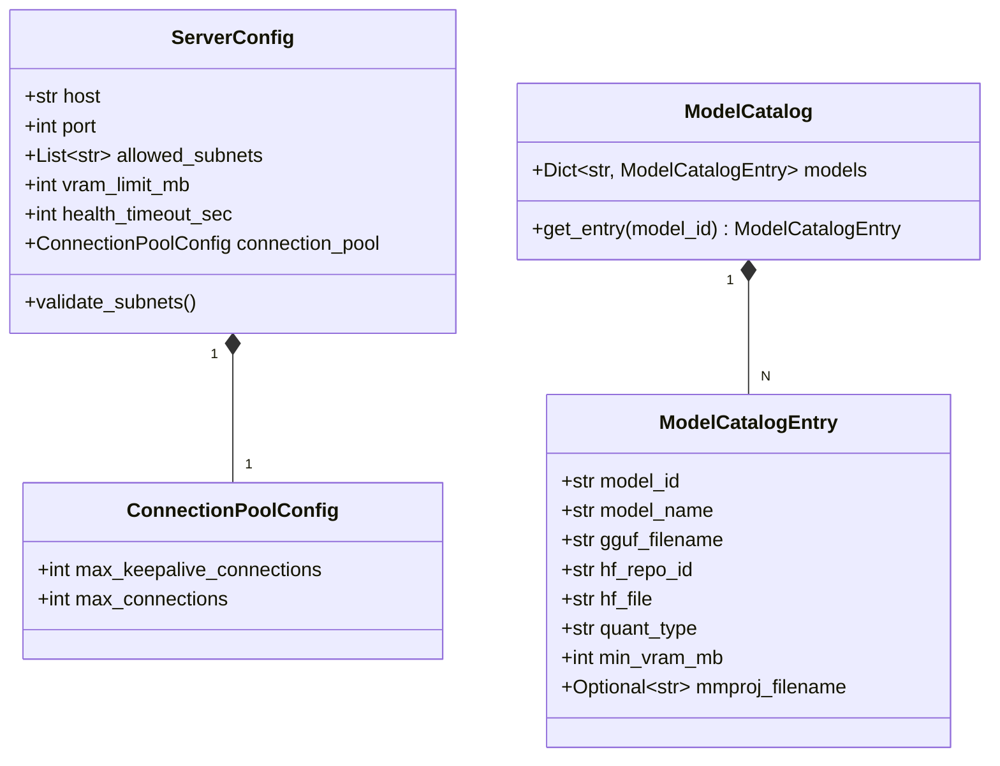

# Phase 1 Data Model: Refactored Entities & Schemas

**Feature Branch**: `specs/017-codebase-refactoring-cleanup`  
**Date**: 2026-07-29

---

## 1. Core Architecture Entities



---

## 2. Pydantic Schema Specifications

### `ServerConfig` Schema
- **Description**: `config/server_config.json` 및 환경변수(`LLAMA_HOST`, `LLAMA_PORT` 등) 동적 바인딩 모델.
- **Fields**:
  - `host`: `str` (기본값 `"0.0.0.0"` 또는 `"127.0.0.1"`)
  - `port`: `int` (기본값 `8081`, 범위 `1024` ~ `65535`)
  - `allowed_subnets`: `List[str]` (기본값 `["127.0.0.1", "192.168.0.0/24"]`)
  - `vram_limit_mb`: `int` (기본값 `11264`)
  - `health_timeout_sec`: `int` (기본값 `120`)
  - `connection_pool`: `ConnectionPoolConfig`

### `ModelCatalogEntry` Schema
- **Description**: `config/model_catalog.json` 내 단일 LLM 서빙 모델 명세.
- **Fields**:
  - `model_id`: `str` (예: `"qwen3.5-4b"`, `"gemma4-e4b"`)
  - `model_name`: `str`
  - `gguf_filename`: `str`
  - `hf_repo_id`: `str`
  - `hf_file`: `str`
  - `quant_type`: `str`
  - `min_vram_mb`: `int`
  - `mmproj_filename`: `Optional[str]`

---

## 3. Subnet CIDR Security Filter Rule Entity

- **Entity**: `IpSubnetGuard`
- **Logic**:
  ```python
  import ipaddress

  class IpSubnetGuard:
      def __init__(self, allowed_cidrs: list[str]):
          self.networks = [ipaddress.ip_network(cidr, strict=False) for cidr in allowed_cidrs]

      def is_allowed(self, client_ip: str) -> bool:
          ip = ipaddress.ip_address(client_ip)
          return any(ip in net for net in self.networks)
  ```
