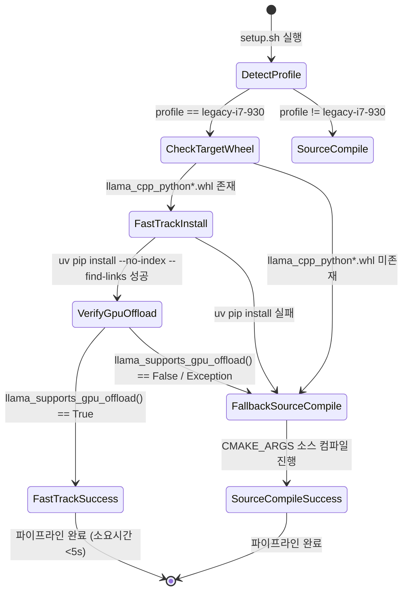

# Data Model: 구형 i7-930 휠 탐색 및 복원 상태 데이터 모델 (030-fix-legacy-wheel-selection)

## Entities & Attributes

### 1. LegacyWheelArtifact (사전 빌드 휠 아티팩트)

`wheels/legacy_i7_930/` 디렉터리에 보관되는 파이썬 `.whl` 바이너리 패키지 파일.

- **`wheel_path`** (`Path`): 휠 파일의 절대/상대 경로 (예: `wheels/legacy_i7_930/llama_cpp_python-0.3.34-py3-none-linux_x86_64.whl`)
- **`package_name`** (`String`): 휠 패키지 식별 명칭 (`llama_cpp_python`)
- **`is_target_wheel`** (`Boolean`): Fast-Track 주요 대상 휠 여부 (`package_name == "llama_cpp_python"`)
- **`cuda_enabled`** (`Boolean`): C++ CUDA backend 활성화 컴파일 여부

### 2. FastTrackInstallationContext (Fast-Track 복원 맥락)

`scripts/setup.sh` 파이프라인 수행 중 Fast-Track 휠 복원의 진행 상태 및 결과.

- **`target_profile`** (`String`): 매칭된 플랫폼 프로필 (예: `legacy-i7-930-gtx1070`)
- **`detected_wheel`** (`String | None`): 매칭된 `llama_cpp_python` 휠 경로
- **`installed_via_fast_track`** (`Integer`): Fast-Track 성공 여부 플래그 (`1` = 성공, `0` = 소스 컴파일 Fallback)
- **`gpu_offload_verified`** (`Boolean`): `llama_supports_gpu_offload()` 검증 합격 여부

## State Transitions

