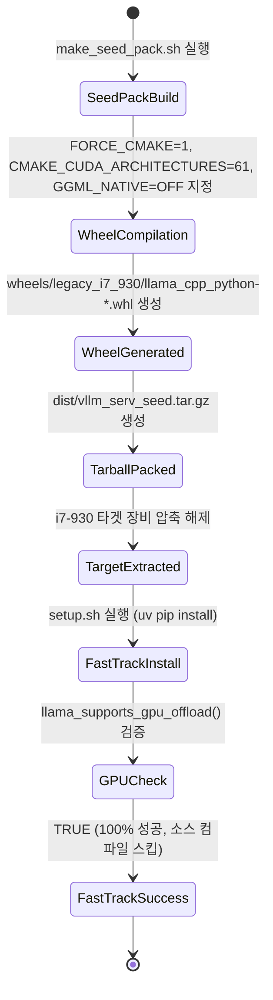

# Data Model: i7-930 사전 빌드 휠 및 시드 팩 엔티티 (031-fix-seed-pack-cuda-arch)

## Entities

### 1. LegacyPrebuiltWheelArtifact (엔티티)

`wheels/legacy_i7_930/` 디렉터리에 보관되는 `llama_cpp_python` 사전 빌드 파이썬 휠 파일 아티팩트.

| Attribute | Type | Description |
|-----------|------|-------------|
| `file_name` | `string` | `llama_cpp_python-0.3.34-py3-none-linux_x86_64.whl` |
| `target_profile` | `string` | `legacy-i7-930-gtx1070` |
| `target_gpu_arch` | `string` | `sm_61` (GTX 1070, Compute Capability 6.1) |
| `cuda_architectures` | `string` | `61` (`-DCMAKE_CUDA_ARCHITECTURES=61`) |
| `ggml_native` | `boolean` | `false` (`-DGGML_NATIVE=OFF`) |
| `force_cmake` | `boolean` | `true` (`FORCE_CMAKE=1`) |
| `cpu_simd_disabled` | `list[string]` | `["AVX", "AVX2", "F16C", "FMA"]` |
| `location` | `string` | `wheels/legacy_i7_930/llama_cpp_python-0.3.34-py3-none-linux_x86_64.whl` |

---

## State Transition & Fast-Track Lifecycle

