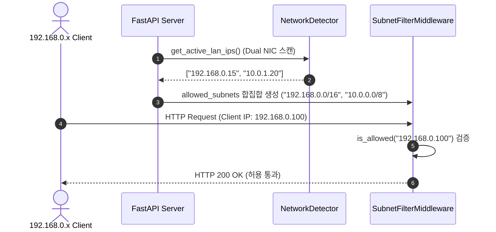

# Data Model: 듀얼 NIC 서브넷 인가 및 동적 네트워크 엔티티 (032-fix-internal-subnet-access)

## Entities

### 1. DynamicSubnetGuard (엔티티)

`IpSubnetGuard` 클래스 기반 런타임 클라이언트 서브넷 인가 엔진.

| Attribute | Type | Description |
|-----------|------|-------------|
| `networks` | `list[ipaddress.IPv4Network]` | 파싱된 허용 CIDR 대역 네트워크 객체 목록 |
| `base_subnets` | `list[string]` | `["127.0.0.1", "192.168.0.0/16", "10.0.0.0/8", "172.16.0.0/12"]` |
| `detected_active_ips` | `list[string]` | `NetworkDetector`에서 스캔한 활성 LAN IPv4 주소 목록 |
| `union_allowed_subnets` | `list[string]` | 정적 기본 대역과 실측 감지 CIDR의 중복 제거 합집합 |

---

## Data Flow & Request Filtering Sequence

