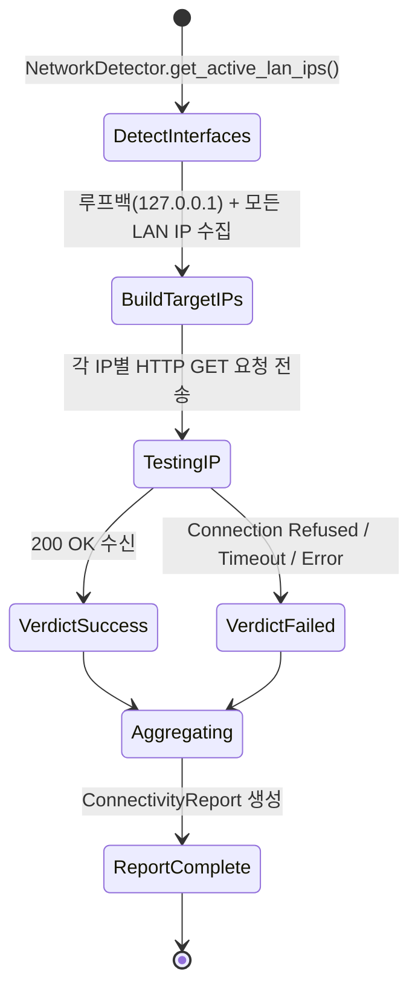

# Phase 1 Data Model: Assigned IP Server Verification Test

## Entities & Data Structures

### 1. `IPTestVerdict` (개별 IP 접속 검증 결과 개체)

단일 IP 주소 및 포트에 대한 접속, 호출, 응답 시도의 상세 결과를 기록합니다.

| Field Name | Type | Description | Constraints / Examples |
|------------|------|-------------|------------------------|
| `ip_address` | `str` | 검증 대상 IP 주소 | 예: `"127.0.0.1"`, `"192.168.1.100"` |
| `port` | `int` | 검증 대상 서버 포트 | 예: `8081`, `8089` |
| `endpoint` | `str` | 검증 대상 HTTP 엔드포인트 경로 | 예: `"/health"`, `"/v1/models"` |
| `status` | `str` | 접속 및 응답 최종 상태 판정 | `"SUCCESS"`, `"FAILED"`, `"TIMEOUT"`, `"CONNECTION_REFUSED"` |
| `http_status_code` | `Optional[int]` | 수신된 HTTP 응답 상태 코드 | 예: `200`, `500` (접속 불가 시 `None`) |
| `response_time_ms` | `float` | 요청 전송부터 응답 완료까지 소요 시간(ms) | `>= 0.0` |
| `error_message` | `Optional[str]` | 실패 시 원인 진단 메시지 | 예: `"ConnectionRefusedError: [Errno 111] Connection refused"` |

---

### 2. `ConnectivityReport` (종합 네트워크 검증 보고서 개체)

모든 루프백 및 할당 IP에 대한 검증 결과를 집계한 종합 리포트입니다.

| Field Name | Type | Description | Constraints / Examples |
|------------|------|-------------|------------------------|
| `tested_ips` | `List[str]` | 검증이 수행된 전체 IP 목록 | 루프백 + 듀얼랜 포함 할당 LAN IP 전체 |
| `verdicts` | `List[IPTestVerdict]` | 각 IP별 개별 검증 결과 목록 | `len(verdicts) == len(tested_ips)` |
| `all_passed` | `bool` | 모든 테스트 대상 IP가 접속 및 응답 성공하였는지 여부 | `True` if all `status == "SUCCESS"` else `False` |
| `failed_ips` | `List[str]` | 접속 또는 응답에 실패한 IP 주소 목록 | 실패한 IP 주소 문자열 리스트 |
| `summary_message` | `str` | 요약 진단 텍스트 메시지 | 예: `"3/3 IPs PASSED (127.0.0.1, 192.168.1.10, 10.0.0.5)"` |

---

### 3. `ServerNetworkContext` (서버 네트워크 컨텍스트)

검증에 사용되는 서버 바인딩 및 인터페이스 정보를 담는 엔티티입니다.

| Field Name | Type | Description | Constraints / Examples |
|------------|------|-------------|------------------------|
| `bind_host` | `str` | 서버 리슨 호스트 설정 | 기본값: `"0.0.0.0"` |
| `api_port` | `int` | 서버 서비스 API 포트 | 기본값: `8081` |
| `loopback_ip` | `str` | 루프백 검증 IP | `"127.0.0.1"` |
| `active_lan_ips` | `List[str]` | 감지된 활성 비-루프백 LAN IP 목록 | 예: `["192.168.1.100", "10.0.0.5"]` |

## State & Flow Transition

