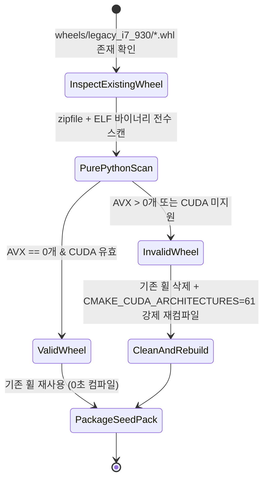

# Phase 1 Data Model: Seed Pack Wheel Validation & Setup Failure Diagnostics

## Entities & Data Structures

### 1. `WheelScanReport` (휠 바이너리 스캔 결과 개체)

사전 빌드 휠 내 모든 `.so` 공유 라이브러리의 AVX 명령어 및 CUDA 지원 여부 스캔 결과를 수록합니다.

| Field Name | Type | Description | Constraints / Examples |
|------------|------|-------------|------------------------|
| `wheel_path` | `str` | 검사 대상 `.whl` 파일 경로 | 예: `"wheels/legacy_i7_930/llama_cpp_python-0.3.34-py3-none-linux_x86_64.whl"` |
| `is_valid` | `bool` | 휠 바이너리의 시드 팩 수용 가능 여부 | `True` (AVX 0개 & CUDA 유효) / `False` |
| `scanned_so_files` | `List[str]` | 휠 내부에서 스캔된 전체 `.so` 파일 목록 | 예: `["libggml-base.so", "libggml-cpu.so", "libggml-cuda.so", "libllama.so"]` |
| `avx_instruction_count` | `int` | 검출된 총 AVX 명령어 수 | `0` (정상) / `> 0` (오염됨) |
| `cuda_enabled` | `bool` | CUDA GPU 백엔드 포함 여부 | `True` |
| `scan_error` | `Optional[str]` | 스캔 과정에서 발생한 예외/오류 | 예: `"Corrupted ZIP header"` (정상 시 `None`) |

---

### 2. `SetupValidationDiagnostic` (Fast-Track 검증 진단 개체)

`setup.sh` 구동 시 Fast-Track 사전 빌드 휠 검증 시도 결과 및 캡처된 stderr 정보를 저장합니다.

| Field Name | Type | Description | Constraints / Examples |
|------------|------|-------------|------------------------|
| `exit_code` | `int` | 파이썬 검증 프로세스 종료 코드 | `0` (성공) / `!= 0` (실패) |
| `failure_category` | `str` | 분류된 실패 원인 텍스트 | `"SIGILL_ILLEGAL_INSTRUCTION"`, `"CUDA_DRIVER_ERROR"`, `"IMPORT_ERROR"`, `"GPU_OFFLOAD_FALSE"` |
| `summary_reason` | `str` | 가독성 높은 1줄 핵심 진단 로그 | 예: `"Illegal Instruction (AVX unsupported by host CPU)"` |
| `raw_stderr` | `str` | 캡처된 파이썬 stderr 전문 | Traceback 및 예외 출력 원본 |

## State & Flow Transition

