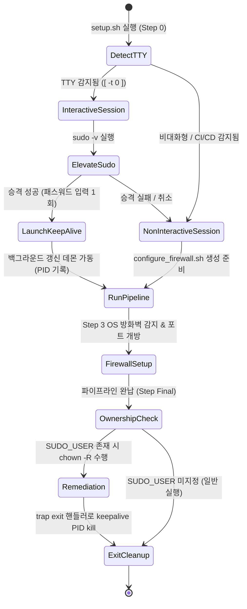

# Data Model & Schema Specification: 시드 팩 마이그레이션 및 setup.sh 관리자 권한·방화벽 자동화

**Feature Branch**: `039-seed-pack-sudo-firewall-migration`  
**Created**: 2026-07-30  
**Status**: Draft  

---

## 1. Core Entities & Data Structures

### 1.1 SudoSessionState (쉘 & Python 런타임 수용)

`setup.sh` 구동 시 관리자 권한 획득 상태 및 백그라운드 갱신 데몬 관리를 나타내는 엔티티입니다.

| Attribute | Type | Description | Validation / Constraints |
|-----------|------|-------------|--------------------------|
| `is_interactive` | boolean | TTY 터미널 세션 여부 (`[ -t 0 ]`) | True: 대화형, False: 비대화형(CI/CD) |
| `has_sudo_access` | boolean | `sudo -v` 또는 `sudo -n true` 성공 여부 | True: 승격 성공, False: 권한 없음 |
| `sudo_user` | string | `$SUDO_USER` 계정명 | `sudo` 실행 시 원본 사용자 계정, 미지정 시 현재 계정 |
| `sudo_uid` | integer | `$SUDO_UID` 계정 ID | 소유권 보정 대상 사용자 UID |
| `sudo_gid` | integer | `$SUDO_GID` 그룹 ID | 소유권 보정 대상 사용자 GID |
| `keepalive_pid` | integer (optional) | 백그라운드 타임스탬프 갱신 루프 프로세스 PID | 종료 시 `kill` 대상 PID |

---

### 1.2 FirewallSystemType (Enum)

시스템에 활성화된 OS 방화벽 엔진 구분입니다.

| Value | Utility Binary | Target OS Family | Command Pattern |
|-------|----------------|------------------|-----------------|
| `ufw` | `/usr/sbin/ufw` | Ubuntu, Debian | `ufw allow <port>/tcp` |
| `firewalld` | `/usr/bin/firewall-cmd` | RHEL, CentOS, Rocky Linux, Fedora | `firewall-cmd --permanent --add-port=<port>/tcp && firewall-cmd --reload` |
| `nftables` | `/usr/sbin/nft` | Debian 10+, Arch, RHEL 8+ | `nft add rule inet filter input tcp dport <port> accept` |
| `iptables` | `/sbin/iptables` | Generic Linux / Legacy | `iptables -A INPUT -p tcp --dport <port> -j ACCEPT` |
| `unknown` | N/A | Docker Container, Minimal Linux | (No rule applied, warning emitted) |

---

### 1.3 FirewallRuleConfig

개방 대상 서비스 포트 및 네트워크 정책을 기술하는 도메인 데이터 구조입니다.

| Field | Type | Default | Description |
|-------|------|---------|-------------|
| `service_name` | string | Required | 예: `"OpenAI API & Dashboard"`, `"Backend llama.cpp"` |
| `port` | integer | Required | 서비스 포트 번호 (`8081`, `8089`) |
| `protocol` | string | `"tcp"` | 전송 프로토콜 (`"tcp"`, `"udp"`) |
| `subnet_cidr` | string (optional) | `""` | 허용할 서브넷 CIDR (예: `"10.0.0.0/8"`, 빈값 시 전체 개방) |

---

### 1.4 FirewallStatusInfo (Python Dataclass & Shell Output Schema)

방화벽 설정 및 포트 검증 결과를 담는 응답 데이터 구조입니다.

```python
@dataclass
class FirewallStatusInfo:
    system_type: str            # "ufw" | "firewalld" | "nftables" | "iptables" | "unknown"
    is_firewall_active: bool    # OS 방화벽 활성화 유무
    port_open_success: bool     # 지정 포트 개방 성공 여부
    requires_sudo: bool         # sudo 승격 필요 여부
    guide_message: str          # 권한 거부 시 표출할 복구 가이드 메시지
```

---

### 1.5 OwnershipCorrectionConfig

`sudo ./setup.sh` 구동 완료 후 소유권을 환원할 대상 디렉토리 및 정책 정의입니다.

| Target Path | Target Owner | Recursive | Description |
|-------------|--------------|-----------|-------------|
| `.venv/` | `$SUDO_USER:$SUDO_USER` | True | Python 가상환경 내 모든 패키지 및 바이너리 소유권 원복 |
| `logs/` | `$SUDO_USER:$SUDO_USER` | True | 애플리케이션 로그 디렉토리 권한 보정 |
| `config/` | `$SUDO_USER:$SUDO_USER` | True | 설정 파일 소유권 원복 |
| `.` (workspace root) | `$SUDO_USER:$SUDO_USER` | False | 작업 디렉토리 루트 소유권 확인 |

---

## 2. State Transitions & Lifecycle

### 2.1 Sudo Lifecycle in `setup.sh`


