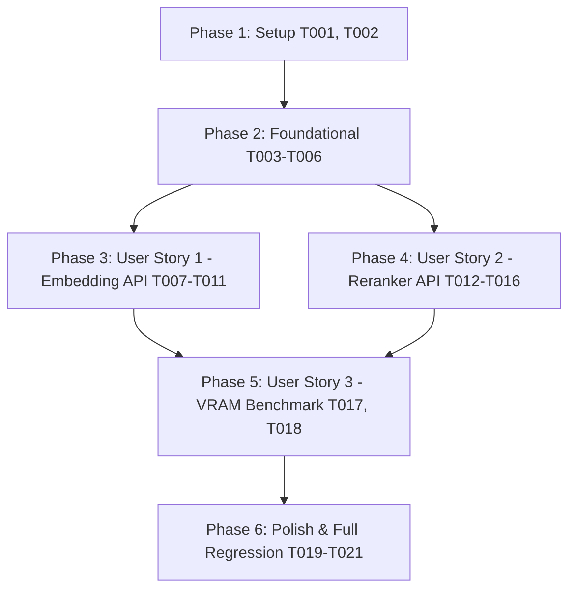

# Tasks: 임베딩(Embedding) 및 리랭커(Reranker) 모델 서빙 지원 및 1세대 코어(Nehalem) CPU 호환성 검증 (053-embedding-reranker-model-serving)

**Input**: Design documents from `/specs/053-embedding-reranker-model-serving/`  
**Prerequisites**: [plan.md](file:///home/dev/storage/vllm_serv/specs/053-embedding-reranker-model-serving/plan.md), [spec.md](file:///home/dev/storage/vllm_serv/specs/053-embedding-reranker-model-serving/spec.md), [research.md](file:///home/dev/storage/vllm_serv/specs/053-embedding-reranker-model-serving/research.md), [data-model.md](file:///home/dev/storage/vllm_serv/specs/053-embedding-reranker-model-serving/data-model.md), [contracts/](file:///home/dev/storage/vllm_serv/specs/053-embedding-reranker-model-serving/contracts/)

**Tests**: 헌법 v1.6.0 (Principle II & VII)에 따라 실물 시스템 연동 테스트(`tests/unit/test_embedding_reranker_serving.py`) 작성이 의무 사항입니다.

---

## Format: `[TaskID] [P?] [Story] Description`

- **[P]**: 병렬 실행 가능 (서로 다른 파일, 의존성 없음)
- **[Story]**: 해당 과제가 속한 유저 스토리 라벨 ([US1], [US2], [US3])
- 모든 작업 설명에는 대상 파일의 절대/상대 경로가 명시되어 있습니다.

---

## Phase 1: Setup (기반 데이터 및 카탈로그 명세)

**Purpose**: 임베딩 및 리랭커 모델 카탈로그 스키마 등록 및 구성 파일 업데이트

- [x] T001 `config/model_catalog.json`에 `bge-m3` (task_type: embedding, port: 8090) 및 `bge-reranker-v2-m3` (task_type: rerank, port: 8091) 카탈로그 명세 추가
- [x] T002 [P] `config/server_config.json` 및 `src/core/config_manager.py`에 `embedding_backend_port`(8090), `rerank_backend_port`(8091), `embedding_enabled`, `rerank_enabled` 설정 필드 및 Pydantic v2 유효성 검증 추가

---

## Phase 2: Foundational (멀티 인스턴스 백엔드 인프라 구축)

**Purpose**: `ProcessManager` 및 `ModelDownloader` 확장으로 다중 `llama-server` 프로세스 생주 및 자동 다운로드 지원 (모든 유저 스토리의 필수 차단 전제 조건)

- [x] T003 `src/core/config_manager.py`의 `ModelCatalogEntry` 모델에 `task_type` 및 `default_port` 필드 추가 및 `TaskTypeEnum` 정의
- [x] T004 `src/core/model_downloader.py`에서 `bge-m3` 및 `bge-reranker-v2-m3` 카탈로그 항목이 `ModelDownloader` 자동 다운로드 파이프라인과 100% 연동되도록 바인딩
- [x] T005 `src/core/process_manager.py`를 확장하여 LLM(포트 8089), 임베딩(포트 8090), 리랭커(포트 8091) 3개 독립 프로세스를 동시 관리하고, task_type에 따라 `--embedding` 및 `--reranking` 실행 플래그를 자동 부여하도록 구현
- [x] T006 `src/core/process_manager.py`에 임베딩/리랭커 인스턴스 헬스체크 및 크래시 자동 재시작(Recovery) 루프 구현 (FR-007)

---

## Phase 3: User Story 1 - 임베딩(Embedding) API 엔드포인트 서빙 및 테스트 (Priority: P1) 🎯 MVP

**Goal**: OpenAI 호환 `POST /v1/embeddings` 및 `POST /embedding` 엔드포인트를 통해 BGE-M3 (1024차원) 밀집 벡터 응답을 투명 프록시 서빙하고 Nehalem CPU 호환성 검증

**Independent Test**: `POST /v1/embeddings`에 `{"model": "bge-m3", "input": ["Hello world"]}` 호출 시 1024차원 float 벡터 배열 수신 검증

### Tests for User Story 1 (MANDATORY)

- [x] T007 [P] [US1] `tests/unit/test_embedding_reranker_serving.py`에 임베딩 API (`POST /v1/embeddings`) 연동 및 백엔드 포워딩 실측 단위 테스트 작성 (실행 시 실패 확인)

### Implementation for User Story 1

- [x] T008 [P] [US1] `src/api/routes/inference_api.py`에 OpenAI 규격 `EmbeddingRequest` / `EmbeddingResponse` DTO 및 `POST /v1/embeddings`, `POST /embedding` 엔드포인트 라우팅 구현 (8090 포트로 프록시)
- [x] T009 [US1] `src/api/server.py`의 `lifespan` 관리자에 서버 기동 시 임베딩 `llama-server` 인스턴스 자동 기동(FR-006) 및 HTTP 비동기 커넥션 풀 연결 추가
- [x] T010 [US1] `legacy-i7-930-gtx1070` CPU 프로필 하에서 임베딩 서빙 기동 시 Non-AVX 바이너리 선택 및 CUDA 100% 오프로딩(`-ngl 99`) 적용 검증 (FR-003)
- [x] T011 [US1] `tests/unit/test_embedding_reranker_serving.py` 테스트 수트 실행하여 임베딩 API 실체 연동 Green 통과 보장

---

## Phase 4: User Story 2 - 리랭커(Reranker) API 엔드포인트 서빙 및 테스트 (Priority: P1)

**Goal**: 표준 Cross-Encoder `POST /v1/rerank` 및 `POST /rerank` 엔드포인트를 통해 BGE-Reranker-v2-M3 관련도 점수 응답을 투명 프록시 서빙하고 Nehalem CPU 호환성 검증

**Independent Test**: `POST /v1/rerank`에 `{"query": "q", "documents": ["doc1", "doc2"]}` 호출 시 relevance_score 수신 검증

### Tests for User Story 2 (MANDATORY)

- [x] T012 [P] [US2] `tests/unit/test_embedding_reranker_serving.py`에 리랭커 API (`POST /v1/rerank`) 연동 및 관련도 점수 정합성 단위 테스트 추가 (실행 시 실패 확인)

### Implementation for User Story 2

- [x] T013 [P] [US2] `src/api/routes/inference_api.py`에 `RerankRequest` / `RerankResponse` DTO 및 `POST /v1/rerank`, `POST /rerank` 엔드포인트 라우팅 구현 (8091 포트로 프록시)
- [x] T014 [US2] `src/api/server.py`의 `lifespan` 관리자에 서버 기동 시 리랭커 `llama-server` 인스턴스 자동 기동(FR-006) 및 헬스체크 연결 추가
- [x] T015 [US2] `legacy-i7-930-gtx1070` CPU 프로필 하에서 리랭커 서빙 기동 시 Non-AVX 바이너리 선택 및 CUDA 100% 오프로딩(`-ngl 99`) 적용 검증 (FR-003)
- [x] T016 [US2] `tests/unit/test_embedding_reranker_serving.py` 테스트 수트 실행하여 리랭커 API 실체 연동 Green 통과 보장

---

## Phase 5: User Story 3 - VRAM 동시 로딩 벤치마크 & 플랫폼 검증 (Priority: P2)

**Goal**: 임베딩 + 리랭커 + LLM 3개 인스턴스 동시 상주 시 target GPU 플랫폼(GTX 1070, GTX 1080 Ti, RTX 3060)별 VRAM 초과 여부 실측 검증 (FR-005, SC-004)

**Independent Test**: `scripts/benchmark_quality.py` 실행 시 VRAM 예산 적합성 100% 통과 또는 하향 권고 출력 검증

- [x] T017 [P] [US3] `scripts/benchmark_quality.py`를 확장하여 임베딩(`bge-m3`) + 리랭커(`bge-reranker-v2-m3`) + LLM 동시 로딩 시 플랫폼별 VRAM 점유율 측정 및 적합성 검증 보고서 생성 기능 구현
- [x] T018 [US3] `tests/integration/test_quality_benchmark.py`에 동시 로딩 벤치마크 검증 통합 테스트 수트 추가

---

## Phase 6: Polish & Cross-Cutting Concerns (정리 및 회귀 검증)

**Purpose**: 전체 테스트 수트 및 E2E 브라우저 회귀 검증, 헌법 v1.6.0 준수 확인

- [x] T019 [P] `src/api/routes/dashboard_api.py` 및 대시보드 API에 활성 모델 상태(LLM / Embedding / Reranker) 3종 모니터링 응답 노출
- [x] T020 [P] `specs/053-embedding-reranker-model-serving/quickstart.md` 가이드에 맞춰 end-to-end `curl` 및 `uv run pytest` 실측 수렴 검증 수행
- [x] T021 헌법 v1.6.0 (Principle VII) 규정에 따라 전체 회귀 테스트 수트 (`uv run pytest tests/`) 실행하여 100% Green 통과 보장

---

## Dependencies & Execution Order

---

## Implementation Strategy

### MVP First (User Story 1)
1. Phase 1 (Setup) -> Phase 2 (Foundational) 순차 완성
2. Phase 3 (User Story 1: Embedding API) 완성 및 독립 테스트 검증 (MVP!)
3. Phase 4 (User Story 2: Reranker API) 확장 및 독립 테스트 검증
4. Phase 5 (VRAM Co-loading Benchmark) 검증 및 Phase 6 회귀 검증 완납
