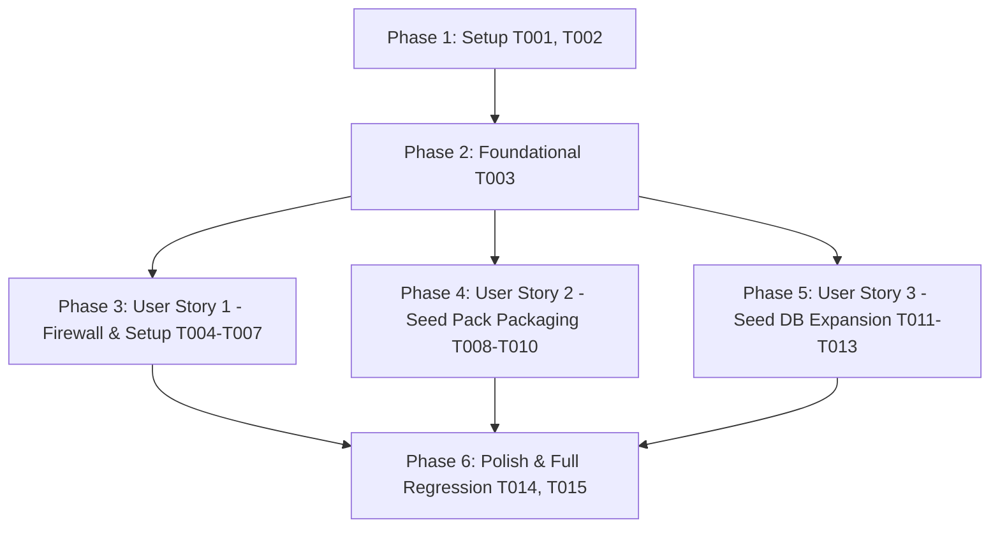

# Tasks: 신규 스펙(임베딩/리랭커 서빙 및 방화벽 포트 등)의 Seed Pack 및 setup.sh 동기화 반영 (054-seedpack-setup-sync)

**Input**: Design documents from `/specs/054-seedpack-setup-sync/`  
**Prerequisites**: [plan.md](file:///home/dev/storage/vllm_serv/specs/054-seedpack-setup-sync/plan.md), [spec.md](file:///home/dev/storage/vllm_serv/specs/054-seedpack-setup-sync/spec.md), [research.md](file:///home/dev/storage/vllm_serv/specs/054-seedpack-setup-sync/research.md), [data-model.md](file:///home/dev/storage/vllm_serv/specs/054-seedpack-setup-sync/data-model.md), [contracts/](file:///home/dev/storage/vllm_serv/specs/054-seedpack-setup-sync/contracts/)

**Tests**: 헌법 v1.6.0 (Principle II & VII)에 따라 실물 스크립트 및 통합 연동 테스트(`tests/unit/test_seed_pack.py`, `tests/integration/test_migration_pipeline.py`) 작성이 의무 사항입니다.

---

## Format: `[TaskID] [P?] [Story] Description`

- **[P]**: 병렬 실행 가능 (서로 다른 파일, 의존성 없음)
- **[Story]**: 해당 과제가 속한 유저 스토리 라벨 ([US1], [US2], [US3])
- 모든 작업 설명에는 대상 파일의 절대/상대 경로가 명시되어 있습니다.

---

## Phase 1: Setup (기반 스크립트 및 테스트 구조 검증)

**Purpose**: 프로젝트 기본 스크립트 파싱 상태 검증 및 테스트 환경 확인

- [X] T001 `scripts/setup.sh`, `scripts/make_seed_pack.sh`, `scripts/seed_db.py` 쉘 및 파이썬 구문 정상 구동 검증 (`bash -n scripts/setup.sh`, `bash -n scripts/make_seed_pack.sh`)
- [X] T002 [P] `tests/unit/test_seed_pack.py` 및 `tests/integration/test_migration_pipeline.py` 동기화 테스트 수트 환경 준비

---

## Phase 2: Foundational (공통 상수 및 계약 스키마 확정)

**Purpose**: 4개 멀티 백엔드 서비스 포트(8081, 8089, 8090, 8091) 공통 바인딩 규격 확정

- [X] T003 `scripts/setup.sh` 및 `scripts/configure_firewall.sh`에 공통으로 바인딩할 방화벽 포트 배열 `FIREWALL_PORTS=(8081 8089 8090 8091)` 구조 확정

---

## Phase 3: User Story 1 - 신규 스펙 포트 OS 방화벽 및 `setup.sh` 자동 반영 (Priority: P1) 🎯 MVP

**Goal**: `./setup.sh` 실행 시 8081, 8089, 8090, 8091 4개 포트 방화벽 규칙 자동 생성 및 필수 파일(`src/core/auxiliary_manager.py`) 존재 검증

**Independent Test**: `bash scripts/setup.sh` 실행 후 `scripts/configure_firewall.sh` 파일 내 `PORTS=(8081 8089 8090 8091)` 포트 개방 수록 검증

### Tests for User Story 1 (MANDATORY) ⚠️

- [X] T004 [P] [US1] `tests/unit/test_seed_pack.py`에 `setup.sh` 및 `configure_firewall.sh` 방화벽 포트 4종(`8081`, `8089`, `8090`, `8091`) 수록 검증 단위 테스트 추가 (실행 시 실패 확인)

### Implementation for User Story 1

- [X] T005 [P] [US1] `scripts/setup.sh`의 `REQUIRED_FILES` 배열에 `src/core/auxiliary_manager.py` 필수 파일 항목 추가 (FR-002)
- [X] T006 [P] [US1] `scripts/setup.sh` 및 `scripts/configure_firewall.sh` 복구 스크립트 생성을 확장하여 `FIREWALL_PORTS=(8081 8089 8090 8091)` 4개 포트 ufw/firewalld/nftables/iptables 자동 적용 구현 (FR-001)
- [X] T007 [US1] `tests/unit/test_seed_pack.py` 테스트 수트 실행하여 US1 방화벽 포트 및 setup 검증 Green 통과 보장

---

## Phase 4: User Story 2 - Seed Pack 아카이브 생성 및 검증 강화 (`make_seed_pack.sh`) (Priority: P1)

**Goal**: `make_seed_pack.sh` 실행 시 `auxiliary_manager.py` 및 신규 카탈로그 엔트리가 온전히 포함되었는지 아카이브 무결성 검증 추가

**Independent Test**: `bash scripts/make_seed_pack.sh` 실행 후 `tar -tzf dist/vllm_serv_seed.tar.gz | grep auxiliary_manager.py` 수록 검증

### Tests for User Story 2 (MANDATORY) ⚠️

- [X] T008 [P] [US2] `tests/integration/test_migration_pipeline.py`에 Seed Pack 생성 후 `auxiliary_manager.py` 및 `bge-m3` 카탈로그 엔트리 아카이브 수록 무결성 검증 통합 테스트 추가 (실행 시 실패 확인)

### Implementation for User Story 2

- [X] T009 [US2] `scripts/make_seed_pack.sh`의 아카이브 무결성 검증 섹션을 확장하여 `src/core/auxiliary_manager.py` 및 `config/model_catalog.json` 수록 확인 로그 및 검증 추가 (FR-003)
- [X] T010 [US2] `tests/integration/test_migration_pipeline.py` 테스트 수트 실행하여 US2 Seed Pack 패키징 무결성 Green 통과 보장

---

## Phase 5: User Story 3 - DB 시드 스크립트(`scripts/seed_db.py`) 엔드포인트 샘플 확장 (Priority: P2)

**Goal**: `seed_db.py` 실행 시 `/v1/embeddings` 및 `/v1/rerank` 샘플 시드 메트릭 데이터 주입

**Independent Test**: `uv run python scripts/seed_db.py --reset` 실행 후 `data/metrics.db`에서 `/v1/embeddings` 및 `/v1/rerank` 레코드 수록 확인

### Tests for User Story 3 (MANDATORY) ⚠️

- [X] T011 [P] [US3] `tests/unit/test_db_seed_integration.py`에 `/v1/embeddings` 및 `/v1/rerank` 시드 메트릭 주입 검증 단위 테스트 추가 (실행 시 실패 확인)

### Implementation for User Story 3

- [X] T012 [US3] `scripts/seed_db.py`의 `sample_records`에 BGE-M3 1024차원 밀집 벡터 응답 메트릭(`/v1/embeddings`) 및 Cross-Encoder 관련도 점수 메트릭(`/v1/rerank`) 샘플 수록 구현 (FR-004)
- [X] T013 [US3] `tests/unit/test_db_seed_integration.py` 테스트 수트 실행하여 US3 DB 시드 데이터 주입 Green 통과 보장

---

## Phase 6: Polish & Cross-Cutting Concerns (정리 및 회귀 검증)

**Purpose**: 전체 테스트 수트 및 E2E 브라우저 회귀 검증, 헌법 v1.6.0 준수 확인

- [X] T014 [P] `specs/054-seedpack-setup-sync/quickstart.md` 가이드에 맞춰 `./setup.sh`, `./scripts/make_seed_pack.sh`, `python scripts/seed_db.py` 실측 검증 수행
- [X] T015 헌법 v1.6.0 (Principle VII) 규정에 따라 전체 회귀 테스트 수트 (`uv run pytest tests/`) 실행하여 100% Green 통과 보장

---

## Dependencies & Execution Order



---

## Parallel Execution Examples

### User Story 1 Parallel Tasks
```bash
# Launch test and setup.sh updates in parallel:
Task: "tests/unit/test_seed_pack.py 방화벽 포트 4종 수록 검증 단위 테스트 추가"
Task: "scripts/setup.sh REQUIRED_FILES에 auxiliary_manager.py 추가"
Task: "scripts/setup.sh 및 configure_firewall.sh FIREWALL_PORTS (8081 8089 8090 8091) 적용"
```

### User Story 2 Parallel Tasks
```bash
# Launch integration test update for Seed Pack:
Task: "tests/integration/test_migration_pipeline.py auxiliary_manager.py 아카이브 수록 무결성 검증 추가"
```

---

## Implementation Strategy

### MVP First (User Story 1 Only)
1. Phase 1 (Setup) -> Phase 2 (Foundational) 순차 완성
2. Phase 3 (User Story 1: setup.sh 및 방화벽 포트 4종 동기화) 완성 및 독립 테스트 검증 (MVP!)
3. Phase 4 (User Story 2: Seed Pack 아카이브 패키징 무결성) 완성 및 검증
4. Phase 5 (User Story 3: DB 시드 레코드 확장) 완성 및 Phase 6 회귀 검증 완납
