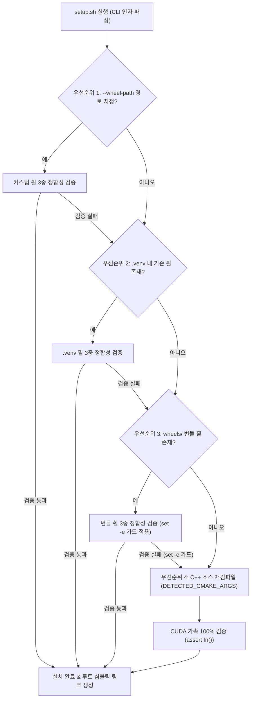

# Data Model & Schema: 4단계 휠 감지 파이프라인 및 3중 정합성 스키마 (055-fix-migration-setup-fallback)

**Feature Branch**: `055-fix-migration-setup-fallback`
**Date**: 2026-07-31

---

## 1. 4단계 결정론적 휠 복원 파이프라인 데이터 흐름

---

## 2. 3중 하드웨어 정합성 검증 구조 (3-Way Verification Schema)

| 검증 항목 (Check) | 검증 대상 (Target) | 수식 / 반환 조건 | 통과 요건 (Pass Condition) | 실패 시 동작 (On Fail) |
|-------------------|-------------------|-----------------|---------------------------|-----------------------|
| **1. CPU SIMD 호환성** | `src.core.cpu_detector` | `verify_wheel_binary.py` | AVX 미지원 CPU(Nehalem)에서 AVX/AVX2/FMA/F16C 유입 0건 (`SIGILL` 미발생) | 휠 거부 & 다음 단계 이행 |
| **2. CUDA GPU 오프로딩** | `llama-cpp-python` | `llama_supports_gpu_offload()` | `True` 반환 (CPU 전용 오프로딩 저하 방지) | 휠 거부 & 다음 단계 이행 |
| **3. Compute Capability** | NVIDIA GPU Arch | `sm_61` (GTX 1070/1080Ti) 등 | NVCC 및 CUDA 드라이버 라이브러리 정상 로드 | 휠 거부 & C++ 소스 컴파일 Fallback |

---

## 3. CLI 옵션 스키마 (`setup.sh`, `make_seed_pack.sh`)

- `--wheel-path <FILE_PATH>`: 외부/현지에서 직접 빌드된 커스텀 `.whl` 파일 경로 지정.
- `--skip-build`: 사전 휠 설치 실패 시 C++ 소스 재컴파일을 수행하지 않고 에러 종료 (CI/테스트용).
