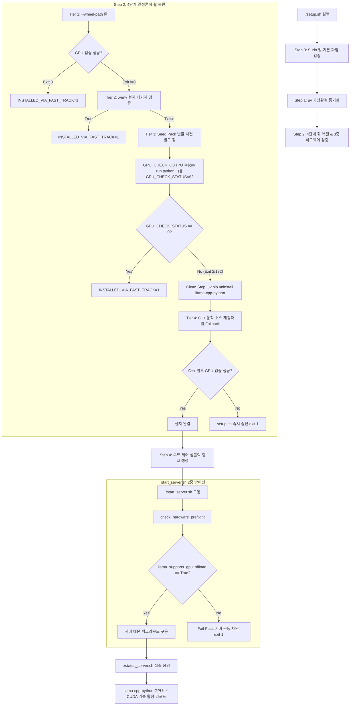

# Data Model & Flow Architecture: Fast-Track 휠 검증 서브쉘 종료 코드 캡처 구문 수정 및 C++ 소스 재컴파일 Fallback 정상 전이 보장 (056-fix-subshell-status-code-fallback)

## 1. 3중 방어선 스크립트 실행 플로우차트 (3-Tier Script Defense Flowchart)

---

## 2. 서브쉘 상태 데이터 구조 (Subshell Verification Status Schema)

| 변수명 / 필드명 | 데이터 타입 | 설명 | 허용 값 범위 및 예시 |
|-----------------|-------------|------|----------------------|
| `GPU_CHECK_OUTPUT` | `string` | 서브쉘 `uv run python` 구문 실행 시 stdout 및 stderr 출력 트레이스백 | 예: `"ERROR: llama_supports_gpu_offload() returned False"` |
| `GPU_CHECK_STATUS` | `integer` | 서브쉘 명령의 실제 exit status code (`$?`) | `0` (성공), `2` (GPU 오프로드 실패), `132` (SIGILL AVX 유입) |
| `INSTALLED_VIA_FAST_TRACK` | `integer` | Fast-Track 사전 휠 복원 성공 여부 플래그 | `1` (Fast-Track 성공), `0` (Fallback 필요) |
| `preflight.passed` | `boolean` | `check_hardware_preflight()` 전체 검증 결과 | `True` / `False` |
| `preflight.llama_gpu_offload` | `boolean` | `.venv` 내 `llama-cpp-python` CUDA 가속 기능 활성화 여부 | `True` / `False` |
