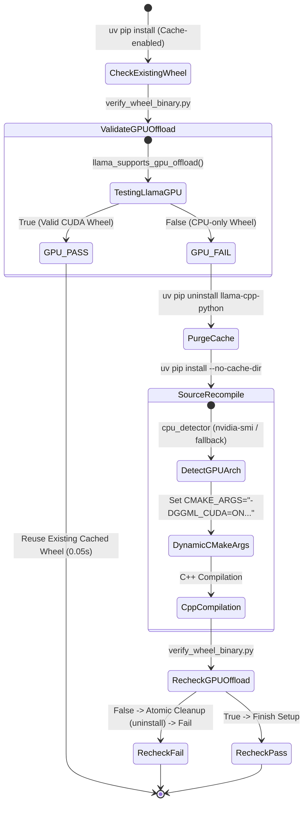

# Data Model & Schema Definitions: Tier 4 uv 휠 캐시 실측 검증 및 조건부 재컴파일 파이프라인 (057-fix-uv-no-cache-source-compilation)

**Feature Branch**: `057-fix-uv-no-cache-source-compilation`  
**Created**: 2026-07-31  
**Spec Link**: [`spec.md`](file:///home/dev/storage/vllm_serv/specs/057-fix-uv-no-cache-source-compilation/spec.md)

---

## 1. Core Data Entities

### Entity 1: `WheelVerificationResult` (휠 실측 검증 결과)
- **설명**: 가상환경 또는 local `wheels/` 디렉터리에 설치/배치된 `llama-cpp-python` 바이너리의 CUDA 오프로드 및 CPU SIMD 지원 여부 실측 검증 결과 객체.
- **필드 구성**:
  | 필드명 | 타입 | 필수 여부 | 설명 | 예시 |
  |:---|:---|:---:|:---|:---|
  | `is_installed` | `bool` | 필수 | 가상환경 내 `llama_cpp` 모듈 임포트 가능 여부 | `True` |
  | `supports_gpu_offload` | `bool` | 필수 | `llama_supports_gpu_offload() == True` 검증 결과 | `True` |
  | `avx_enabled` | `bool` | 필수 | 바이너리 내 AVX/AVX2 SIMD 심볼 수록 여부 | `False` |
  | `cuda_architectures` | `list[str]` | 필수 | 빌드에 포함된 Compute Capability 목록 | `["sm_61"]` |
  | `verification_timestamp` | `str` | 필수 | 검증 수행 일시 (ISO-8601) | `"2026-07-31T01:27:00Z"` |

---

### Entity 2: `PlatformHardwareProfile` (플랫폼 하드웨어 검출 프로필)
- **설명**: `src.core.cpu_detector`가 호스트 머신에서 `nvidia-smi` 및 CPU SIMD 명령어를 실행하여 동적 추출한 빌드 플래그 객체.
- **필드 구성**:
  | 필드명 | 타입 | 필수 여부 | 설명 | 예시 |
  |:---|:---|:---:|:---|:---|
  | `profile_name` | `str` | 필수 | 플랫폼 식별 프로필명 | `"legacy-i7-930-gtx1070"` |
  | `gpu_model` | `str` | 필수 | 검출된 GPU 카드의 모델명 | `"GeForce GTX 1070"` |
  | `compute_capability` | `str` | 필수 | CUDA Compute Capability 코드 | `"61"` |
  | `cmake_cuda_architectures` | `str` | 필수 | CMake 빌드용 `-DCMAKE_CUDA_ARCHITECTURES` 값 | `"61"` |
  | `cpu_simd_avx` | `bool` | 필수 | CPU AVX 지원 여부 | `False` |
  | `cflags_march` | `str` | 필수 | C/C++ 컴파일러 아키텍처 옵션 | `"-march=x86-64"` |
  | `is_fallback` | `bool` | 필수 | `nvidia-smi` 감지 실패 시 기본값 Fallback 사용 여부 | `False` |

---

### Entity 3: `SeedPackOption` (시드 팩 생성 및 안전 해제 옵션)
- **설명**: `make_seed_pack.sh` 패키징 및 `unpack_seed.sh` 압축 해제 시 사용되는 파라미터 규격.
- **필드 구성**:
  | 필드명 | 타입 | 필수 여부 | 설명 | 예시 |
  |:---|:---|:---:|:---|:---|
  | `target_archive_path` | `str` | 필수 | 압축 아카이브 파일 경로 | `"vllm_serv_seed.tar.gz"` |
  | `wheels_directory` | `str` | 필수 | 사전 빌드 휠 수록 경로 | `"wheels/legacy_i7_930"` |
  | `skip_old_files` | `bool` | 필수 | tar 덮어쓰기 방지 옵션 (`-k` / `--skip-old-files`) | `True` |
  | `preserve_permissions` | `bool` | 필수 | tar 퍼미션 보존 옵션 (`-p` / `--same-permissions`) | `True` |
  | `force_no_cache` | `bool` | 필수 | 신규 휠 빌드 시 캐시 무효화 여부 (`--no-cache-dir`) | `True` |

---

## 2. State Transitions (Tier 4 uv Wheel Verification Pipeline)

