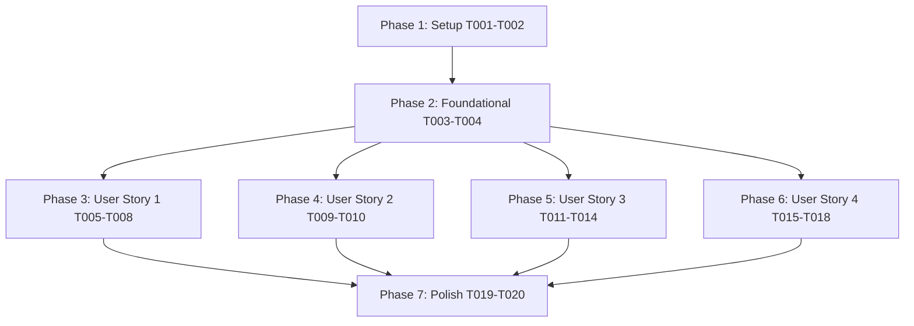

# Tasks: Tier 4 uv 휠 캐시 실측 검증 및 불일치 시 조건부 --no-cache-dir C++ 소스 재컴파일 파이프라인 (057-fix-uv-no-cache-source-compilation)

**Input**: Design documents from `/specs/057-fix-uv-no-cache-source-compilation/`  
**Prerequisites**: `plan.md`, `spec.md`, `research.md`, `data-model.md`, `contracts/fallback-pipeline-api.json`, `quickstart.md`

**Tests**: Tests are MANDATORY per Constitution v1.6.0 (Real-Integration TDD & Full Suite Regression Discipline).

---

## Phase 1: Setup (Shared Infrastructure)

**Purpose**: 프로젝트 환경 및 하드웨어 프로필 기본 기반 점검

- [x] T001 Verify `config/platform_profiles.json` contains platform profiles for `dev-rtx3060`, `pascal-avx2-gtx1080ti`, and `legacy-i7-930-gtx1070`
- [x] T002 [P] Verify `uv` environment and executable permissions for shell scripts in `scripts/`

---

## Phase 2: Foundational (Blocking Prerequisites)

**Purpose**: 모든 사용자 스토리가 공통으로 공유하는 하드웨어 감지기 및 휠 검증기 기본 대책 수록

- [x] T003 Ensure `src/core/cpu_detector.py` provides `get_llama_build_flags` and handles `nvidia-smi` execution failure with safe fallback to default platform profile in `config/platform_profiles.json`
- [x] T004 Ensure `scripts/verify_wheel_binary.py` performs 3-way CUDA offload (`llama_supports_gpu_offload()`) and CPU SIMD (AVX/AVX2) verification returning standard exit codes (0=PASS, 1=CPU-only, 2=SIMD mismatch) per `contracts/fallback-pipeline-api.json`

---

## Phase 3: User Story 1 - Tier 4 uv 휠 캐시 실측 검증 및 조건부 `--no-cache-dir` 소스 재컴파일 (Priority: P1) 🎯 MVP

**Goal**: `scripts/setup.sh` Tier 4 파이프라인 진입 시 uv 캐시 휠의 3중 가속 검증을 먼저 실행하여, 정상 CUDA 휠이면 불필요한 빌드 없이 고속 재사용하고, CPU 전용 휠로 확인될 경우에만 `--no-cache-dir` 옵션으로 캐시를 무효화한 뒤 C++ 소스 재컴파일을 수행하여 100% CUDA 가속 패키지를 안전하게 설치하며, 컴파일 중단 시 원자적 cleanup을 수행함.

**Independent Test**: `scripts/setup.sh` 구동 시 오염된 캐시 휠이 존재할 때 캐시 무효화 로그가 출력되며 `--no-cache-dir` 재컴파일이 구동되어 `llama_supports_gpu_offload() == True`가 검증됨.

### Tests for User Story 1 (MANDATORY)

- [x] T005 [P] [US1] Create unit tests for Tier 4 conditional `--no-cache-dir` cache invalidation and atomic cleanup in `tests/unit/test_seed_pack.py`

### Implementation for User Story 1

- [x] T006 [US1] Update `scripts/setup.sh` Tier 4 section to run 1st-stage `uv pip install` and test `llama_supports_gpu_offload()` via `scripts/verify_wheel_binary.py`
- [x] T007 [US1] Add conditional cache invalidation branch in `scripts/setup.sh`: on verification failure, output `⚠️ [UV CACHE INVALID]` warning, run `uv pip uninstall llama-cpp-python`, and execute `CMAKE_ARGS="$DETECTED_CMAKE_ARGS" uv pip install --no-cache-dir "llama-cpp-python[server]" --no-binary llama-cpp-python`
- [x] T008 [US1] Add atomic cleanup error handler (`trap 'uv pip uninstall -y llama-cpp-python' ERR INT TERM`) during C++ source recompilation in `scripts/setup.sh`

---

## Phase 4: User Story 2 - 이관 타겟 머신에서의 100% CUDA 가속 완결 및 status_server.sh 정상 검증 (Priority: P1) 🎯 MVP

**Goal**: `./setup.sh` 완결 후 백엔드 서버 구동 시 `./status_server.sh`를 통해 CUDA 가속 정상 활성화 및 PID 상주를 실측 리포트로 확인 조율함.

**Independent Test**: `./status_server.sh` 구동 시 `llama-cpp-python GPU: ✓ CUDA 가속 활성` 및 PID 상주 100% 리포트 출력.

### Tests for User Story 2 (MANDATORY)

- [x] T009 [P] [US2] Add status verification check tests in `tests/unit/test_seed_pack.py`

### Implementation for User Story 2

- [x] T010 [US2] Verify `scripts/status_server.sh` output formatting to explicitly validate `llama-cpp-python GPU: ✓ CUDA 가속 활성` and report backend process PID

---

## Phase 5: User Story 3 - make_seed_pack.sh 타겟 서비스 플랫폼 맞춤 빌드 & Post-Build 검증 (Priority: P1) 🎯 MVP

**Goal**: `scripts/make_seed_pack.sh` 실행 시 레거시 서비스 타겟(`legacy-i7-930-gtx1070`) 사양 사전 휠(`wheels/legacy_i7_930/*.whl`, AVX=0, CUDA=1)을 검증하여 기존 유효 휠이 있으면 재사용하고, 훼손/미존재 시 `--no-cache-dir`로 신규 빌드 후 Post-Build 3중 검증을 실행하여 실패 시 `rm -f` 결함 휠을 자동 삭제함.

**Independent Test**: `scripts/make_seed_pack.sh --build-legacy` 구동 시 기존 휠 유효 시 재사용 스킵, 결함 휠 빌드 시 `rm -f` 자동 삭제 후 순수 휠만 아카이브에 포함됨.

### Tests for User Story 3 (MANDATORY)

- [x] T011 [P] [US3] Add unit tests for `make_seed_pack.sh` legacy wheel reuse and Post-Build verification cleanup in `tests/unit/test_seed_pack.py`

### Implementation for User Story 3

- [x] T012 [US3] Update `scripts/make_seed_pack.sh` `--build-legacy` logic to test existing `wheels/legacy_i7_930/*.whl` with `verify_wheel_binary.py` before rebuilding
- [x] T013 [US3] Update `scripts/make_seed_pack.sh` to enforce `uv run pip wheel --no-cache-dir` with `CFLAGS=-march=x86-64` and `CMAKE_ARGS="-DGGML_CUDA=ON -DGGML_AVX=OFF -DGGML_AVX2=OFF -DGGML_F16C=OFF -DGGML_FMA=OFF -DGGML_NATIVE=OFF -DCMAKE_CUDA_ARCHITECTURES=61"` when building new legacy wheels
- [x] T014 [US3] Add Post-Build verification call (`python3 scripts/verify_wheel_binary.py`) in `scripts/make_seed_pack.sh` and execute `rm -f` on verification failure

---

## Phase 6: User Story 4 - scripts/unpack_seed.sh 안전 보존 압축 해제 스크립트 및 vllm_serv/ 루트 단축 심볼릭 링크 (Priority: P1) 🎯 MVP

**Goal**: `scripts/unpack_seed.sh` 및 프로젝트 루트 단축 실행 `./unpack_seed.sh`를 신규 작성하여 프로젝트 루트(`vllm_serv/`)에서 `vllm_serv_seed.tar.gz` (또는 유연 `$1` 인자) 압축 해제 시 수동 옵션 없이 기존 검증을 통과한 유효 바이너리를 자동 보존(`-k` / `--skip-old-files`) 및 퍼미션 보존(`-p` / `--same-permissions`)하여 덮어쓰기를 원천 방지함.

**Independent Test**: `./unpack_seed.sh` 구동 시 기존 `.venv` 또는 `wheels/` 내 유효 바이너리가 덮어써지지 않고 보존되며 아카이브가 성공적으로 해제됨.

### Tests for User Story 4 (MANDATORY)

- [x] T015 [P] [US4] Add unit tests for `unpack_seed.sh` `--skip-old-files` and `--same-permissions` flags in `tests/unit/test_seed_pack.py`

### Implementation for User Story 4

- [x] T016 [US4] Create `scripts/unpack_seed.sh` helper script with flexible `$1` argument (defaulting to `vllm_serv_seed.tar.gz`) executing `tar -xvkpf "$TAR_FILE" -C ./`
- [x] T017 [US4] Create root shortcut symlink `unpack_seed.sh -> scripts/unpack_seed.sh` in repository root `/home/dev/storage/vllm_serv/`
- [x] T018 [US4] Add executable permissions (`chmod +x scripts/unpack_seed.sh`) and verify path resolution from `vllm_serv/` root

---

## Phase 7: Polish & Cross-Cutting Concerns

**Purpose**: 전체 수트 회귀 테스트 및 `quickstart.md` 완결 검증

- [x] T019 Run full unit test suite `uv run pytest` to guarantee 100% Green Pass (Constitution VII Discipline)
- [x] T020 Run end-to-end quickstart validation scenarios defined in `quickstart.md`

---

## Dependencies & Execution Order

---

## Parallel Execution Opportunities

- **Phase 1**: `T002` can run in parallel with `T001`.
- **Phase 3 (US1)**: `T005` (Tests) can run in parallel before `T006-T008`.
- **Phase 4 (US2)**: `T009` (Tests) can run in parallel with `T010`.
- **Phase 5 (US3)**: `T011` (Tests) can run in parallel before `T012-T014`.
- **Phase 6 (US4)**: `T015` (Tests) can run in parallel with `T016-T018`.
- **All User Stories (US1, US2, US3, US4)** can be implemented concurrently once Phase 2 Foundational is complete!
