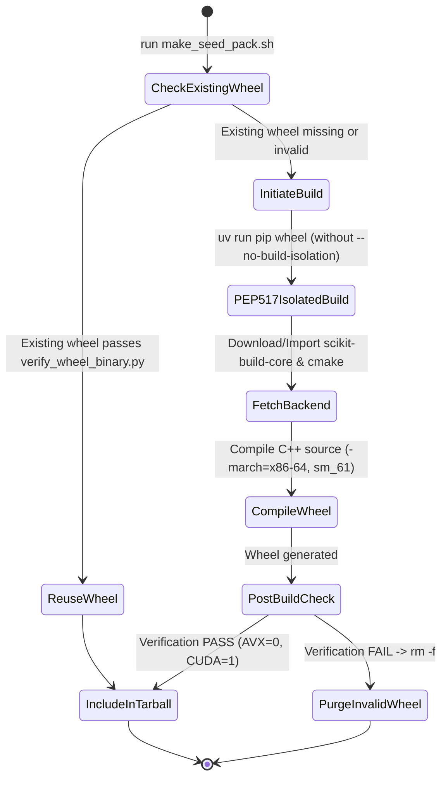

# Phase 1 Data Model & Entity Specifications (058-fix-make-seed-pack-build-backend)

## Core Entities

### 1. `BuildBackendRequirement`
- **Description**: C++ 휠 컴파일에 필요한 PEP 517/518 빌드 백엔드 패키지 사양
- **Fields**:
  - `package_name` (str): `"scikit-build-core"`
  - `min_version` (str): `"0.10.0"`
  - `build_tool` (str): `"cmake"`
  - `isolation_enabled` (bool): `True` (PEP 517 isolated build mode)

### 2. `LegacyPrebuiltWheelBuildResult`
- **Description**: `make_seed_pack.sh` 구동 시 `wheels/legacy_i7_930/*.whl` 사전 컴파일 결과
- **Fields**:
  - `wheel_path` (str): `wheels/legacy_i7_930/llama_cpp_python-0.3.34-cp312-cp312-linux_x86_64.whl`
  - `build_status` (str): `SUCCESS` | `SKIPPED` | `FAILED`
  - `backend_imported` (bool): `True`
  - `verification_passed` (bool): `True` (AVX=0, CUDA=1)

---

## State Transition Diagram: Seed Pack Wheel Build Lifecycle

