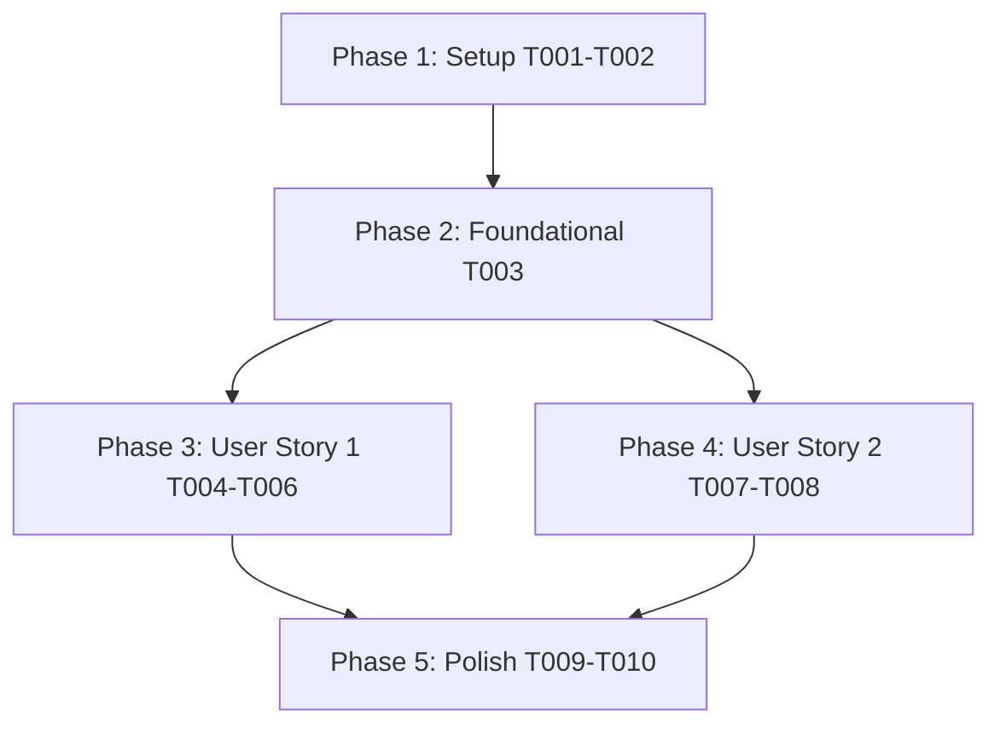

# Tasks: make_seed_pack.sh 사전 휠 빌드 시 scikit-build-core 빌드 백엔드 누락 오류 해결 (058-fix-make-seed-pack-build-backend)

**Input**: Design documents from `/specs/058-fix-make-seed-pack-build-backend/`  
**Prerequisites**: `plan.md`, `spec.md`, `research.md`, `data-model.md`, `contracts/build-backend-contract.json`, `quickstart.md`

**Tests**: Tests are MANDATORY per Constitution v1.6.0 (Real-Integration TDD & Full Suite Regression Discipline).

---

## Phase 1: Setup (Shared Infrastructure)

**Purpose**: 프로젝트 환경 및 pyproject.toml 의존성 설정 점검

- [x] T001 Verify `pyproject.toml` structure and build dependencies configuration
- [x] T002 [P] Verify `uv` environment and executable permissions for `scripts/make_seed_pack.sh`

---

## Phase 2: Foundational (Blocking Prerequisites)

**Purpose**: 사전 휠 빌드 및 Post-Build 3중 실측 검증 도구 점검

- [x] T003 Ensure `scripts/verify_wheel_binary.py` is ready for Post-Build 3-way verification of legacy prebuilt wheels

---

## Phase 3: User Story 1 - make_seed_pack.sh 빌드 백엔드 격리 해제 및 정상 사전 휠 생성 (Priority: P1) 🎯 MVP

**Goal**: `scripts/make_seed_pack.sh` 실행 시 `uv run pip wheel` 구문에서 `--no-build-isolation` 옵션을 제거하여 PEP 517/518 격리 빌드 환경에서 `scikit-build-core` 백엔드가 자동 조달 및 실행되도록 교정하고 `BackendUnavailable` 오류를 원천 차단함.

**Independent Test**: `scripts/make_seed_pack.sh --build-legacy` 구동 시 `BackendUnavailable: Cannot import 'scikit_build_core.build'` 예외 없이 `wheels/legacy_i7_930/*.whl`이 성공적으로 생성되고 Post-Build 검증을 통과함.

### Tests for User Story 1 (MANDATORY)

- [x] T004 [P] [US1] Add unit test asserting `make_seed_pack.sh` legacy wheel build command does NOT include `--no-build-isolation` in `tests/unit/test_seed_pack.py`

### Implementation for User Story 1

- [x] T005 [US1] Update `scripts/make_seed_pack.sh` to remove `--no-build-isolation` flag from `uv run pip wheel "llama-cpp-python[server]"` command line
- [x] T006 [US1] Run `./scripts/make_seed_pack.sh --build-legacy` and verify `wheels/legacy_i7_930/*.whl` is generated with 0 `BackendUnavailable` errors

---

## Phase 4: User Story 2 - setup.sh 및 pyproject.toml / 빌드 환경 의존성 완결성 (Priority: P2)

**Goal**: `pyproject.toml`에 `scikit-build-core` 및 `cmake` 빌드 의존성을 보강하여 온디맨드 빌드 및 오프라인 사전 컴파일 환경의 안정성을 이중 보장함.

**Independent Test**: `uv run pytest tests/unit/test_seed_pack.py` 실행 시 빌드 의존성 및 사전 휠 테스트 100% PASS.

### Tests for User Story 2 (MANDATORY)

- [x] T007 [P] [US2] Add unit test asserting `scikit-build-core` build requirement is present in `pyproject.toml` in `tests/unit/test_seed_pack.py`

### Implementation for User Story 2

- [x] T008 [US2] Update `pyproject.toml` to declare `scikit-build-core` and `cmake` under build/dependency configurations

---

## Phase 5: Polish & Cross-Cutting Concerns

**Purpose**: 전체 수트 회귀 테스트 및 `quickstart.md` 완결 검증

- [x] T009 Run unit test suite `uv run pytest tests/unit/test_seed_pack.py` to guarantee 100% Green Pass
- [x] T010 Run end-to-end quickstart validation scenarios defined in `quickstart.md`

---

## Dependencies & Execution Order

---

## Parallel Execution Opportunities

- **Phase 1**: `T002` can run in parallel with `T001`.
- **Phase 3 (US1)**: `T004` (Tests) can run in parallel before `T005-T006`.
- **Phase 4 (US2)**: `T007` (Tests) can run in parallel with `T008`.
- **User Story 1 & User Story 2** can be implemented concurrently once Phase 2 Foundational is complete!
