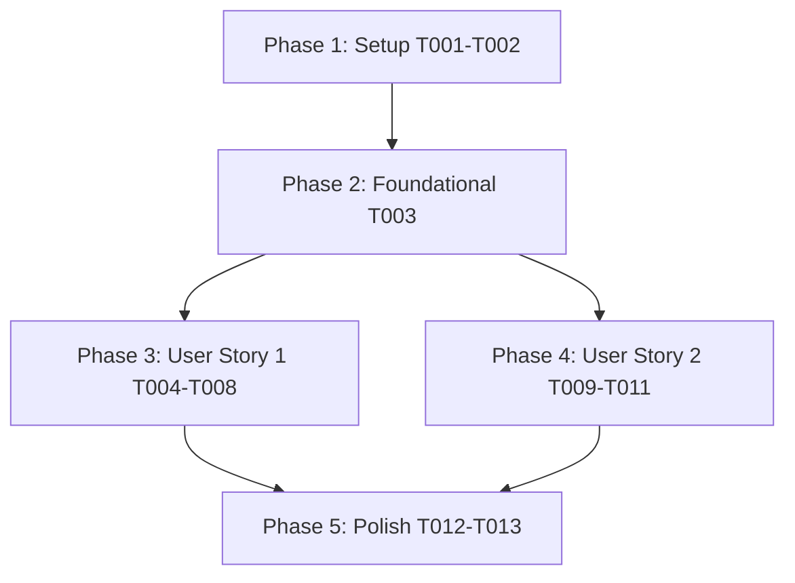

# Tasks: make_seed_pack.sh 레거시 사전 휠 Post-Build AVX 실측 검증 로직 및 빌드 플래그 정밀화 (059-fix-legacy-wheel-avx-build)

**Input**: Design documents from `/specs/059-fix-legacy-wheel-avx-build/`  
**Prerequisites**: `plan.md`, `spec.md`, `research.md`, `data-model.md`, `contracts/wheel-verification-contract.json`, `quickstart.md`

**Tests**: Tests are MANDATORY per Constitution v1.6.0 (Real-Integration TDD & Full Suite Regression Discipline).

---

## Phase 1: Setup (Shared Infrastructure)

**Purpose**: 프로젝트 환경 및 빌드 스크립트 실행 권한 점검

- [x] T001 Verify `pyproject.toml` structure and `scikit-build-core` dependency declarations
- [x] T002 [P] Verify `uv` environment and executable permissions for `scripts/verify_wheel_binary.py` and `scripts/make_seed_pack.sh`

---

## Phase 2: Foundational (Blocking Prerequisites)

**Purpose**: CUDA 디바이스 커널과 CPU 호스트 공유 라이브러리 검증 인터페이스 정의 점검

- [x] T003 Ensure `contracts/wheel-verification-contract.json` rules are mapped to `verify_wheel_binary.py` architecture

---

## Phase 3: User Story 1 - verify_wheel_binary.py 바이너리 스캐너 정밀화 및 False Positive 100% 제거 (Priority: P1) 🎯 MVP

**Goal**: `scripts/verify_wheel_binary.py` 검증 도구의 스캐너가 `libggml-cuda.so` 내 CUDA GPU 디바이스 데이터 바이트를 CPU AVX 바이트로 오판단하는 False Positive 결함을 제거하고, CPU 호스트 공유 라이브러리(`ggml-cpu.so`, `libllama.so` 등)의 AVX 무결성을 정밀 실측하여 `✓ [POST-BUILD SUCCESS]`를 100% 달성함.

**Independent Test**: `uv run python scripts/verify_wheel_binary.py wheels/legacy_i7_930/llama_cpp_python-*.whl` 실행 시 CUDA 디바이스 커널 오검출 없이 Exit Code 0과 `✓ Wheel verified valid`를 리턴함.

### Tests for User Story 1 (MANDATORY) ⚠️

- [x] T004 [P] [US1] Add unit test asserting `verify_wheel_binary.py` correctly segregates CUDA device libraries (`libggml-cuda.so`) from CPU host libraries (`ggml-cpu.so`, `libllama.so`) without false positive AVX errors in `tests/unit/test_seed_pack.py`
- [x] T005 [P] [US1] Add unit test asserting `verify_wheel_binary.py` returns Exit Code 0 and `avx_clean=True` when inspecting valid legacy prebuilt wheels in `tests/unit/test_seed_pack.py`

### Implementation for User Story 1

- [x] T006 [US1] Update `scripts/verify_wheel_binary.py` to classify shared libraries into CUDA device binaries (`cuda` in filename) vs CPU host binaries (`ggml-cpu`, `libllama`, `libggml-base`, `libggml`), restricting AVX byte scanning to CPU host binaries
- [x] T007 [US1] Refactor `scripts/verify_wheel_binary.py` output reporting and CLI exit codes (Exit Code 0 for success, 1 for CPU-only, 2 for SIMD mismatch)
- [x] T008 [US1] Run `uv run python scripts/verify_wheel_binary.py wheels/legacy_i7_930/llama_cpp_python-*.whl` and verify 100% valid outcome

---

## Phase 4: User Story 2 - scikit-build-core 표준 환경 변수(SKBUILD_CMAKE_ARGS) 보강 및 빌드 정밀화 (Priority: P2)

**Goal**: `scripts/make_seed_pack.sh`에서 `scikit-build-core` 공식 환경 변수인 `SKBUILD_CMAKE_ARGS`를 보강하여 PEP 517/518 격리 컴파일 시 CMake 인자가 100% 전파되도록 구성함.

**Independent Test**: `./scripts/make_seed_pack.sh --build-legacy` 실행 시 Post-Build 3중 검증 통과 및 아카이브 정상 생성.

### Tests for User Story 2 (MANDATORY) ⚠️

- [x] T009 [P] [US2] Add unit test asserting `make_seed_pack.sh` includes `SKBUILD_CMAKE_ARGS` environment variable declaration in `tests/unit/test_seed_pack.py`

### Implementation for User Story 2

- [x] T010 [US2] Update `scripts/make_seed_pack.sh` to explicitly declare `SKBUILD_CMAKE_ARGS` alongside `CMAKE_ARGS`, `CFLAGS`, and `CXXFLAGS` when building legacy prebuilt wheels
- [x] T011 [US2] Run `./scripts/make_seed_pack.sh --build-legacy` and verify `✓ [POST-BUILD SUCCESS]` 100% pass without wheel deletion

---

## Phase 5: Polish & Cross-Cutting Concerns

**Purpose**: 전체 수트 회귀 테스트 및 `quickstart.md` 완결 검증

- [x] T012 Run unit test suite `uv run pytest tests/unit/test_seed_pack.py` to guarantee 100% Green Pass
- [x] T013 Run end-to-end quickstart validation scenarios defined in `quickstart.md`

---

## Dependencies & Execution Order

---

## Parallel Execution Opportunities

- **Phase 1**: `T002` can run in parallel with `T001`.
- **Phase 3 (US1)**: `T004` and `T005` (Tests) can run in parallel before `T006-T008`.
- **Phase 4 (US2)**: `T009` (Tests) can run in parallel with `T010`.
- **User Story 1 & User Story 2** can be implemented concurrently once Phase 2 Foundational is complete!

---

## Implementation Strategy

### MVP First (User Story 1 Only)

1. Complete Phase 1: Setup
2. Complete Phase 2: Foundational
3. Complete Phase 3: User Story 1 (`verify_wheel_binary.py` False Positive fix)
4. **STOP and VALIDATE**: Verify `verify_wheel_binary.py` independently

### Incremental Delivery

1. Complete Setup + Foundational
2. Add User Story 1 → Test independently (MVP!)
3. Add User Story 2 → Test `make_seed_pack.sh` end-to-end
4. Run full regression test suite (`uv run pytest`)
