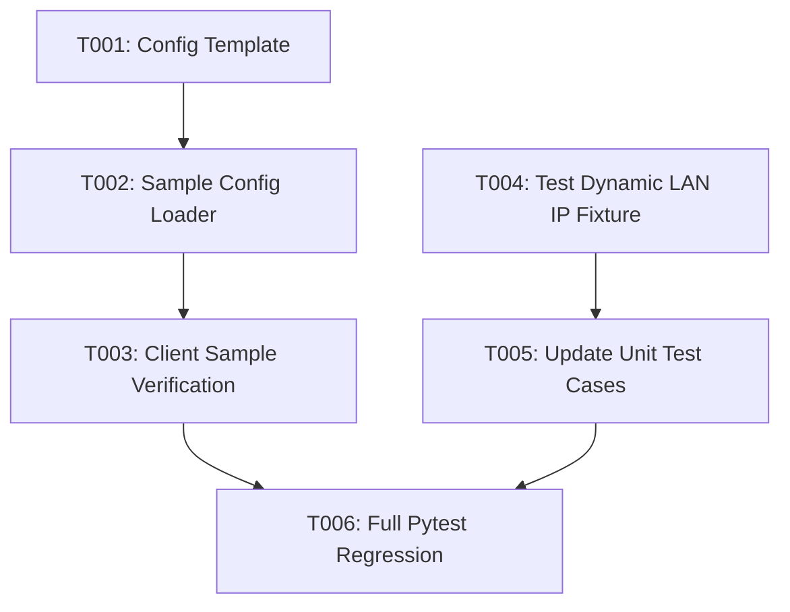

# Tasks: samples 예제 스크립트의 서비스 플랫폼 IP 대역 접속 보장 및 테스트 스크립트 실 IP 검증 분리 (070-samples-platform-ip-separation)

**Feature**: `070-samples-platform-ip-separation`
**Specification**: [`specs/070-samples-platform-ip-separation/spec.md`](spec.md)
**Implementation Plan**: [`specs/070-samples-platform-ip-separation/plan.md`](plan.md)

---

## Task Execution Graph

---

## Phase 1: Setup & Foundational Infrastructure

- [x] T001 Create default configuration example file `samples/config.json.example` with platform default IP (`http://192.168.0.100`) and standard ports in `samples/config.json.example`

---

## Phase 2: User Story 1 - Client Sample Config Loader [US1] (Priority: P1) 🎯 MVP

**Story Goal**: 훈련생 및 연동 사용자가 서비스 플랫폼 IP(`192.168.0.x`)를 `config.json` 또는 `.env`로 명시 및 자유롭게 변경할 수 있는 독립 클라이언트 로더 연동.
**Independent Test**: `samples/config.json` 또는 `SERVER_HOST` 환경변수가 설정되었을 때 `samples/common.py`가 해당 서버 주소를 올바르게 파싱하여 API 호출을 수행하는지 확인.

- [x] T002 [P] [US1] Implement standard library configuration parser for `SERVER_HOST` env, `samples/.env`, and `samples/config.json` in `samples/common.py`
- [x] T003 [P] [US1] Verify client sample scripts execute independently without importing backend server modules in `samples/sample_01_chat.py`

---

## Phase 3: User Story 2 - Test Suite Dynamic Real IP Detection [US2] (Priority: P2)

**Story Goal**: `tests/` 회귀 수트에서 `127.0.0.1` / `localhost` 사용을 금지하고 현 실행 플랫폼(`10.0.0.x` 대역 등)의 실 LAN IP를 동적 탐지하여 네트워크 망 접속 상태 검증.
**Independent Test**: `uv run pytest tests/unit/test_sample_scripts.py tests/unit/test_network_detector.py` 실행 시 100% 통과.

- [x] T004 [P] [US2] Update `target_host_ip` fixture in `tests/conftest.py` to dynamically detect active LAN IP using `NetworkDetector` while banning `127.0.0.1`/`localhost` in `tests/conftest.py`
- [x] T005 [US2] Update unit tests to match new configuration loader and dynamic LAN IP detection behavior in `tests/unit/test_sample_scripts.py` and `tests/unit/test_network_detector.py`

---

## Phase 4: Polish & Full Verification

- [x] T006 Run complete regression test suite (`uv run pytest -q`) to confirm 100% pass rate

---

## Implementation Strategy & Parallel Opportunities

- **MVP Scope**: Phase 1 + Phase 2 (Task T001 ~ T003)
- **Parallel Opportunities**:
  - T002 [US1] (`samples/common.py`)와 T004 [US2] (`tests/conftest.py`)는 서로 다른 파일에 독립적으로 작업이 가능합니다.
