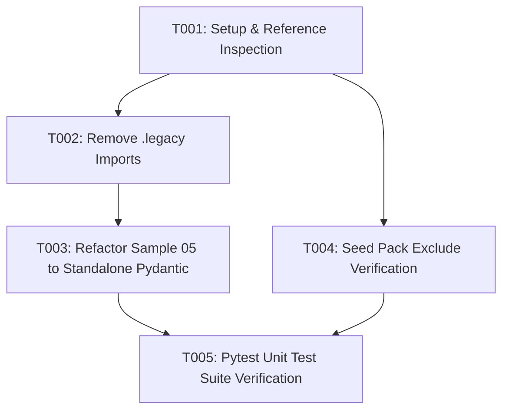

# Tasks: sample_05_structured_output.py의 .legacy 모듈 의존성 제거 및 시드팩 독립성 보장 (071-seed-pack-include-legacy)

**Feature**: `071-seed-pack-include-legacy`
**Specification**: [`specs/071-seed-pack-include-legacy/spec.md`](spec.md)
**Implementation Plan**: [`specs/071-seed-pack-include-legacy/plan.md`](plan.md)

---

## Task Execution Graph

---

## Phase 1: Setup & Foundational Infrastructure

- [x] T001 Inspect current `.legacy` module import references in `samples/sample_05_structured_output.py`

---

## Phase 2: User Story 1 - Self-contained sample_05_structured_output.py [US1] (Priority: P1) 🎯 MVP

**Story Goal**: `samples/sample_05_structured_output.py`가 외부 `.legacy` 디렉터리에 대한 참조 없이 단독(Self-contained)으로 구동되는 Pydantic 기반 예제로 리팩토링.
**Independent Test**: `.legacy` 디렉터리가 삭제된 환경에서도 `uv run python samples/sample_05_structured_output.py` 실행 시 모듈 임포트 예외 없이 성공하는지 검증.

- [x] T002 [US1] Remove `sys.path` modification and `.legacy` module imports (`ATEAM_ExtractionItem`, `BTEAM_ExtractionItem`) from `samples/sample_05_structured_output.py`
- [x] T003 [US1] Refactor `samples/sample_05_structured_output.py` to use standalone Pydantic `StockAnalysisResponse` schema with OpenAI `json_object` format in `samples/sample_05_structured_output.py`

---

## Phase 3: User Story 2 - Seed Pack Exclude .legacy Verification [US2] (Priority: P2)

**Story Goal**: `scripts/make_seed_pack.sh` 실행 시 `.legacy` 폴더가 불필요하게 아카이브에 수록되지 않도록 확인.
**Independent Test**: `./scripts/make_seed_pack.sh` 실행 후 아카이브 목록 검증 시 `.legacy` 제외 확인.

- [x] T004 [P] [US2] Confirm `scripts/make_seed_pack.sh` archive generation excludes `.legacy` directory in `scripts/make_seed_pack.sh`

---

## Phase 4: Polish & Full Verification

- [x] T005 Update unit test mocks and execute full regression test suite (`uv run pytest -q`)

---

## Implementation Strategy & Parallel Opportunities

- **MVP Scope**: Phase 1 + Phase 2 (Task T001 ~ T003)
- **Parallel Opportunities**:
  - T003 (`samples/sample_05_structured_output.py`)와 T004 (`scripts/make_seed_pack.sh`)는 서로 다른 파일이므로 병렬 검토 가능.
