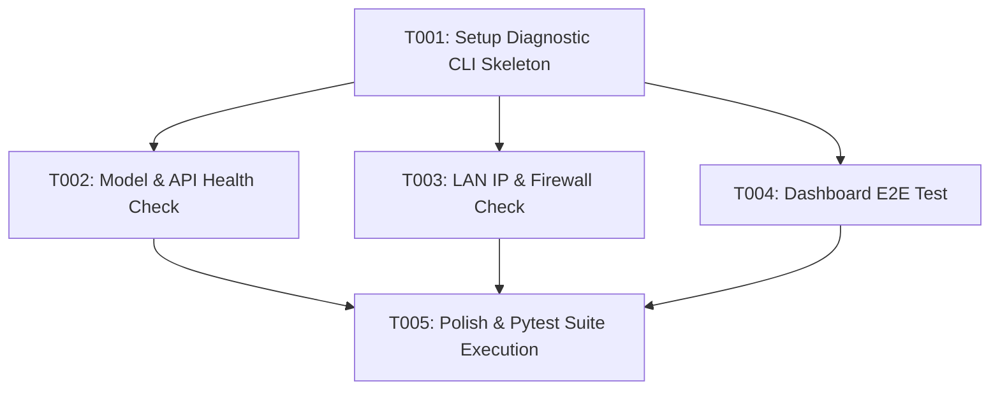

# Tasks: LLM 서버 서비스 모델, API 엔드포인트, E2E 대시보드, 방화벽 및 LAN 접속 통합 진단 (072-server-e2e-health-check)

**Feature**: `072-server-e2e-health-check`
**Specification**: [`specs/072-server-e2e-health-check/spec.md`](spec.md)
**Implementation Plan**: [`specs/072-server-e2e-health-check/plan.md`](plan.md)

---

## Task Execution Graph

---

## Phase 1: Setup & Foundational Infrastructure

- [x] T001 Create diagnostic CLI script skeleton and JSON report schema in `scripts/diagnose_server_health.py`

---

## Phase 2: User Story 1 - LLM Serving Models & API Health Check [US1] (Priority: P1) 🎯 MVP

**Story Goal**: `/v1/models` 조회를 통해 활성 서빙 모델 리스트를 수집하고 주요 API 엔드포인트 응답성 검증.
**Independent Test**: `scripts/diagnose_server_health.py` 구동 시 서빙 모델명(예: `qwen3.5-4b`) 및 API 200 OK 응답 수집 확인.

- [x] T002 [US1] Implement model listing (`/v1/models`) and API endpoints (`/v1/chat/completions`, `/health`) diagnostic probe in `scripts/diagnose_server_health.py`

---

## Phase 3: User Story 2 - Real LAN IP & Firewall Port Check [US2] (Priority: P1) 🎯 MVP

**Story Goal**: 서버의 유효 LAN IP(`10.0.0.x` 또는 `192.168.0.x`)를 동적 감지하고 8081/8082 포트의 방화벽/바인딩 상태 체크.
**Independent Test**: `NetworkDetector` 감지 IP 및 지정 포트 소켓 바인딩 성공 여부 확인.

- [x] T003 [P] [US2] Implement active LAN IP detection and port socket binding test (8081, 8082) in `scripts/diagnose_server_health.py`

---

## Phase 4: User Story 3 - Web Dashboard E2E Test [US3] (Priority: P2)

**Story Goal**: 8082 포트 웹 대시보드의 브라우저 UI 헤드리스 렌더링 E2E 자동 검증.
**Independent Test**: Playwright E2E 테스트 실행 시 메인 대시보드 렌더링 Pass 확인.

- [x] T004 [P] [US3] Implement Playwright/HTTP browser E2E rendering test for Web Dashboard in `tests/unit/test_server_health_diagnostics.py`

---

## Phase 5: Polish & Integration Verification

- [x] T005 Integrate JSON/Terminal health report formatter and execute unit test suite (`uv run pytest tests/unit/test_server_health_diagnostics.py`)

---

## Implementation Strategy & Parallel Opportunities

- **MVP Scope**: Phase 1 + Phase 2 + Phase 3 (Task T001 ~ T003)
- **Parallel Opportunities**:
  - T003 (LAN IP/방화벽 체크)와 T004 (웹 대시보드 E2E 테스트)는 독립적으로 실행 가능.
