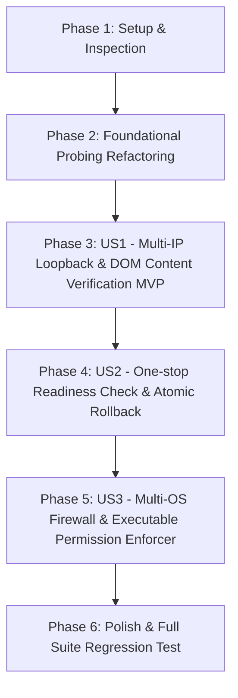

# Tasks: Service Platform Parity & Health Diagnostics Fix (`076-fix-service-platform-parity`)

**Feature Directory**: [`specs/076-fix-service-platform-parity`](file:///home/dev/storage/vllm_serv/specs/076-fix-service-platform-parity)  
**Spec**: [`spec.md`](spec.md) | **Plan**: [`plan.md`](plan.md)  

---

## Dependency Graph

---

## Phase 1: Setup & Inspection

**Purpose**: 개발 머신과 서비스 플랫폼 간의 네트워크/프로세스 바인딩 격차 점검

- [X] T001 Inspect active network interfaces and hosts mapping in `src/core/network_detector.py`
- [X] T002 Inspect socket probe and timeout handling in `scripts/diagnose_server_health.py`

---

## Phase 2: Foundational (전제 기반 구축)

**Purpose**: 다중 루프백 수신 및 소켓 세션 리소스 누수 차단 구조 정비

- [X] T003 Clean up socket connection timeouts (`timeout=3.0`) and enforce `Connection: close` header in `scripts/diagnose_server_health.py`

**Checkpoint**: Foundation ready - 유저 스토리별 작업 진행 가능

---

## Phase 3: User Story 1 - 다중 IP/루프백 통합 프로빙 및 DOM 내용 검증 (Priority: P1) 🎯 MVP

**Goal**: `127.0.0.1`, `localhost`, `127.0.1.1`, active LAN IP 전체를 순회 탐색하고, HTTP 200/307 및 HTML DOM 키워드(`vllm_serv` / `Dashboard`) 포함 여부를 실측 검증하여 100% 오탐 없는 진단 수렴

**Independent Test**: `uv run python scripts/diagnose_server_health.py` 실행 시 다중 IP 순회 및 대시보드 `✅ ON` 출력

### Tests for User Story 1

- [X] T004 [P] [US1] Create integration test for multi-loopback probing in `tests/integration/test_multi_loopback_health_probe.py`

### Implementation for User Story 1

- [X] T005 [US1] Refactor `check_port_open` and `check_dashboard_e2e` to iterate through target IPs (`127.0.0.1`, `localhost`, `127.0.1.1`, `active_ip`), support environment variable port binding overrides, and verify HTML DOM keywords in `scripts/diagnose_server_health.py`
- [X] T006 [US1] Verify multi-loopback probe output via `uv run python scripts/diagnose_server_health.py`

**Checkpoint**: User Story 1 (MVP) 독립 수렴 검증 완료

---

## Phase 4: User Story 2 - 원스톱 대시보드 백그라운드 가동 및 Readiness 원자적 롤백 (Priority: P2)

**Goal**: `start_server.sh` 구동 시 8081 메인 API 서버와 Port 8082 웹 대시보드 Uvicorn 데몬을 `uv run` 환경에서 원스톱으로 동시 백그라운드 가동하고 동시 Readiness(30초 대기) 검증 후 실패 시 원자적 Clean Exit/Rollback 수행

**Independent Test**: `./start_server.sh` 1회 실행 후 8081 및 8082 포트 동시 LISTEN 확인

### Tests for User Story 2

- [X] T007 [P] [US2] Create integration test for dual-port readiness & atomic rollback in `tests/integration/test_dual_port_readiness.py`
- [X] T007b [P] [US2] Create Playwright E2E browser test for dashboard rendering in `tests/e2e/test_dashboard_e2e.py` per Constitution Article VII

### Implementation for User Story 2

- [X] T008 [US2] Update `start_server.sh` to launch Port 8082 Uvicorn dashboard via `uv run python -m uvicorn` with dual readiness check & atomic rollback in `start_server.sh`
- [X] T009 [US2] Update `status_server.sh` to report Port 8082 LISTEN status and HTML DOM content health in `status_server.sh`
- [X] T010 [US2] Update `scripts/setup.sh` start/status template functions to match new dual-port launching logic in `scripts/setup.sh`

---

## Phase 5: User Story 3 - OS 방화벽 및 실행 권한 전역 강제 (Priority: P3)

**Goal**: `scripts/setup.sh` 실행 시 UFW, firewalld, iptables 전체 방화벽 엔진에 `8081/tcp`, `8082/tcp`를 승인하고 모든 제어 스크립트에 `chmod +x`를 강제 적용

**Independent Test**: `./scripts/setup.sh` 실행 후 `sudo ufw status` 내 8081/tcp 및 8082/tcp ALLOW IN 확인

### Implementation for User Story 3

- [X] T011 [US3] Ensure `8081/tcp` and `8082/tcp` are included in `FIREWALL_PORTS` array and enforce `chmod +x` on all scripts in `scripts/setup.sh`

---

## Phase 6: Polish & Cross-Cutting Concerns

**Purpose**: 서비스 플랫폼 ALL GREEN 실측 검증 및 전체 회귀 테스트 수행

- [X] T012 [P] Verify ALL GREEN output (`STATUS: 🎉 SYSTEM HEALTHY`) in `scripts/diagnose_server_health.py`
- [X] T013 Execute full suite regression test via `uv run pytest` per Constitution Article VII
