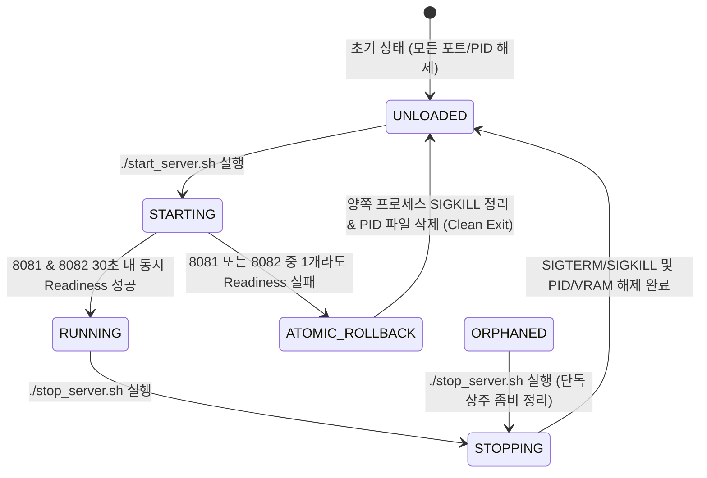

# Data Model & State Transitions: `077-sync-server-dashboard-lifecycle`

**Feature Directory**: [`specs/077-sync-server-dashboard-lifecycle`](file:///home/dev/storage/vllm_serv/specs/077-sync-server-dashboard-lifecycle)  
**Spec**: [`spec.md`](spec.md) | **Research**: [`research.md`](research.md)  

---

## 1. Entities & Schema

### ProcessControlState (프로세스 제어 상태 엔티티)

| Entity Attribute | Type | Description | Constraints |
|------------------|------|-------------|-------------|
| `daemon_name` | String | 데몬 식별자 (`main_server` / `dashboard_server`) | Required |
| `port` | Integer | 서비스 수신 포트 (`8081` / `8082`) | 1~65535 |
| `pid_file` | Path | PID 기록 파일 (`vllm_serv.pid` / `vllm_dashboard.pid`) | Absolute Path |
| `process_pattern` | String | `pgrep -f` 탐색 프로세스 실행 패턴 | Pattern string |
| `status` | Enum | `RUNNING`, `UNLOADED`, `ORPHANED`, `FAILED` | Required |
| `readiness_timeout_s` | Integer | 가동 대기 타임아웃 초 | Default 30 |

---

## 2. State Transition Diagram

