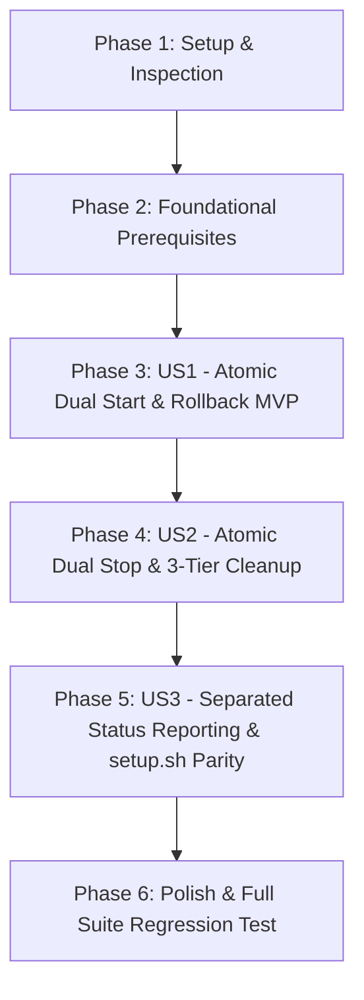

# Tasks: 메인 서버-대시보드 프로세스 생명주기 원자적 동기화 (`077-sync-server-dashboard-lifecycle`)

**Feature Directory**: [`specs/077-sync-server-dashboard-lifecycle`](file:///home/dev/storage/vllm_serv/specs/077-sync-server-dashboard-lifecycle)  
**Spec**: [`spec.md`](spec.md) | **Plan**: [`plan.md`](plan.md)  

---

## Dependency Graph

---

## Phase 1: Setup (Shared Infrastructure)

**Purpose**: 현재 PID 관리 및 프로세스 탐색 방식 구조 점검

- [x] T001 Inspect current PID tracking and process detection in `scripts/start_server.sh`, `scripts/stop_server.sh`, and `scripts/status_server.sh`

---

## Phase 2: Foundational (Blocking Prerequisites)

**Purpose**: Dual PID 파일 관리 구조 기본 수립

- [x] T002 Ensure `vllm_serv.pid` and `vllm_dashboard.pid` path constants are defined across `scripts/start_server.sh`, `scripts/stop_server.sh`, `scripts/status_server.sh`, and `scripts/setup.sh`

**Checkpoint**: Foundation ready - 유저 스토리별 작업 진행 가능

---

## Phase 3: User Story 1 - 원자적 동시 서버-대시보드 가동 (`start_server.sh`) (Priority: P1) 🎯 MVP

**Goal**: 8081 메인 API 서버와 8082 웹 대시보드 데몬을 동시 가동하고 Dual PID 기록, 단독 상주 경고 중단, 30초 동시 Readiness 체크 및 실패 시 원자적 SIGKILL 롤백 수행

**Independent Test**: `./start_server.sh` 실행 후 8081/8082 포트 LISTEN 및 PID 파일 2개 상주 확인; 단독 상주 상태 실행 시 경고 출력 및 중단 확인

### Tests for User Story 1

- [x] T003 [P] [US1] Create integration test for atomic dual-port start, single-running warning, and rollback in `tests/integration/test_dual_port_readiness.py`

### Implementation for User Story 1

- [x] T004 [US1] Refactor `scripts/start_server.sh` to track `vllm_serv.pid` and `vllm_dashboard.pid`, check for already running processes (aborting with warning and PID info per Q1 clarification), perform 30s dual readiness check, and execute atomic SIGKILL rollback on failure
- [x] T005 [US1] Verify atomic dual-port start behavior via `uv run bash -n scripts/start_server.sh` and execution

**Checkpoint**: User Story 1 (MVP) 독립 수렴 검증 완료

---

## Phase 4: User Story 2 - 원자적 동시 서버-대시보드 완전 종료 (`stop_server.sh`) (Priority: P1)

**Goal**: 8081 메인 서버, 8082 대시보드, C++ `llama-server` 하위 프로세스를 PID 파일 및 3단계 `pgrep` 패턴 탐색으로 100% 원자적 종료(SIGTERM 5s 후 SIGKILL)하고 VRAM 및 PID 파일 완전 회수

**Independent Test**: 단독 상주/좀비 프로세스 상태에서 `./stop_server.sh` 실행 시 `pgrep` 탐색 결과 0건 및 VRAM 해제 확인

### Tests for User Story 2

- [x] T006 [P] [US2] Create unit/integration test for 3-tier process cleanup and PID file removal in `tests/unit/test_shell_scripts.py`
- [x] T007 [P] [US2] Update Playwright E2E browser test for 8082 dashboard rendering in `tests/e2e/test_dashboard_e2e.py` per Constitution Article VII

### Implementation for User Story 2

- [x] T008 [US2] Refactor `scripts/stop_server.sh` to read `vllm_serv.pid` and `vllm_dashboard.pid`, send SIGTERM/SIGKILL, and execute 3-tier `pgrep` fallback cleanup for `src.api.server`, `uvicorn src.api.main:app`, and `llama-server`

**Checkpoint**: User Stories 1 AND 2 independently functional

---

## Phase 5: User Story 3 - 정확한 포트/프로세스 동기화 상태 진단 및 setup.sh 정합성 (Priority: P2)

**Goal**: `status_server.sh`에서 8081 메인 서버 PID와 8082 대시보드 PID 상태를 독립 라인으로 시각화하고, `setup.sh` HEREDOC 템플릿을 동일 동기화 로직으로 동기화 및 `chmod +x` 강제

**Independent Test**: `./status_server.sh` 실행 시 분리된 상태 리포트 확인 및 `./scripts/setup.sh` 실행 후 스크립트 실행 권한 확인

### Implementation for User Story 3

- [x] T009 [US3] Refactor `scripts/status_server.sh` to report 8081 main server PID and 8082 dashboard PID on separate status lines with REST API and HTML DOM keyword verification
- [x] T010 [US3] Update `scripts/setup.sh` HEREDOC templates for `start_server.sh`, `stop_server.sh`, `status_server.sh` to match atomic lifecycle logic and enforce `chmod +x` across all scripts

---

## Phase 6: Polish & Cross-Cutting Concerns

**Purpose**: 검증 시나리오 수행 및 전체 회귀 테스트 통과

- [x] T011 [P] Run quickstart validation scenarios in `quickstart.md`
- [x] T012 Execute full suite regression test via `uv run pytest` per Constitution Article VII

---

## Dependencies & Execution Order

### Phase Dependencies

- **Setup (Phase 1)**: No dependencies - can start immediately
- **Foundational (Phase 2)**: Depends on Setup completion - BLOCKS all user stories
- **User Stories (Phase 3+)**: Depend on Foundational phase completion (US1 → US2 → US3)
- **Polish (Final Phase)**: Depends on all user story phases being complete

### Parallel Opportunities

- T003, T006, T007, T011 are marked [P] and can run in parallel with non-conflicting tasks.
- All test tasks for a user story can be written and verified before/alongside implementation.

---

## Implementation Strategy

### MVP First (User Story 1 Only)

1. Complete Phase 1: Setup & Phase 2: Foundational
2. Complete Phase 3: User Story 1 (Atomic Dual Start & Rollback)
3. **STOP and VALIDATE**: Verify `./start_server.sh` independently

### Incremental Delivery

1. Complete Setup + Foundational
2. Add User Story 1 (Atomic Start & Rollback) → MVP
3. Add User Story 2 (Atomic Stop & 3-Tier Cleanup) → Complete cleanup safety
4. Add User Story 3 (Separated Status Reporting & setup.sh Parity) → Complete operational UX
