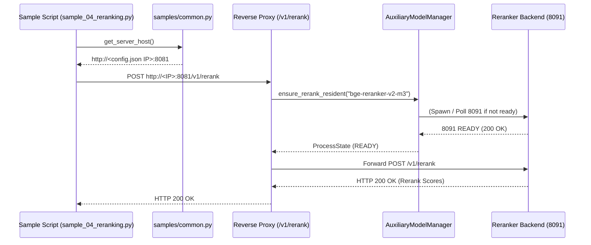

# Data Model & State Transitions: `078-fix-samples-and-reranker-503`

**Feature Directory**: [`specs/078-fix-samples-and-reranker-503`](file:///home/dev/storage/vllm_serv/specs/078-fix-samples-and-reranker-503)  
**Spec**: [`spec.md`](spec.md) | **Research**: [`research.md`](research.md)  

---

## 1. Entities & Schema

### SampleServerConfig (샘플 클라이언트 서버 설정 엔티티)

| Entity Attribute | Type | Description | Constraints |
|------------------|------|-------------|-------------|
| `server_host` | String | 서빙 API 서버 URL (`http://10.0.0.41:8081` 또는 `http://192.168.0.100:8081`) | Valid HTTP URL string |
| `api_key` | String | API 인증 키 (선택사항) | String or null |
| `timeout_s` | Float | HTTP 통신 타임아웃 초 | Default 10.0 |

---

## 2. Sequence Diagram: Sample Client & On-Demand Reranker Routing

