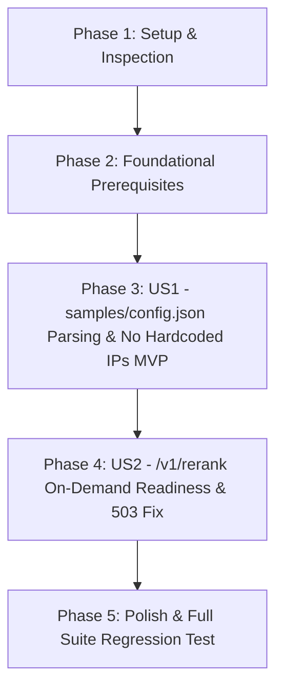

# Tasks: 샘플 스크립트 IP 설정 구조화 및 Reranker API 503 오류 해결 (`078-fix-samples-and-reranker-503`)

**Feature Directory**: [`specs/078-fix-samples-and-reranker-503`](file:///home/dev/storage/vllm_serv/specs/078-fix-samples-and-reranker-503)  
**Spec**: [`spec.md`](spec.md) | **Plan**: [`plan.md`](plan.md)  

---

## Dependency Graph

---

## Phase 1: Setup (Shared Infrastructure)

**Purpose**: 현재 샘플 스크립트 설정 파싱 및 호스트 탐색 구조 점검

- [x] T001 Inspect current host resolution in `samples/common.py` and example configuration in `samples/config.json.example`

---

## Phase 2: Foundational (Blocking Prerequisites)

**Purpose**: 샘플 클라이언트 설정 예시 가이드 체계화

- [x] T002 Update `samples/config.json.example` with clear comments for dev platform (`10.0.0.x`) and service platform (`192.168.0.x`) client configuration

**Checkpoint**: Foundation ready - 유저 스토리별 작업 진행 가능

---

## Phase 3: User Story 1 - `samples/config.json` 기반 서버 IP 설정 체계화 및 하드코딩 제거 (Priority: P1) 🎯 MVP

**Goal**: `samples/common.py` 모듈에서 하드코딩된 특정 IP 주소를 전면 배제하고, `SERVER_HOST` / `OPENAI_BASE_URL` 환경변수 -> `samples/.env` -> `samples/config.json` 파싱 순서 적용

**Independent Test**: `samples/config.json`에 기재된 IP로 `get_server_host()`가 정확히 파싱하여 통신하며, 소스코드 내 하드코딩 IP 주소가 0건인지 확인

### Tests for User Story 1

- [x] T003 [P] [US1] Create integration test for config parsing priority and hardcoded IP removal in `tests/integration/test_sample_scripts_and_reranker.py`

### Implementation for User Story 1

- [x] T004 [US1] Refactor `samples/common.py` to parse `SERVER_HOST` env, `samples/.env`, and `samples/config.json` in priority order, completely removing hardcoded IP address string `192.168.0.100` and defaulting to `http://127.0.0.1:8081`
- [x] T005 [US1] Verify sample script execution (`samples/sample_01_chat.py`, `samples/sample_02_model_params.py`, `samples/sample_03_embedding.py`, `samples/sample_05_structured_output.py`) using `samples/config.json` settings

**Checkpoint**: User Story 1 (MVP) 독립 수렴 검증 완료

---

## Phase 4: User Story 2 - Reranker API `/v1/rerank` 온디맨드 가동 및 503 오류 제거 (Priority: P1)

**Goal**: `/v1/rerank` (포트 8091) 및 `/v1/embeddings` (포트 8090) 수신 시 `auxiliary_manager.ensure_rerank_resident()` 및 `ensure_embedding_resident()`를 프록시 전송 전 온디맨드로 호출하여 503 에러 원천 차단

**Independent Test**: Reranker 오프라인 상태에서 `POST /v1/rerank` 및 `samples/sample_04_reranking.py` 호출 시 온디맨드로 8091 준비 후 HTTP 200 OK와 리랭크 결과 반환 검증

### Implementation for User Story 2

- [x] T006 [US2] Update `src/api/routes/inference_api.py` reverse proxy route to trigger `await auxiliary_manager.ensure_rerank_resident("bge-reranker-v2-m3")` for `/v1/rerank` and `await auxiliary_manager.ensure_embedding_resident("bge-m3")` for `/v1/embeddings` before HTTP forwarding
- [x] T007 [P] [US2] Add integration test for `/v1/rerank` on-demand readiness and 503 error prevention in `tests/integration/test_sample_scripts_and_reranker.py`
- [x] T008 [US2] Verify `samples/sample_04_reranking.py` execution returns 200 OK with relevance scores

**Checkpoint**: User Stories 1 AND 2 independently functional

---

## Phase 5: Polish & Cross-Cutting Concerns

**Purpose**: 검증 시나리오 수행 및 전체 회귀 테스트 통과

- [x] T009 [P] Run quickstart validation scenarios in `quickstart.md`
- [x] T010 Execute full suite regression test via `uv run pytest` per Constitution Article VII

---

## Dependencies & Execution Order

### Phase Dependencies

- **Setup (Phase 1)**: No dependencies - can start immediately
- **Foundational (Phase 2)**: Depends on Setup completion - BLOCKS all user stories
- **User Stories (Phase 3+)**: Depend on Foundational phase completion (US1 → US2)
- **Polish (Final Phase)**: Depends on all user story phases being complete

### Parallel Opportunities

- T003, T007, T009 are marked [P] and can run in parallel with non-conflicting tasks.
- All test tasks for a user story can be written and verified before/alongside implementation.

---

## Implementation Strategy

### MVP First (User Story 1 Only)

1. Complete Phase 1: Setup & Phase 2: Foundational
2. Complete Phase 3: User Story 1 (`config.json` parsing & zero hardcoded IPs)
3. **STOP and VALIDATE**: Verify `get_server_host()` independently

### Incremental Delivery

1. Complete Setup + Foundational
2. Add User Story 1 (`config.json` priority parsing & hardcoded IP removal) → MVP
3. Add User Story 2 (`/v1/rerank` on-demand readiness & 503 fix) → Complete RAG sample functionality
