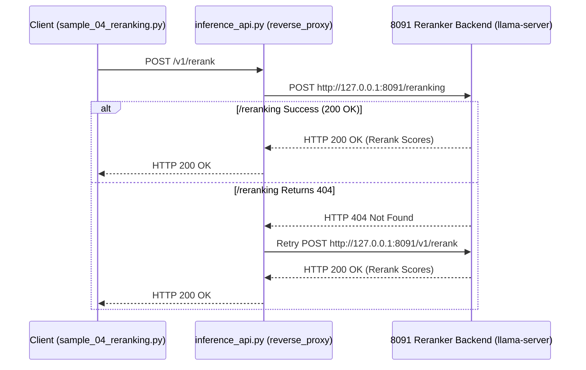

# Data Model & Sequence Diagram: `079-fix-reranker-404-routing`

**Feature Directory**: [`specs/079-fix-reranker-404-routing`](file:///home/dev/storage/vllm_serv/specs/079-fix-reranker-404-routing)  
**Spec**: [`spec.md`](spec.md) | **Research**: [`research.md`](research.md)  

---

## 1. Sequence Diagram: Reranker Reverse Proxy Path Fallback

