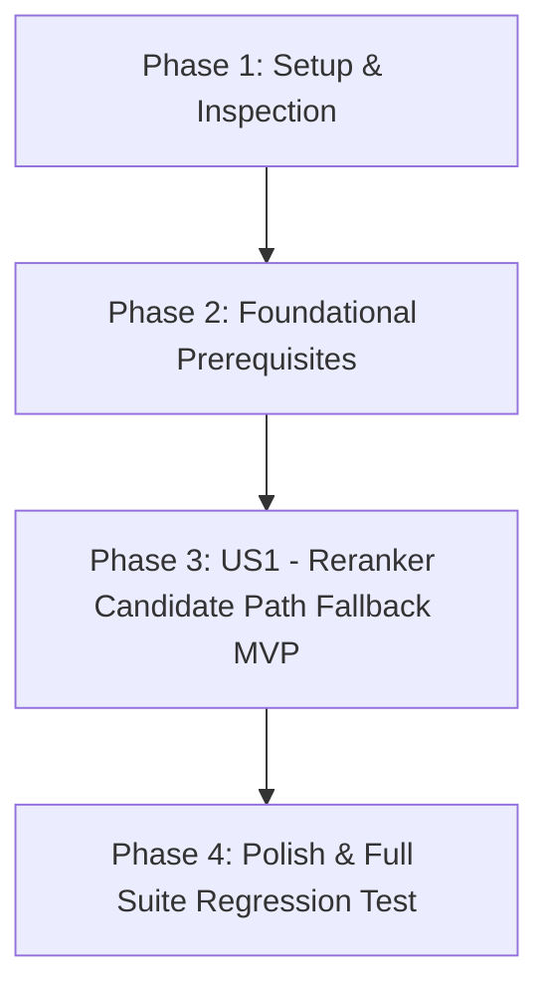

# Tasks: Reranker API `/v1/rerank` 404 라우팅 오류 해결 (`079-fix-reranker-404-routing`)

**Feature Directory**: [`specs/079-fix-reranker-404-routing`](file:///home/dev/storage/vllm_serv/specs/079-fix-reranker-404-routing)  
**Spec**: [`spec.md`](spec.md) | **Plan**: [`plan.md`](plan.md)  

---

## Dependency Graph

---

## Phase 1: Setup (Shared Infrastructure)

**Purpose**: 역방향 프록시 라우터의 8091 Reranker 전달 로직 점검

- [x] T001 Inspect reverse proxy routing in `src/api/routes/inference_api.py`

---

## Phase 2: Foundational (Blocking Prerequisites)

**Purpose**: Reranker 백엔드 후보 경로 목록 체계화

- [x] T002 Define Reranker candidate backend paths (`["/reranking", "/v1/rerank", "/rerank", "/v1/reranking"]`) helper in `src/api/routes/inference_api.py`

**Checkpoint**: Foundation ready - 유저 스토리 진행 가능

---

## Phase 3: User Story 1 - Reranker API 역방향 프록시 앤드포인트 자동 번역 및 404 폴백 해결 (Priority: P1) 🎯 MVP

**Goal**: `src/api/routes/inference_api.py` `reverse_proxy` 함수에서 Reranker 요청 수신 시 백엔드 포트 8091에 대해 후보 경로를 순차 탐색 및 폴백하여 404 오류 차단

**Independent Test**: `POST /v1/rerank` 및 `python samples/sample_04_reranking.py` 실행 시 404 Not Found 오류 0건 및 HTTP 200 OK 수신 검증

### Tests for User Story 1

- [x] T003 [P] [US1] Create integration test for reranker candidate path fallback in `tests/integration/test_reranker_404_routing.py`

### Implementation for User Story 1

- [x] T004 [US1] Implement candidate path fallback loop in `reverse_proxy` in `src/api/routes/inference_api.py` for rerank requests on port 8091
- [x] T005 [US1] Verify `samples/sample_04_reranking.py` execution succeeds with HTTP 200 OK

**Checkpoint**: User Story 1 (MVP) 독립 수렴 검증 완료

---

## Phase 4: Polish & Cross-Cutting Concerns

**Purpose**: 검증 시나리오 수행 및 전체 회귀 테스트 통과

- [x] T006 [P] Run quickstart validation scenarios in `quickstart.md`
- [x] T007 Execute full suite regression test via `uv run pytest` per Constitution Article VII

---

## Dependencies & Execution Order

### Phase Dependencies

- **Setup (Phase 1)**: No dependencies - can start immediately
- **Foundational (Phase 2)**: Depends on Setup completion - BLOCKS all user stories
- **User Story 1 (Phase 3)**: Depends on Foundational phase completion
- **Polish (Final Phase)**: Depends on User Story 1 completion

### Parallel Opportunities

- T003, T006 are marked [P] and can run in parallel with non-conflicting tasks.
