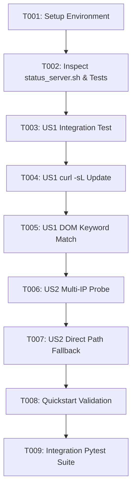

# Tasks: status_server.sh 대시보드 헬스체크 307 리다이렉트 처리 및 상태 진단 정확도 정상화

**Input**: Design documents from `/specs/087-fix-dashboard-status-healthcheck/`  
**Prerequisites**: `spec.md`, `plan.md`, `research.md`, `data-model.md`, `contracts/`, `quickstart.md`  

---

## Task Format: `[ID] [P?] [Story] Description`

- **[P]**: Can run in parallel (different files, no dependencies)
- **[Story]**: Which user story this task belongs to (e.g., US1, US2)

---

## Phase 1: Setup (Shared Infrastructure)

**Purpose**: Environment verification and feature directory structure confirmation

- [X] T001 Verify feature spec files and active environment in `specs/087-fix-dashboard-status-healthcheck/`

---

## Phase 2: Foundational (Blocking Prerequisites)

**Purpose**: Core script inspection before modifying status check logic

- [X] T002 Inspect existing `scripts/status_server.sh` dashboard curl probe and `tests/integration/test_server_health_diagnostics_consistency.py`

---

## Phase 3: User Story 1 - status_server.sh 대시보드 307 리다이렉트 추적 및 키워드 검증 (Priority: P1) 🎯 MVP

**Goal**: `scripts/status_server.sh`에서 curl 호출 시 `-L` (Location Follow) 플래그를 추가하여 8082 대시보드의 `307 Temporary Redirect` (0바이트) 응답을 추적하고 HTML DOM 키워드 검증을 통해 `Port 8082 OPEN, DOM Verified` 결과를 정확히 출력함.

**Independent Test**: 대시보드 가동 상태에서 `./status_server.sh` 실행 시 `🟢 대시보드 서비스 및 HTML DOM 정상 작동 중 (Port 8082 OPEN, DOM Verified)`가 출력됨.

### Tests for User Story 1 ⚠️
- [X] T003 [P] [US1] Write integration test for dashboard 307 redirect status check in `tests/integration/test_server_health_diagnostics_consistency.py`

### Implementation for User Story 1
- [X] T004 [US1] Update `scripts/status_server.sh` L78 to use `curl -sL --max-time 3` for port 8082 dashboard probe
- [X] T005 [US1] Verify HTML DOM keyword matching (`vLLM|Dashboard|vllm_serv|대시보드`) and status message formatting in `scripts/status_server.sh`

**Checkpoint**: User Story 1 complete - `./status_server.sh` accurately reports 8082 Dashboard RUNNING state without false negative `CLOSED`.

---

## Phase 4: User Story 2 - 다중 IP 루프백 탐색 및 /dashboard/ 직접 프로브 (Priority: P1)

**Goal**: `SERVER_HOST`가 `0.0.0.0` 또는 바인딩 주소일 때 `127.0.0.1`, `localhost`, LAN IP 순으로 탐색하고 `/dashboard/` 직렬 경로 프로브를 수행하여 로컬 네트워크 인터페이스 차이에 의한 오진 방지.

**Independent Test**: 다양한 바인딩 조건에서 `./status_server.sh` 실행 시 8082 대시보드 헬스체크 정상 탐색 확인.

### Implementation for User Story 2
- [X] T006 [P] [US2] Update `PROBE_HOSTS` loop logic in `scripts/status_server.sh` to probe `127.0.0.1`, `localhost`, and LAN IP for dashboard healthcheck
- [X] T007 [US2] Add `/dashboard/` direct path fallback probe in `scripts/status_server.sh` if root `/` probe receives empty response

**Checkpoint**: User Story 1 and User Story 2 complete - robust dashboard status healthcheck across all network interfaces.

---

## Phase 5: Polish & Cross-Cutting Concerns

**Purpose**: Final verification and regression testing

- [X] T008 [P] Execute quickstart validation guide scenarios in `specs/087-fix-dashboard-status-healthcheck/quickstart.md`
- [X] T009 Run full integration regression test suite (`uv run pytest tests/integration/test_server_health_diagnostics_consistency.py -v`)

---

## Dependencies & Execution Order

---

## Parallel Execution Opportunities

- T003 [P] [US1] Integration test file creation can be written in parallel with script inspection
- T006 [P] [US2] Multi-IP probe logic structuring
- T008 [P] Quickstart validation document review

---

## Implementation Strategy

### MVP First (User Story 1 Only)
1. Complete Phase 1 & 2 Setup/Foundational tasks (T001, T002)
2. Complete Phase 3 User Story 1 (T003 ~ T005)
3. Run `./status_server.sh` to verify `Port 8082 OPEN, DOM Verified` output
4. Proceed to Phase 4 & Phase 5 for full regression verification
