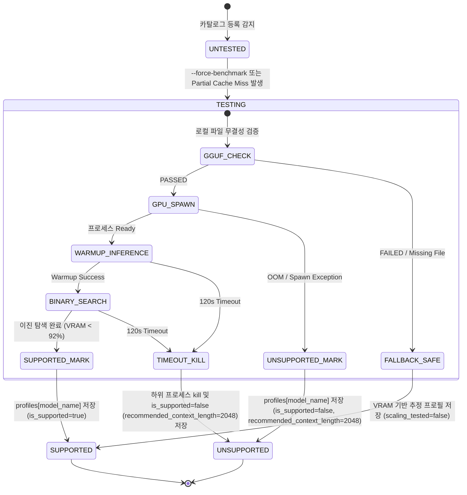

# Data Model & Schema Specification: 서비스 대상 전체 LLM 모델 기반 컨텍스트 윈도우 스케일링 벤치마크 확장

**Feature**: `098-benchmark-all-serviced-models`
**Created**: 2026-08-05

## Entity Definitions

### 1. ModelCatalogEntry (`config/model_catalog.json`)

`config/model_catalog.json` 내 개별 모델 정의 엔티티입니다.

| Field Name | Type | Required | Description | Validation / Constraints |
|------------|------|----------|-------------|--------------------------|
| `task_type` | `string` | Yes | 모델의 서빙 태스크 분류 | `"llm"`, `"embedding"`, `"rerank"` 중 하나. `"llm"`인 모델만 벤치마크 대상 |
| `model_path` | `string` | Yes | 로컬 GGUF 파일 상대 경로 | 예: `"models/gemma4-e2b/gemma4-e2b.gguf"` |
| `vram_est_mb` | `integer` | No | 추정 VRAM 용량 (MB) | 기본값 4000, 0 이상 |
| `context_window_max` | `integer` | No | 카탈로그 명시 최대 컨텍스트 | 기본값 16384, 2048 이상 |

---

### 2. ModelContextProfileEntry (`config/model_context_profiles.json` -> `profiles[model_name]`)

개별 모델에 대해 이진 탐색 및 실측 GPU 인퍼런스를 통해 측정된 컨텍스트 윈도우 프로필 엔티티입니다.

```json
{
  "max_context_length": 8192,
  "recommended_context_length": 7168,
  "binary_search_steps": [
    {
      "step": 1,
      "tested_n_ctx": 10240,
      "real_vram_mb": 11200,
      "status": "OOM/FAIL"
    },
    {
      "step": 2,
      "tested_n_ctx": 7168,
      "real_vram_mb": 6800,
      "status": "PASS"
    }
  ],
  "peak_vram_mb": 6800,
  "tpot_tok_per_sec": 45.0,
  "scaling_tested": true,
  "is_supported": true,
  "last_tested_at": "2026-08-05T11:50:00Z"
}
```

| Field Name | Type | Required | Description | Validation / Constraints |
|------------|------|----------|-------------|--------------------------|
| `max_context_length` | `integer` | Yes | VRAM 92% 미만으로 구동 가능한 최대 n_ctx | 2048 이상 (불가 시 2048) |
| `recommended_context_length` | `integer` | Yes | 안전 마진(90%) 적용 추천 n_ctx | 512의 배수 얼라인먼트 |
| `binary_search_steps` | `array[object]`| Yes | 이진 탐색 단계별 실측 레코드 | 스텝별 n_ctx, 실측 VRAM, PASS/FAIL 상태 |
| `peak_vram_mb` | `integer` | Yes | 벤치마크 수행 중 최고 VRAM 점유량 | MB 단위 |
| `tpot_tok_per_sec` | `float` | Yes | 웜업 토큰 생성 속도 (TPS) | 0.0 이상 |
| `scaling_tested` | `boolean` | Yes | 실측 이진 탐색 수행 완료 여부 | `true` (실측 완수) 또는 `false` (추정치) |
| `is_supported` | `boolean` | Yes | 해당 하드웨어에서 서비스 가능 여부 | 로딩 실패/타임아웃 시 `false` |
| `last_tested_at` | `string` | Yes | ISO 8601 UTC 타임스탬프 | 예: `"2026-08-05T11:50:00Z"` |

---

### 3. ModelContextProfilesData (`config/model_context_profiles.json` 루트)

전체 프로필 캐시 파일의 최상위 스키마 엔티티입니다.

| Field Name | Type | Required | Description |
|------------|------|----------|-------------|
| `generated_at` | `string` | Yes | 프로필 생성/최종 갱신 시각 (ISO 8601 UTC) |
| `system_hardware` | `object` | Yes | 하드웨어 스냅샷 (`gpu_name`, `total_vram_mb`, `is_cuda_available`) |
| `profiles` | `map[string, ModelContextProfileEntry]` | Yes | 모델명을 키로 하는 전체 프로필 dictionary |

---

## State Transition Diagram (모델 벤치마크 상태 전이도)



---

## Validation & Business Rules

1. **LLM 태스크 유형 필터링**: `task_type == "llm"`인 모델만 벤치마크 대상으로 추출하고 `embedding`, `rerank` 태스크 모델은 자동 제외합니다.
2. **원자적 병합(Atomic Merge)**: `config/model_context_profiles.json` 업데이트 시 기존 프로필 dictionary를 로드한 뒤 갱신 대상 키만 덮어쓰고, `.tmp` 임시 파일 작성 후 `os.replace`로 저장합니다.
3. **Partial Cache Miss 조건**: `set(catalog_llm_models) - set(existing_profiles.keys())`가 비어있지 않으면 미등록된 신규 모델에 대해서만 핀포인트 벤치마크를 수행합니다.
