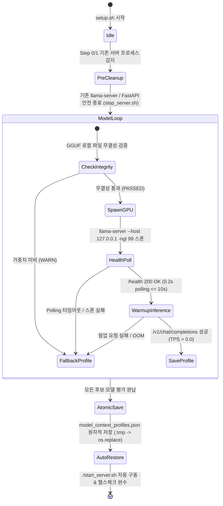

# Data Model & Schema Definitions: setup.sh 폴리싱 및 GPU 모델 로드 실측 벤치마크 파이프라인 리팩토링 (099-fix-setup-gpu-benchmark)

## 1. 개요

`099-fix-setup-gpu-benchmark` 기능에서 수록 및 갱신되는 `config/model_context_profiles.json` 및 `config/server_config.json`의 데이터 구조 및 엔티티 명세를 정의합니다.

---

## 2. 엔티티 명세

### 2.1 ModelContextProfiles (`config/model_context_profiles.json`)

| 필드명 | 타입 | 필수 여부 | 설명 |
|:---|:---|:---:|:---|
| `generated_at` | `String` (ISO 8601) | Y | 프로필 데이터 세트 최종 생성 시각 (예: `2026-08-05T13:00:00Z`) |
| `system_hardware` | `Object` | Y | 실측 검증 시 하드웨어 디바이스 정보 (GPU 모델, VRAM, CUDA 가능 여부) |
| `profiles` | `Map<String, ModelContextProfileEntry>` | Y | 카탈로그 후보 모델명을 키로 하는 모델별 실측 프로필 맵 |

#### ModelContextProfileEntry

| 필드명 | 타입 | 필수 여부 | 설명 | 기본값 / 제약조건 |
|:---|:---|:---:|:---|:---|
| `max_context_length` | `Integer` | Y | 이진 탐색을 통해 실측된 최대 성공 컨텍스트 토큰 크기 | 2048 (실패 시) |
| `recommended_context_length` | `Integer` | Y | VRAM 안전 여유율(90%) 적용 후 추천 컨텍스트 토큰 크기 | 2048 (실패 시) |
| `binary_search_steps` | `List<BinarySearchStep>` | Y | 이진 탐색 수행 단계별 실측 VRAM 및 상태 기록 | `[]` |
| `peak_vram_mb` | `Integer` | Y | 이진 탐색 과정에서 실측된 최대 VRAM 점유량 (MB) | 0 (실패 시) |
| `tpot_tok_per_sec` | `Float` | Y | 웜업 인퍼런스 실측 토큰 생성 속도 (TPS) | `> 0.0` (성공 시), `0.0` (실패 시) |
| `scaling_tested` | `Boolean` | Y | 실측 GPU 오프로딩 및 스케일링 테스트 완료 여부 | `true` (실측 완료), `false` (OOM/미비) |
| `is_supported` | `Boolean` | Y | 현재 GPU 하드웨어 VRAM에서 서빙 지원 가능 여부 | `true` / `false` |
| `last_tested_at` | `String` (ISO 8601) | Y | 해당 모델 벤치마크 수행 완료 시각 | UTC ISO 8601 |

#### BinarySearchStep

```json
{
  "step": 1,
  "tested_n_ctx": 10240,
  "real_vram_mb": 5420,
  "status": "PASS"
}
```

---

### 2.2 ServerConfig (`config/server_config.json`)

벤치마크 평가를 통해 자동 선택된 최적 모델 및 컨텍스트 설정이 반영되는 엔티티입니다.

```json
{
  "model": "qwen3.5-4b",
  "context_window": 8192,
  "auto_benchmark_profile": {
    "recommended_model": "qwen3.5-4b",
    "recommended_context_window": 8192,
    "benchmark_tps": 48.5,
    "vram_used_mb": 4200,
    "benchmark_timestamp": "2026-08-05T13:00:00Z"
  }
}
```

---

## 3. 상태 전이 모델 (State Transitions)


