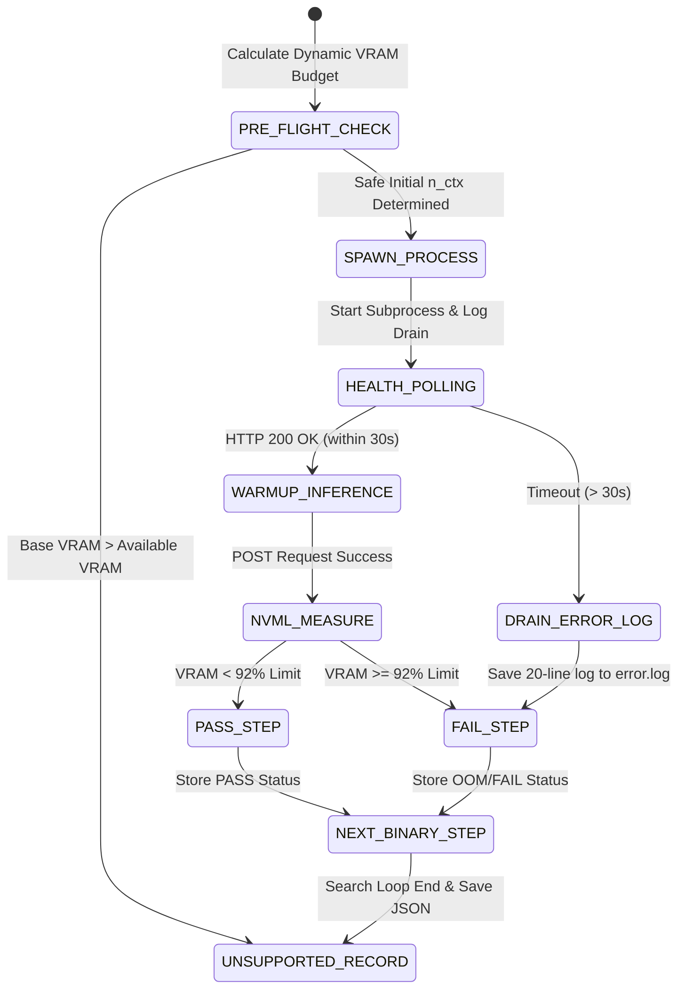

# Data Model: 벤치마크 OOM 진단 및 실시간 로그 영구 저장 개선 (100-fix-benchmark-oom-logging)

## Entities & Data Schemas

### 1. BenchmarkExecutionLog (벤치마크 실행 로그)

벤치마크 구동 시 발생한 백엔드 서브프로세스의 실행 상태, 캡처된 로그 줄, 종료 코드 및 에러 원인을 추적하기 위한 데이터 모델입니다.

- **`timestamp`** (string, ISO-8601): 로그 발생 시각 (예: `2026-08-05T13:45:00Z`).
- **`model_id`** (string): 벤치마크 대상 모델 식별자 (예: `qwen3.5-4b`, `gemma4-12b`).
- **`tested_n_ctx`** (integer): 해당 탐색 단계에서 테스트된 컨텍스트 윈도우 크기 (예: `4096`, `8192`).
- **`process_pid`** (integer, optional): 실행된 `llama-server` 서브프로세스 PID.
- **`exit_code`** (integer, optional): 서브프로세스 종료 코드 (정상 `0`, 비정상 `1`, `137` 등).
- **`captured_stderr_tail`** (list of string): 비정상 종료/타임아웃 시 캡처된 최근 20줄 이상의 콘솔 출력 버퍼.
- **`failure_reason`** (string, optional): 실패 시 판명된 구체적 원인 (`HEALTH_CHECK_TIMEOUT`, `CUDA_OOM_EXCEEDED`, `PROCESS_CRASH_EXIT_1`, `MODEL_FILE_NOT_FOUND`).

---

### 2. DynamicVramBudget (동적 VRAM 예산 산출 엔티티)

하드코딩 없이 GGUF 모델 메타데이터와 물리 GPU 측정값으로 산출하는 VRAM 예산 데이터 구조입니다.

- **`gguf_file_size_mb`** (float): 로컬 GGUF 파일의 실제 파일 크기 (MB).
- **`estimated_base_vram_mb`** (float): 모델 가중치 로딩 시 필요한 베이스 VRAM 용량 (`gguf_file_size_mb * 1.1`).
- **`total_gpu_vram_mb`** (float): NVML 실측 전체 VRAM 용량 (예: GTX 1080 Ti = `11264`).
- **`available_gpu_vram_mb`** (float): NVML 실측 현재 가용 VRAM 용량 (`total_gpu_vram_mb - used_vram_mb`).
- **`remaining_kv_budget_mb`** (float): KV 캐시 탑재에 할당 가능한 순수 잔여 VRAM 예산 (`available_gpu_vram_mb - estimated_base_vram_mb`).
- **`safe_initial_n_ctx`** (integer): 잔여 VRAM 예산에 맞춰 동적으로 결정된 안전 탐색 시작 컨텍스트 크기 (2048, 4096 등).

---

### 3. ModelContextProfile (모델별 벤치마크 결과 데이터 스키마)

`config/model_context_profiles.json` 파일에 원자적으로 반영되는 모델별 최종 프로필 구조입니다.

```json
{
  "qwen3.5-4b": {
    "max_context_length": 8192,
    "recommended_context_length": 7168,
    "binary_search_steps": [
      {
        "step": 1,
        "tested_n_ctx": 4096,
        "real_vram_mb": 4200,
        "status": "PASS"
      },
      {
        "step": 2,
        "tested_n_ctx": 8192,
        "real_vram_mb": 6800,
        "status": "PASS"
      }
    ],
    "peak_vram_mb": 6800,
    "tpot_tok_per_sec": 42.5,
    "scaling_tested": true,
    "is_supported": true,
    "failure_reason": null,
    "last_tested_at": "2026-08-05T13:45:00Z"
  },
  "gemma4-12b": {
    "max_context_length": 2048,
    "recommended_context_length": 2048,
    "binary_search_steps": [],
    "peak_vram_mb": 0,
    "tpot_tok_per_sec": 0.0,
    "scaling_tested": false,
    "is_supported": false,
    "failure_reason": "CUDA_OOM_EXCEEDED (Estimated VRAM exceeds 11264MB capacity)",
    "last_tested_at": "2026-08-05T13:45:30Z"
  }
}
```

---

## State Transitions

### Benchmark Subprocess Lifecycle


