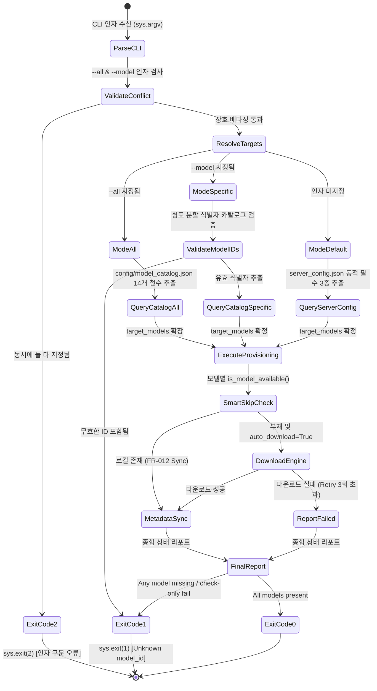

# Phase 1 Data Model: `scripts/ensure_models.py` 전체/특정 모델 다운로드 CLI 옵션 확장 (102-catalog-full-download-cli)

## Key Entities & Data Schemas

### 1. EnsureModelsCLIConfig (CLI 파싱 및 정규화 엔티티)

| Field Name | Type | Default | Description |
|------------|------|---------|-------------|
| `all_models` | `bool` | `False` | `--all` 또는 `--download-all` 플래그 지정 여부 |
| `target_model_arg` | `Optional[str]` | `None` | `--model` 인자로 전달된 단일/쉼표구분 모델 ID 문자열 |
| `check_only` | `bool` | `False` | `--check-only` 다운로드 스킵 및 상태 점검 전용 플래그 |
| `auto_download` | `bool` | `True` | `--no-auto-download` 옵션 미지정 시 자동 다운로드 수행 여부 |

### 2. ModelResolutionResult (타깃 모델 리졸버 결과 엔티티)

| Field Name | Type | Description |
|------------|------|-------------|
| `target_models` | `List[str]` | 최종 점검/다운로드 대상 모델 ID 리스트 (예: `['qwen3.6-27b']` 또는 14개 전체) |
| `resolution_mode` | `str` | `"ALL"`, `"SPECIFIC"`, `"DEFAULT_REQUIRED"` 중 하나 |
| `is_valid` | `bool` | 모든 요청된 모델 ID의 카탈로그 수록 여부 |
| `invalid_model_ids` | `List[str]` | 카탈로그에 존재하지 않아 거부된 모델 ID 리스트 |

---

## State Transition Diagram

