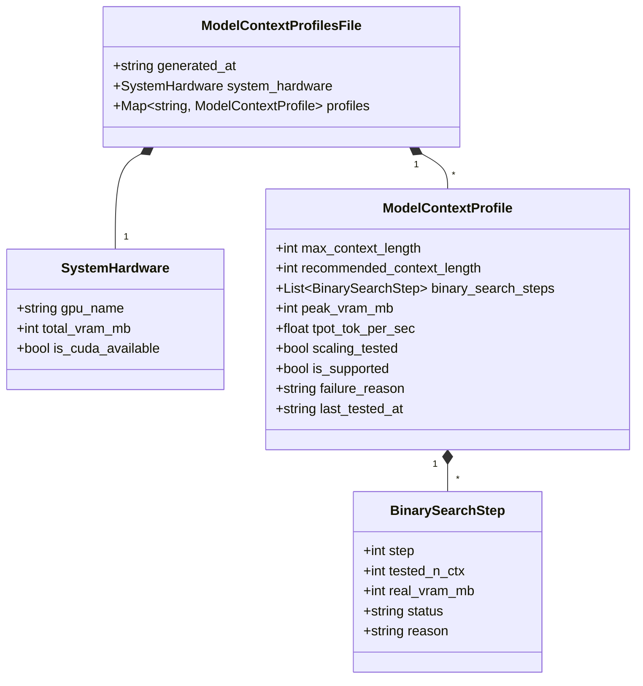

# Phase 1 Data Model: 컨텍스트 윈도우 크기 벤치마킹 고도화 (105-enhance-context-window-benchmark)

## Context Scaling Data Architecture

`config/model_context_profiles.json`에 저장되는 데이터 스키마 및 이진 탐색 스텝 메타데이터 모델 정의입니다.

---

## Entity Schema & Field Specifications

### 1. `ModelContextProfile` Entity

| Field | Type | Required | Description | Example |
| :--- | :--- | :--- | :--- | :--- |
| `max_context_length` | Integer | Yes | 실측 성공한 최대 컨텍스트 크기 (토큰) | `10240` |
| `recommended_context_length` | Integer | Yes | 권장 오프셋 컨텍스트 크기 | `8192` |
| `binary_search_steps` | List[BinarySearchStep] | Yes | 이진 탐색 단계별 실측 레코드 | `[...]` |
| `peak_vram_mb` | Integer | Yes | 최대 peak VRAM 점유량 (MB) | `8450` |
| `tpot_tok_per_sec` | Float | Yes | 초당 토큰 생성 속도 (TPS) | `45.0` |
| `scaling_tested` | Boolean | Yes | 이진 탐색 구동 여부 | `true` |
| `is_supported` | Boolean | Yes | 서비스 가능 여부 | `true` |
| `failure_reason` | String | Yes | 실패 사유 또는 "SUCCESS" | `"SUCCESS"` |
| `last_tested_at` | String (ISO 8601) | Yes | 최근 측정 완료 일시 | `"2026-08-07T07:10:00Z"` |

### 2. `BinarySearchStep` Entity

| Field | Type | Required | Description | Example |
| :--- | :--- | :--- | :--- | :--- |
| `step` | Integer | Yes | 이진 탐색 차수 (1~5) | `1` |
| `tested_n_ctx` | Integer | Yes | 평가 대상 컨텍스트 크기 | `10240` |
| `real_vram_mb` | Integer | Yes | 실측 VRAM 점유량 (MB) | `8450` |
| `status` | String | Yes | `"PASS"` 또는 `"OOM/FAIL"` | `"PASS"` |
| `reason` | String | Yes | 성공 사유 또는 세부 에러 메시지 | `"SUCCESS"` |
