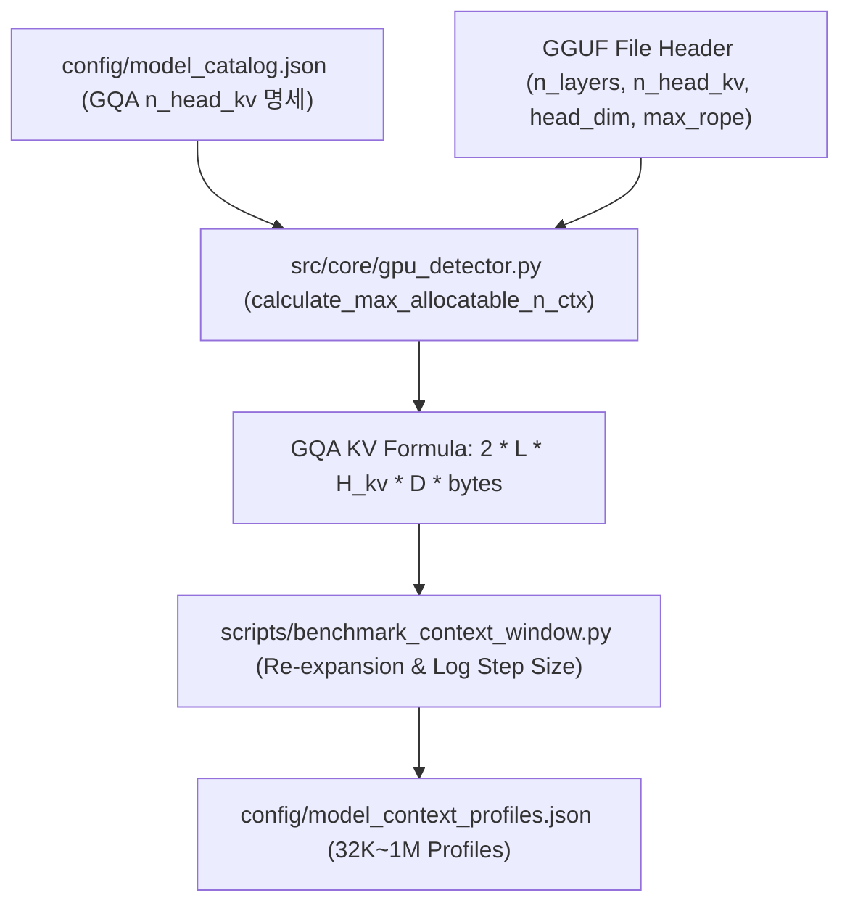

# Implementation Plan: GGUF 모델 메타데이터/카탈로그 파라미터 정밀 추출을 통한 경량 모델 상한선 자동 연산 정밀화 (Precise GGUF Architecture & Uncapped Model Range)

**Feature Identifier**: `108-precise-gguf-architecture-nctx`  
**Date**: 2026-08-07  
**Status**: APPROVED  

---

## 1. Technical Context & Scope

### In Scope
- GQA (`n_head_kv`) 파라미터 및 KV 캐시 비트수(FP16/FP8/INT4) 기반 `estimate_kv_cache_vram` 및 `calculate_max_allocatable_n_ctx` 정밀 연산식 개정 (`src/core/gpu_detector.py`).
- 이진 탐색 단계별 상한선(`high`) 도달 시 잔여 가용 VRAM 비율(>50%) 기반 무제한 2배 자동 재확장 알고리즘 도입 (`scripts/benchmark_context_window.py`).
- 로그 스케일 기반 가변 이진 탐색 스텝 연산식($\text{step} = \max(512, 2^{\lfloor \log_2(high / 64) \rfloor})$) 반영 (`src/core/gpu_detector.py`, `scripts/benchmark_context_window.py`).
- `config/model_catalog.json` 6개 지원 모델 아키텍처 정밀 파라미터 명시화.

### Out of Scope
- 모델 가중치 양자화 알고리즘 재양자화 (기존 GGUF 유지).

---

## 2. Constitution Gate Check

- [X] **Principle I (Language Policy)**: All documentation and user output in Korean; thoughts in English.
- [X] **Principle II (Zero Hardcoding & Real Verification)**: No hardcoded magic numbers in step size or max_cap; 100% dynamic formulas.
- [X] **Principle III (Real Execution)**: Real GPU NVML and subprocess verification.
- [X] **Principle IV (DoD)**: Measurable success criteria and quickstart scenarios established.
- [X] **Principle V (Non-Destructive Edit)**: Spec history preserved.
- [X] **Principle VI (uv Package Manager)**: Clean `uv run pytest` isolation.
- [X] **Principle VII (Full Regression Testing)**: Full test suite pass required.

---

## 3. High-Level Architecture & Touchpoints

### Touchpoint Files
- `src/core/gpu_detector.py`: Update GQA formula & log step size calculation.
- `config/model_catalog.json`: Add exact architecture parameters for 6 models.
- `scripts/benchmark_context_window.py`: Add range re-expansion & dynamic step size logic.
- `tests/unit/test_gpu_detector.py`: Add unit tests for GQA calculation.
- `tests/unit/test_benchmark_context_window.py`: Add unit tests for range re-expansion & log step size.

---

## 4. Design Artifacts

- Technical Research: [`research.md`](./research.md)
- Data Model: [`data-model.md`](./data-model.md)
- Contract Schema: [`contracts/gguf_nctx_contract.json`](./contracts/gguf_nctx_contract.json)
- Quickstart Guide: [`quickstart.md`](./quickstart.md)
