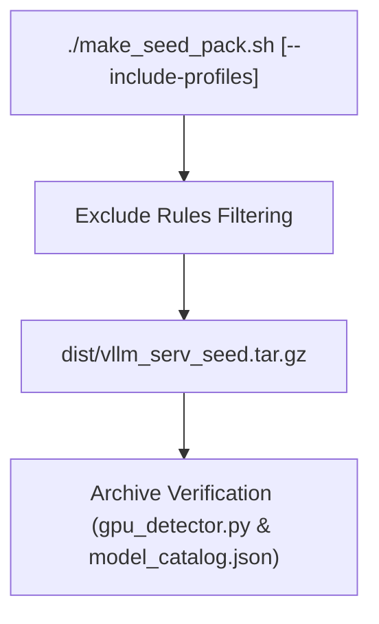

# Implementation Plan: 시드 팩(Seed Pack) 생성 스크립트 최신 명세(GQA/GGUF/프로필) 반영 고도화 (Seed Pack Script Enhancement)

**Feature Identifier**: `109-seed-pack-script-enhancement`  
**Date**: 2026-08-07  
**Status**: APPROVED  

---

## 1. Technical Context & Scope

### In Scope
- `scripts/make_seed_pack.sh` CLI option parser update to support `--include-profiles`.
- Archive exclusion rule update: exclude `config/model_context_profiles.json` by default, but include when `--include-profiles` is supplied.
- Content verification logic update: verify `src/core/gpu_detector.py` and `config/model_catalog.json` are present in archive.
- Unit tests update in `tests/unit/test_shell_scripts.py`.

### Out of Scope
- Model binary weights packaging (`models/*` remains excluded).

---

## 2. Constitution Gate Check

- [X] **Principle I (Language Policy)**: Korean for docs and output, English for thoughts.
- [X] **Principle II (Zero Hardcoding & Real Verification)**: Real archive contents verification.
- [X] **Principle IV (DoD)**: DoD established in spec.
- [X] **Principle VI (uv Package Manager)**: `uv run pytest` test isolation.
- [X] **Principle VII (Full Suite Regression Rule)**: Full suite pass required.

---

## 3. High-Level Architecture & Touchpoints

### Touchpoint Files
- `scripts/make_seed_pack.sh`: Add `--include-profiles` option and updated verification checks.
- `tests/unit/test_shell_scripts.py`: Add unit tests for `--include-profiles` and verification checks.

---

## 4. Design Artifacts

- Technical Research: [`research.md`](./research.md)
- Data Model: [`data-model.md`](./data-model.md)
- CLI Contract: [`contracts/seed_pack_contract.md`](./contracts/seed_pack_contract.md)
- Quickstart Guide: [`quickstart.md`](./quickstart.md)
