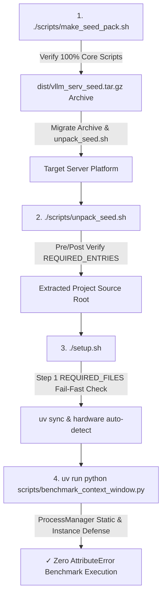

# Data Model & Interface Contracts: 시드 팩 마이그레이션 파이프라인 및 ProcessManager 호환성 전수 검증 (Fix Seed Pack Migration Pipeline & ProcessManager Compatibility)

## 1. Core Component Interfaces

### ProcessManager Interface Contract (`src/core/process_manager.py`)

| Method Name | Decorator / Type | Parameters | Return Type | Behavioral Specification |
|-------------|------------------|------------|-------------|--------------------------|
| `calculate_base_vram_mb` | `@staticmethod` | `model_path: str`, `file_size_bytes: Optional[int] = None` | `int` | GGUF 모델 가중치 파일 용량 * 1.15 계산으로 베이스 VRAM 필요량(MB) 반환. 모델 파일 미존재 시 6000MB 안전 폴백. |
| `force_kill_zombie_llama_servers` | `@staticmethod` | `target_ports: tuple = (8081, 8089, 8090, 8091)` | `None` | 지정된 TCP 포트를 점유하고 있거나 `llama_cpp.server` orphan 프로세스를 `fuser -k -9` 및 `SIGKILL`로 강제 정리. |
| `calculate_base_vram_mb` (instance fallback) | Instance method wrapper | `self`, `model_path: str`, `file_size_bytes: Optional[int] = None` | `int` | 인스턴스에서 `pm.calculate_base_vram_mb(...)` 형태로 호출 시 정적 메서드로 위임. |
| `force_kill_zombie_llama_servers` (instance fallback) | Instance method wrapper | `self`, `target_ports: tuple = ...` | `None` | 인스턴스에서 `pm.force_kill_zombie_llama_servers(...)` 형태로 호출 시 정적 메서드로 위임. |

---

## 2. Seed Pack Pipeline Data & File Contracts

### Required Script Manifest Entries (`make_seed_pack.sh`, `unpack_seed.sh`, `setup.sh`)

```json
{
  "core_python_modules": [
    "src/core/process_manager.py",
    "src/core/model_downloader.py",
    "src/core/gpu_detector.py",
    "src/core/auxiliary_manager.py",
    "src/core/llama_manager.py"
  ],
  "benchmark_scripts": [
    "scripts/benchmark_quality.py",
    "scripts/benchmark_context_window.py"
  ],
  "pipeline_shell_scripts": [
    "scripts/make_seed_pack.sh",
    "scripts/unpack_seed.sh",
    "scripts/setup.sh",
    "scripts/start_server.sh",
    "scripts/stop_server.sh",
    "scripts/status_server.sh"
  ],
  "config_files": [
    "config/model_catalog.json",
    "config/platform_profiles.json",
    "config/server_config.json"
  ]
}
```

---

## 3. Execution Pipeline Lifecycle Diagram


