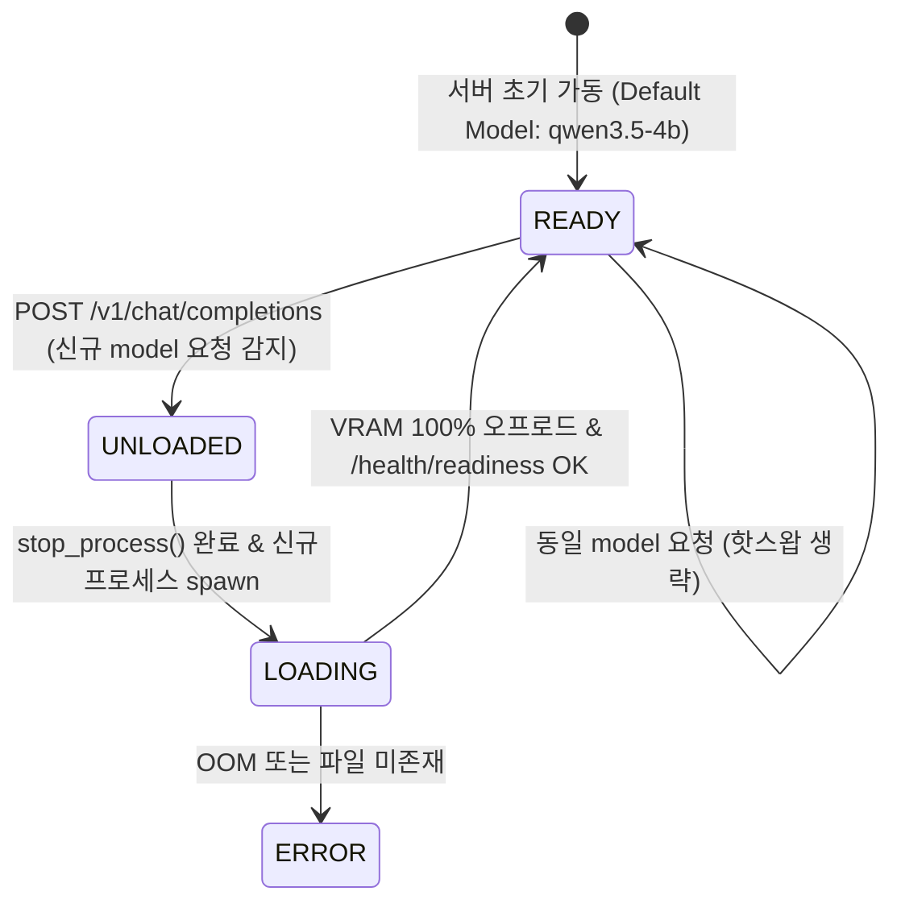

# Data Model & State Transitions: 동적 모델 스위칭 (Model Switching)

**Feature**: `fix-model-switching`  
**Feature Directory**: `specs/116-fix-model-switching`  

## 1. ProcessState 데이터 구조 & 상태 전이

### ProcessStatusEnum
- `UNLOADED`: 모델이 VRAM에 로드되지 않음
- `LOADING`: 백엔드 서브프로세스 생성 및 VRAM 오프로드 진행 중
- `READY`: VRAM 100% 오프로드 완료 및 헬스체크 정상
- `ERROR`: 로드 실패 또는 프로세스 비정상 종료

### 상태 전이 다이어그램 (State Transition Diagram)

## 2. API 요청 데이터 규격 (Chat Completion Request)

| Field | Type | Required | Description |
|-------|------|----------|-------------|
| `model` | `string` | Yes | 요청할 LLM 모델 ID (예: `"qwen3.5-4b"`, `"qwen3.5-2b"`, `"gemma4-e4b"`) |
| `messages` | `list[object]` | Yes | 대화 메시지 배열 (`role`, `content`) |
| `max_tokens` | `integer` | No | 생성 최대 토큰 수 |
| `temperature` | `float` | No | 추론 다양성 조절 파라미터 |
